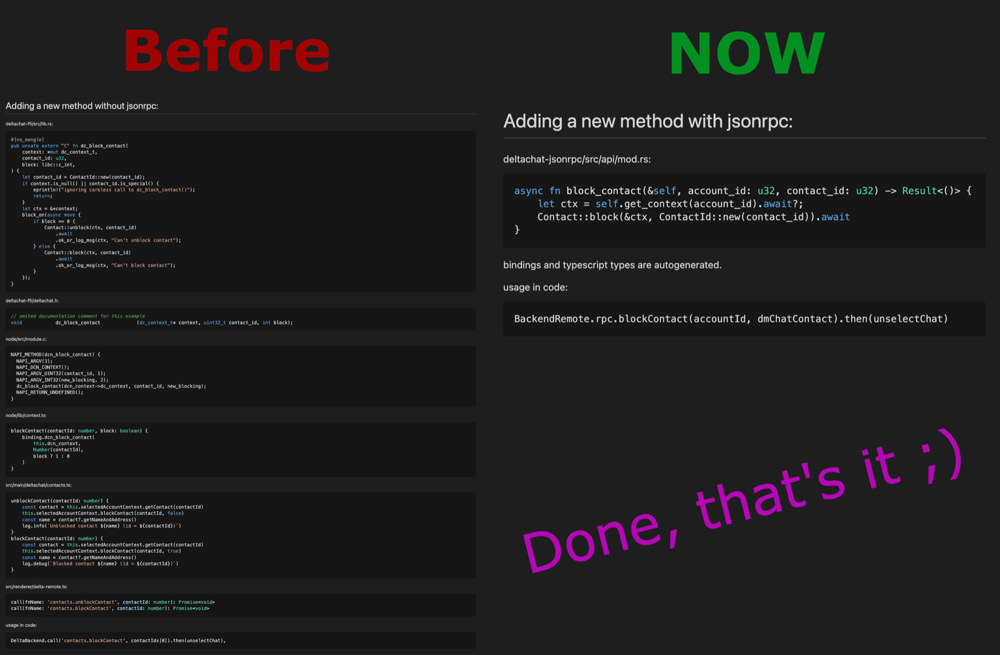

*[CFFI]: C Foreign Function Interface
*[JSON]: JavaScript Object Notation
*[JSON-RPC]: JavaScript Object Notation Remote Procedure Call
*[RPC]: Remote Procedure Call
*[API]: Application Programming Interface
*[UI]: User Interface
*[NAPI]: Node-API
*[BTW]: by the way
*[CBOR]: Concise Binary Object Representation
*[IPC]: Inter-process communication
*[stdio]: standard input/output
*[IDE]: Integrated Development Environment
*[JNI]: Java Native Interface

<style>
abbr[title] {
  text-decoration-color: rgba(128, 128, 128, 0.75);
}
</style>

> پیش از همه، این پست کاملاً فنی است. اگر چیزی هدفمندتر برای کاربران نهایی می‌خواهید پست‌های وبلاگ دیگر ما را بخوانید.

اگر هنوز به کد منبع Delta Chat نگاه نکرده‌اید،
شاید ندانید که ما یک [کتابخانه هسته Rust](https://github.com/deltachat/deltachat-core-rust/) داریم که همه‌چیز را کنار هم نگه می‌دارد.
ویژگی‌های زیرساختی مانند رمزنگاری، پروتکل‌های ایمیل و شبکه،
مدیریت چت، مخاطب و پیام در این کتابخانه هسته Rust پیاده‌سازی شده‌اند
و [همه اپ‌های خانواده فعلی Delta Chat](https://support.delta.chat/t/list-of-all-known-client-projects/3059)
و همچنین بات‌های چت از آن بهره می‌برند:

- کتابخانه هسته همه کار زیرساخت و سازگاری را انجام می‌دهد و
  متدهای سطح‌بالایی مانند `getAccounts`، `getChatlist`، `getChatContacts` و غیره را افشا می‌کند
  تا نگهداری اپ‌ها یا بات‌ها روی همه پلتفرم‌ها خیلی کمتر کار ببرد،
  چون می‌توانند کاملاً روی پیاده‌سازی تعاملات و رابط‌های کاربر تمرکز کنند.

- کتابخانه هسته با تست‌های واحد Rust
  و تست‌های یکپارچه‌سازی کارکردی در Python با استفاده از سرورهای زنده به‌دقت تست می‌شود،
  و هسته چیزی است که همه اپ‌ها را کاملاً با یکدیگر سازگار می‌کند.

- کتابخانه هسته به‌راحتی می‌تواند برای نوشتن بات‌ها و اپ/کلاینت‌های جدید استفاده شود
  (مثل DeltaTouch، کلاینتی برای Ubuntu touch که Lothar در حدود یک سال به‌عنوان پروژه جانبی ساخت؛ [پست وبلاگ](./2023-07-02-deltatouch) را بخوانید).

## رابط تابع خارجی C (CFFI)

رابط تابع خارجی C، به‌اختصار CFFI، اولین راه برای لینک به هسته بود.
وقتی Björn پروژه Delta Chat را شروع کرد معرفی شد.
او [هسته را در C](https://github.com/deltachat/deltachat-core) نوشت و اپ اندروید Telegram را برای UI فورک کرد،
که به Java نوشته شده، پس هسته از طریق CFFI[^CFFI] و [JNI](https://github.com/deltachat/deltachat-android/blob/main/jni/dc_wrapper.c) (Java Native Interface) متصل می‌شود.
بعداً [وقتی هسته را به Rust منتقل کردیم](https://delta.chat/en/2019-05-08-xyiv#the-coming-delta-chat-rustocalypse)، CFFI بدون تغییر ماند
که به‌شدت کمک کرد اکوسیستم پایدار بماند
در حالی که پیاده‌سازی زیرساخت به‌طور رادیکال عوض شد.

[^CFFI]: فایل هدر [deltachat.h](https://github.com/deltachat/deltachat-core-rust/blob/main/deltachat-ffi/deltachat.h)
    راه آسانی برای گرفتن ایده از API است

مزیت CFFI این است که بیشتر زبان‌های برنامه‌نویسی راه داخلی برای bind شدن به آن دارند.

نگاهی به اینکه متدهای CFFI چگونه به نظر می‌رسند (از [`deltachat.h`](https://github.com/deltachat/deltachat-core-rust/blob/main/deltachat-ffi/deltachat.h)):

```c
#define DC_CONNECTIVITY_NOT_CONNECTED        1000
#define DC_CONNECTIVITY_CONNECTING           2000
#define DC_CONNECTIVITY_WORKING              3000
#define DC_CONNECTIVITY_CONNECTED            4000
int dc_get_connectivity(dc_context_t* context);

typedef struct _dc_chatlist  dc_chatlist_t;
dc_chatlist_t* dc_get_chatlist(
  dc_context_t* context,
  int flags,
  const char* query_str,
  uint32_t query_id
);
size_t    dc_chatlist_get_cnt(
  const dc_chatlist_t* chatlist
);
uint32_t  dc_chatlist_get_chat_id(
  const dc_chatlist_t* chatlist,
  size_t index
);
uint32_t  dc_chatlist_get_msg_id(
  const dc_chatlist_t* chatlist,
  size_t index
);
dc_lot_t* dc_chatlist_get_summary(
  const dc_chatlist_t* chatlist,
  size_t index,
  dc_chat_t* chat
);
void      dc_chatlist_unref(
  dc_chatlist_t* chatlist
);
```

بیشتر متدها اینجا اشاره‌گری به ساختار Rust فراهم می‌کنند که می‌تواند برای دسترسی به ویژگی‌هایش از طریق متدهای تخصصی استفاده شود.
پس از استفاده از چنین ساختاری، باید با متدهای `_unref` (مثل `dc_chatlist_unref`) آزادش کنید، وگرنه نشت حافظه ایجاد می‌کنید.

## چرا راه جدیدی برای صحبت با هسته پیاده‌سازی کنیم؟ {#why-implement-a-new-way}

در حالی که CFFI در Android و iOS خوب کار می‌کرد،
در نسخه دسکتاپ که مبتنی بر Electron است مشکل‌سازتر بود.
Electron حاوی مرورگر کامل است که از چندین فرایند استفاده می‌کند،
و نمی‌توانید به‌راحتی اشاره‌گرها به C-structها را از مرزهای فرایند عبور دهید،
صرف‌نظر از اینکه این ایده بدی خواهد بود[^bad-idea].
روی Android و iOS می‌توانید فقط هسته Delta Chat را از thread UI فراخوانی کنید،
چون این thread در همان فرایندی است که کتابخانه هسته Delta Chat به آن لینک شده و نه فرایند کاملاً متفاوت مثل Electron.
پس در نهایت API JSON روی bindingهای NAPI Node.js روی bindingهای C نوشتیم؛
بیشتر درباره آن در مقایسه پایین.

[^bad-idea]: چرا عبور اشاره‌گرهای حافظه از مرزهای فرایند بالقوه خطرناک است؟
    دو دلیل اصلی: هنوز باید منبع remote را پس از استفاده free/cleanup کنید
    و ابزارهای رایج نمی‌توانند نیاز به این کار را یادآوری کنند، چون نخواهند فهمید چه می‌کنید.
    مسئله بالقوه دیگر در پیاده‌سازی است؛ اگر فقط کار آسان را انجام دهید و مکان‌های خام حافظه را به‌عنوان عدد عبور دهید،
    تبریک، یک مسئله امنیتی واقعاً بزرگ اضافه کردید،
    چون بیشتر exploitها با دسترسی به حافظه‌ای شروع می‌شوند که قرار نبود به آن دسترسی داشته باشند
    (use after free، دسترسی به حافظه خارج از محدوده و غیره). هرچند اگر خوش‌شانس باشید فقط کرش می‌کند.

مشکل دیگر در دسکتاپ این است که اساساً تک‌نخی است و در حالی که هسته Delta Chat از async Rust استفاده می‌کند،
CFFI تقریباً روی همه فراخوانی‌ها block می‌کند (توجه به `block_on`):

```rust
pub unsafe extern "C" fn dc_get_fresh_msg_cnt(
    context: *mut dc_context_t,
    chat_id: u32,
) -> libc::c_int {
    if context.is_null() {
        eprintln!("ignoring careless call to dc_get_fresh_msg_cnt()");
        return 0;
    }
    let ctx = &*context;

    block_on(async move {
        ChatId::new(chat_id)
            .get_fresh_msg_cnt(ctx)
            .await
            .unwrap_or_log_default(ctx, "failed to get fresh msg cnt") as libc::c_int
    })
}
```

در Android و iOS می‌توانید به‌راحتی threadها را شروع کنید یا کارهای blocking را به threadهای دیگر بسپارید،
اما روی دسکتاپ، هر فراخوانی فرایند اصلی را **block** می‌کرد **و** به تجربه غیرپاسخگو منجر می‌شد.
حتی هرچند ارتباط بین فرایند اصلی و UI ما از قبل از Electron IPC async استفاده می‌کرد،
Electron هر بار که فرایند اصلی block می‌شد فرایند UI را منجمد می‌کرد.

از این و سایر ناامیدی‌ها، ایده راه جدیدی برای صحبت با هسته متولد شد.

## تاریخچه رابط JSON-RPC

اول فقط حرف بود، مثل بحث‌هایی درباره اینکه از چه فرمت wire استفاده شود: CBOR، message-pack یا فقط JSON ساده.
سپس treefit شروع به نوشتن پروژه deltachat-command-API کرد که درخواست‌ها و پاسخ‌ها را روی JSON عبور می‌داد.
دو هدف بود: آسان‌تر کردن توسعه دسکتاپ و ممکن کردن آزمایش کلاینت KaiOS [^kaios].

[^kaios]: KaiOS سیستم‌عاملی برای گوشی‌های feature کوچک با صفحه‌کلید T9 است.
    KaiOS مشکل مشابهی دارد: فقط webappها مجازند، پس مرز فرایند هم هست. -
    BTW: treefit هنوز برنامه دارد آن کلاینت آزمایشی برای KaiOS را بسازد.

پس از اینکه [اولین نمونه اولیه](https://github.com/Simon-Laux/delta-command-api) را کار کرد،
[Frando](https://github.com/Frando) کدش را تمیز و بازنویسی کرد تا
[idiomatic و حرفه‌ای‌تر](https://github.com/deltachat/deltachat-jsonrpc/pull/14) شود.
او همچنین کد عمومی JSON-RPC را به کتابخانه جداگانه و macro رویه‌ای را به crate اختصاصی Rust
فاکتور کرد،
تا توسط پروژه‌های دیگر هم استفاده شود، که [yerpc](https://github.com/deltachat/yerpc) نام گرفت.

سپس مخزن موقت «Delta Chat JSON-RPC» را در مخزن هسته ادغام کردیم
و دسکتاپ را به استفاده از API جدید JSON-RPC منتقل کردیم،
که به‌لطف bindingهای TypeScript تولیدشده که auto-completion خوب می‌دادند آسان بود.
هرچند DC Desktop هنوز از CFFI و Node bindingها به‌عنوان transport استفاده می‌کرد (تصویر پایین را ببینید)، تا ۱۷ مه ۲۰۲۴،
وقتی treefit آن را به استفاده از باینری deltachat-rpc-server که از stdio به‌عنوان transport استفاده می‌کند مهاجرت داد[^jsonrpc-pr].

[^jsonrpc-pr]: PR: [use stdio binary instead of dc node & update electron to 30 & update min node to 20 #3567](https://github.com/deltachat/deltachat-desktop/pull/3567).

> [RPC](https://en.wikipedia.org/wiki/Remote_procedure_call) مخفف Remote Procedure Call است.
> که اساساً راهی برای فراخوانی توابع/متدها از راه دور است.

نسخه‌های معماری دسکتاپ:

<figure>

<figcaption>

شکل ۱: هنگام افزودن متد جدید باید کد مؤلفه‌های نشان‌داده‌شده به قرمز را لمس کنیم، خاکستری یعنی لمس نمی‌شود، و سبز یعنی کد API تولید می‌شود و می‌توانید مستقیماً در کد UI فراخوانی کنید.

</figcaption>
</figure>

## مزایای JSON-RPC نسبت به CFFI

### کد کمتر برای نوشتن - ساده‌سازی توسعه



همان‌طور که در این «میم» می‌بینید، افزودن متد با JSON-RPC خیلی ساده‌تر از افزودن متد به CFFI است.
این به‌لطف ۲ عامل است:

- متد جدید نیاز ندارد در هر مؤلفه تعریف شود. (همچنین نمودار «نسخه‌های معماری دسکتاپ» بالا را ببینید)
- تولید کد: کد wrapper کلاینت TypeScript و تعریف [OpenRPC](https://open-rpc.org/)
از کد Rust به‌طور خودکار تولید می‌شوند. (از جمله نظرات مستندات)

### مدیریت خطا

مدیریت خطا در C انضباط زیادی می‌طلبد:
الگوی رایج در C برگرداندن کد وضعیت و نوشتن نتایج به اشاره‌گری است که به‌عنوان آرگومان به تابع داده شده.
این مثال از [`lockdown.h`](https://docs.libimobiledevice.org/libimobiledevice/latest/lockdown_8h.html) [libimobiledevice](https://libimobiledevice.org/) را بگیرید:

```c
enum lockdownd_error_t {
  LOCKDOWN_E_SUCCESS = 0,
  LOCKDOWN_E_INVALID_ARG = -1,
  LOCKDOWN_E_INVALID_CONF = -2,
  LOCKDOWN_E_PLIST_ERROR = -3,
  LOCKDOWN_E_PAIRING_FAILED = -4,
  // ...
}
lockdownd_error_t lockdownd_client_new (idevice_t device, lockdownd_client_t *client, const char *label)
```

در CFFI ما به این سخت‌گیری نیستیم؛ بیشتر از 0 یا اشاره‌گرهای `NULL` برای نشان دادن خطاها استفاده می‌کنیم:

> [dc*contact_t * dc*get_contact ( dc_context_t * context, uint32_t contact_id )](https://c.delta.chat/classdc__context__t.html#a36b0e1a01730411b15294da5024ad311) > \[...]
> Returns
> The contact object, must be freed using dc_contact_unref() when no longer used. NULL on errors.

> [int dc_may_be_valid_addr ( const char \* addr )](https://c.delta.chat/classdc__context__t.html#a78f5a96398b3763bde51b1a057c84903) > \[...]
> Returns
> 1=address may be a valid e-mail address, 0=address won't be a valid e-mail address

به نظر سرراست می‌آید، اما باگ جدی با یک ویژگی آزمایشی به‌خاطر این داشتیم.

#### باگ مدیریت خطا که به از دست رفتن حساب‌ها منجر شد

در آن زمان، باگی در اپ iOS بود که حساب‌ها به‌ظاهر تصادفی ناپدید می‌شدند.
بعداً فهمیدیم که **فقط** حساب‌های رمزنگاری‌شده **آزمایشی** تحت تأثیر این مسئله بودند.

باگ اساساً این بود که Delta Chat iOS فکر می‌کرد حساب‌های قفل‌شده unconfigured هستند،
چون **هر دو** **unconfigured** و **error** مقدار `0` برمی‌گرداندند.
و اگر حسابی unconfigured بود، صفحه خوش‌آمد نشان داده می‌شد،
و این صفحه خوش‌آمد دکمه «back» دارد که حساب‌های جدید unconfigured را حذف می‌کرد.
اما چنین حسابی در واقع جدید نبود،
فقط dc-iOS فکر می‌کرد هست، چون `dc_is_configured()` مقدار `0` برمی‌گرداند.

این باگ را با افزودن فراخوانی `dc_is_open()` به صفحه خوش‌آمد رفع کردیم[^ios-issue]:

```diff
         let selectedAccount = dcAccounts.getSelected()
-        if !selectedAccount.isConfigured() {
+        if selectedAccount.isOpen() && !selectedAccount.isConfigured() {
             _ = dcAccounts.remove(id: selectedAccount.id)
             if self.dcAccounts.getAll().isEmpty {
                 _ = self.dcAccounts.add()
```

[^ios-issue]: [issue](https://github.com/deltachat/deltachat-ios/issues/1504#issuecomment-1172894639) و [راه‌حل](https://github.com/deltachat/deltachat-ios/pull/1638)، برای علاقه‌مندان.

<br />

#### گرفتن اطلاعات بیشتر درباره خطاها تا فقط این واقعیت که خطا رخ داده

همان‌طور که بالا نوشته شد، بیشتر فقط می‌فهمید که خطایی رخ داده اما نه _چه_ خطایی.
پس خطا را از کجا می‌گیریم؟

- برای [`dc_configure()`](https://c.delta.chat/classdc__context__t.html#adfe52669a5bed893df78a620566dd698)،
می‌توانید به رویداد [`DC_EVENT_CONFIGURE_PROGRESS`](https://c.delta.chat/group__DC__EVENT.html#gae047f9361d57c42d82a794324f5b9fd6) گوش دهید؛
اگر progress/`data1` برابر 0 باشد آنگاه comment/`data2` حاوی پیام خطا است.
- برای سایر موارد می‌توانید از [`dc_get_last_error()`](https://c.delta.chat/classdc__context__t.html#a84c9f09e57c2985fd1c47809eea01969)
استفاده کنید
تا آخرین رشته خطا را از آخرین رویداد خطا بگیرید - بدون raceهای ممکن از منتظر ماندن یا loop کردن رویدادها.
  - اما اگر عملیات زیادی از threadهای مختلف انجام دهید همچنان می‌تواند race باشد، حداقل در نظریه.

#### چگونه JSON-RPC این مسائل را حل می‌کند

دو نوع پاسخ به درخواست‌های JSON-RPC وجود دارد:
پاسخ یا خطا. خطا حاوی کد خطا و رشته پیام خطاست.

```
--> {"jsonrpc": "2.0", "method": "foobar", "id": "1"}
<-- {"jsonrpc": "2.0", "error": {"code": -32601, "message": "Method not found"}, "id": "1"}
```

در Delta Chat در حال حاضر فقط از رشته خطا استفاده می‌کنیم.
کلاینت‌های JSON-RPC ما (JavaScript و Python) این پاسخ‌های خطا را به‌طور خودکار به خطا در زبان هدف تبدیل می‌کنند
و برمی‌گردانند/throw می‌کنند:


پس همیشه می‌دانیم خطا به کدام فراخوانی تعلق دارد، و خطر مخلوط کردن مقدار بازگشتی boolean و خطا را نداریم.

### فیلدهای نام‌دار در رویدادها

در CFFI توابع زیر را برای گرفتن داده از رویدادها دارید:

| Return Type | Call Signature                                                                                                                                                              |
| ----------- | --------------------------------------------------------------------------------------------------------------------------------------------------------------------------- |
| int         | [dc_event_get_data1_int](https://c.delta.chat/classdc__event__t.html#a900f267609b9768610ecbb5f833ead0e) ([dc_event_t](https://c.delta.chat/classdc__event__t.html) \*event) |
| int         | [dc_event_get_data2_int](https://c.delta.chat/classdc__event__t.html#a189a61d211040263eb9c19582539c941) ([dc_event_t](https://c.delta.chat/classdc__event__t.html) \*event) |
| char \*     | [dc_event_get_data2_str](https://c.delta.chat/classdc__event__t.html#a65954ff569082bf7c2f2f3f1ea1ef401) ([dc_event_t](https://c.delta.chat/classdc__event__t.html) \*event) |

برای دانستن `data1` و `data2` درباره چیستند و آیا `data2` رشته است یا عدد صحیح، باید به مستندات رویداد نگاه کنید: <https://c.delta.chat/group__DC__EVENT.html>

```c
/**
 * Emitted when SMTP connection is established and login was successful.
 *
 * @param data1 0
 * @param data2 (char*) Info string in English language.
 */
#define DC_EVENT_SMTP_CONNECTED           101
```

با bindingهای TypeScript از طرف دیگر، ویژگی‌های نام‌دار و typed می‌گیرید.

نمونه‌هایی از رویدادها در JSON-RPC:

```json
[
  {
    "kind": "SmtpMessageSent",
    "msg": "Message len=2402 was SMTP-sent to example@nine.testrun.org"
  },
  {
    "kind": "MsgDelivered",
    "chatId": 34,
    "msgId": 1342
  }
]
```

استفاده در TypeScript:

```ts
dc.on("SmtpMessageSent", ({ msg }) => {
  console.log(msg);
});
dc.on("MsgDelivered", ({ chatId, msgId }) => {
  console.log(chatId, msgId);
});
```

این خیلی خوب با auto-completion IDE و «IntelliSense» (hover برای گرفتن مستندات) کار می‌کند.

### استفاده async در Delta Chat Desktop

همان‌طور که در [ابتدا](#why-implement-a-new-way) توصیف شد،
قبل از JSON-RPC مشکل داشتیم که دسکتاپ هنگام ترافیک API کمی بیشتر غیرپاسخگو می‌شد،
مثلاً هنگام fetch کردن پیام‌های زیاد.
در حالی که CFFI blocking است، با JSON-RPC هرگز روی یک فراخوانی متد block نمی‌کنید
چون فقط یک stream دوطرفه از پیام‌های JSON-RPC دارید.
این واقعاً دسکتاپ را سریع‌تر کرد و پاسخگوتر ساخت.

### استفاده آسان‌تر از CFFI روی مرزهای فرایند

CFFI باید لینک شود، که همچنین یعنی بخشی از فرایندی می‌شود که آن را لینک کرده.
JSON-RPC از طرف دیگر نیاز به لینک ندارد و مستقل از transport است،
چون فقط ارسال و دریافت اشیاء JSON است.
در حال حاضر ۳ پیاده‌سازی transport وجود دارد (Electron-IPC، stdio، WebSocket) و ساخت جدیدها آسان است.

حتی ممکن است از [API بلادرنگ webxdc](https://webxdc.org/docs/spec/joinRealtimeChannel.html) جدید
برای اتصال به نمونه Delta Chat remote روی رایانه دیگر استفاده کنید،
مشابه ایده پیاده‌سازی اپ webxdc remote desktop.
API بلادرنگ webxdc همچنین موضوع جالبی به‌خودی‌خود است؛
[پست وبلاگ اعلامش](./2024-11-20-webxdc-realtime) را برای یادگیری بیشتر بخوانید.

## API JSON-RPC به‌آرامی به سمت API اصلی حرکت می‌کند

Delta Chat Desktop و بعضی بات‌های چت همه‌جا از API JSON-RPC استفاده می‌کنند
در حالی که اپ‌های Android و iOS فقط از APIهای JSON-RPC برای ویژگی‌های جدید
که دیگر CFFI نمی‌گیرند استفاده می‌کنند.
با این حال، wrapper/کلاینت خودکارتولید برای هیچ زبانی به‌جز TypeScript نداریم.
برای زبان‌های دیگر، کد کلاینت باید دستی نوشته و نگهداری شود.
هنوز افزودن متدهای جدید به JSON-RPC آسان‌تر از CFFI است،
به‌ویژه جایی که هسته struct پیچیده با فیلدهای زیاد برمی‌گرداند:
در CFFI باید struct opaque جدید،
توابع accessor برای ویژگی‌ها و تابع unref و wrapper برای آن توابع بسازید.
در JSON-RPC فقط struct و متد Rust را می‌نویسید و JSON برگشتی را در کلاینت پردازش می‌کنید.

در حالی که دسکتاپ هسته را به‌عنوان subprocess شروع می‌کند و درخواست‌های JSON-RPC را از طریق STDIN/STDOUT انجام می‌دهد،
سایر پلتفرم‌ها از فراخوانی‌های CFFI برای انجام درخواست‌های JSON-RPC استفاده می‌کنند،
هم برای دسترسی همزمان و هم ناهمزمان به هسته[^jsonrpc_in_cffi].
قبلاً، APIهای CFFI همچنین در دسکتاپ استفاده می‌شدند
قبل از اینکه به رویکرد subprocess سوئیچ کند.
نمودار بالا در «تاریخچه رابط JSON-RPC ما» را ببینید.
استفاده از API-CFFI برای انجام فراخوانی‌های JSON-RPC اجازه می‌دهد به‌صورت تدریجی
کدبیس استفاده‌کننده از CFFI به سمت استفاده از APIهای JSON-RPC مهاجرت کند.

[^jsonrpc_in_cffi]: API JSON-RPC در CFFI: [`dc_jsonrpc_instance_t`](https://c.delta.chat/classdc__jsonrpc__instance__t.html)

## سه حوزه که مشارکت و پیشرفت‌ها خوش‌آمدند :)

در حال حاضر، فقط تولید کد خودکار برای bindingهای TypeScript داریم.
عالی خواهد بود bindingهای خودکارتولید برای Swift، Java و Python هم داشته باشیم.
اگر زمینه تولید binding برای این پلتفرم‌های هدف دارید،
و می‌خواهید دستتان را کثیف کنید، لطفاً تماس بگیرید.

کتابخانه هسته تست‌های یکپارچه‌سازی Python زیادی با استفاده از CFFI به هسته Rust دارد.
اگر تجربه [pytest](https://pytest.org) دارید و
می‌خواهید در پورت کردن تست‌های یکپارچه‌سازی به JSON-RPC کمک کنید،
لطفاً [مجموعه تست کارکردی فعلی ما](https://github.com/deltachat/deltachat-core-rust/tree/main/python/tests) را بررسی کنید و PR ارسال کنید یا تماس بگیرید.

در نهایت نه کم‌اهمیت‌ترین، مستندات JSON-RPC هنوز به‌اندازه CFFI کیفیت بالا نیست.
اگر شما، خواننده عزیز، می‌خواهید کمک کنید و به مستندات خوب اهمیت می‌دهید،
برای کمک خوشحال می‌شویم،
شاید با تلاش برای نوشتن یک بات چت JSON-RPC کوچک خودتان؟
کپی کردن مستندات عموماً خوب CFFI
و بهبود گام‌به‌گام مستندات API JSON-RPC گرم استقبال و پشتیبانی می‌شود.

## نتیجه‌گیری / TL;DR

API JSON-RPC این مزایا را نسبت به API CFFI ما دارد:

- زمان تغییر API را کاهش می‌دهد، چون باید فایل‌های کمتری ویرایش کنید.
- گزارش خطای بهتر و مقاوم‌تر.
- تولید کامل کد کلاینت TypeScript کمک می‌کند بعضی باگ‌ها را زود هنگام build بگیریم.
- همه متدها non-blocking هستند، که تجربه کاربری بسیار روان بدون انجماد UI اجازه می‌دهد.
- JSON-RPC روی stdio از همه انواع زبان‌های برنامه‌نویسی بدون هیچ مرحله لینک پیچیده آسان استفاده می‌شود. (مثل NAPI یا JNI که در اپ اندروید باید استفاده کنیم[^jni])

پس در مجموع JSON-RPC گام بزرگی به جلو در ساده‌سازی توسعه Delta Chat است.

[^jni]: https://github.com/deltachat/deltachat-android/blob/main/jni/dc_wrapper.c

## خواندن بیشتر

**مستندات:**

- <https://jsonrpc.delta.chat/>
- [فهرست همه توابع](https://js.jsonrpc.delta.chat/classes/RawClient.html)

**کد منبع:**

- جایی که متدهای API JSON-RPC تعریف می‌شوند: [deltachat-core-rust/deltachat-jsonrpc/src/api/types/mod.rs](https://github.com/deltachat/deltachat-core-rust/blob/main/deltachat-jsonrpc/src/api/types/mod.rs)
- yerpc، کتابخانه JSON-RPC: <https://github.com/deltachat/yerpc>
- فایل هدر CFFI، که منبع سایت مستندات در <https://c.delta.chat> است: [deltachat-core-rust/deltachat-ffi/deltachat.h](https://github.com/deltachat/deltachat-core-rust/blob/main/deltachat-ffi/deltachat.h)
- پیاده‌سازی توابع CFFI: [deltachat-core-rust/deltachat-ffi/src/lib.rs](https://github.com/deltachat/deltachat-core-rust/blob/main/deltachat-ffi/src/lib.rs)
