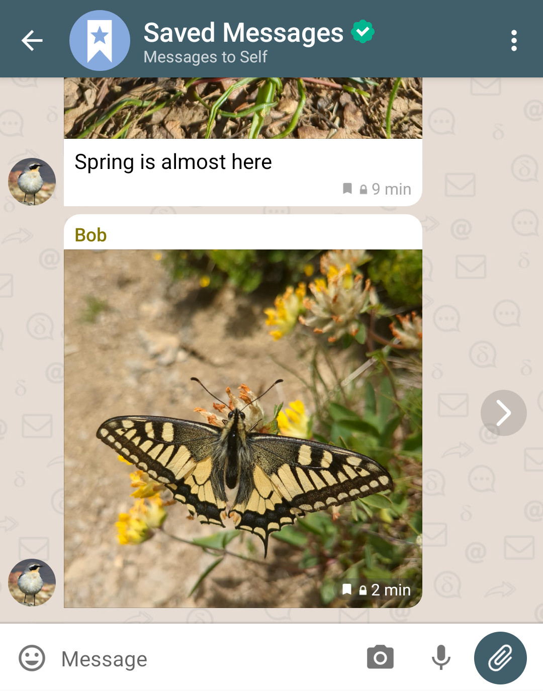
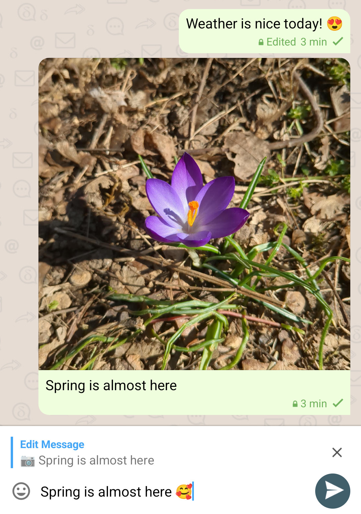
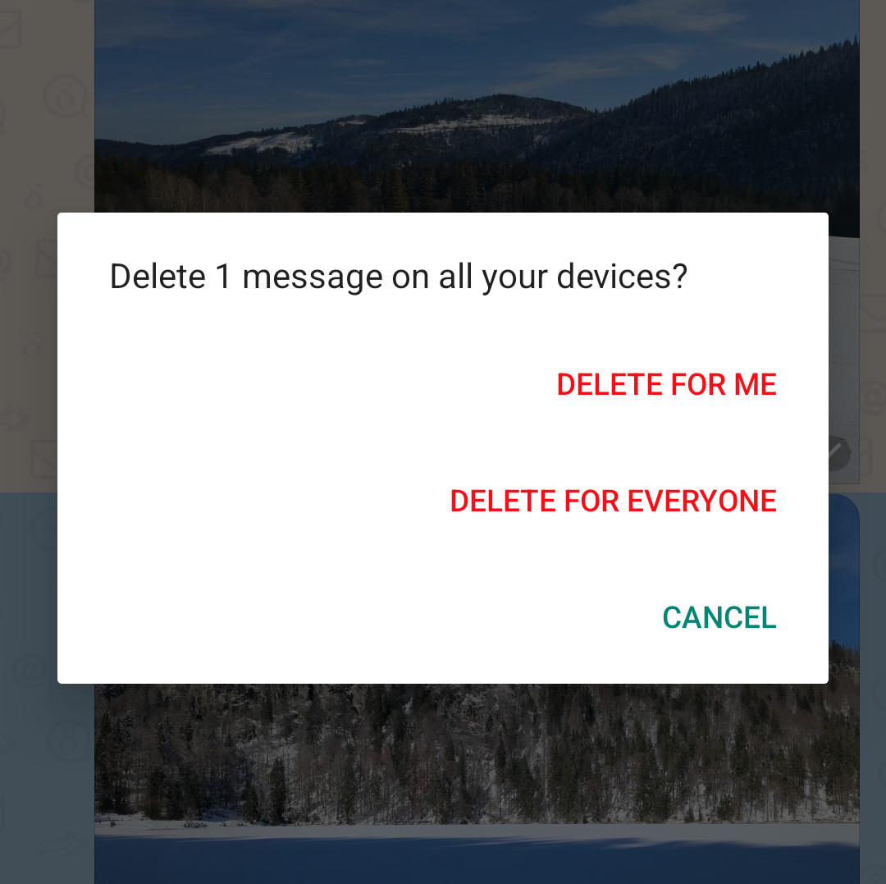

دیگر نیازی نیست بعد از فرستادن پیام سرخ شوید یا در عذاب ذوب شوید!
ویرایش و حذف پیام‌ها اکنون در بیشتر فروشگاه‌های اپ در دسترس است :)

شاید بپرسید این چگونه ممکن است؟
سه ستون اصلی درباره نحوه کارکرد Delta Chat وجود دارد
که شاید به اصلاح تصورات غلط رایج هم کمک کند:

1. **Delta Chat یک کلاینت ایمیل کلاسیک نیست.**
   محتوای پوشه mailbox (IMAP) را به شما نشان نمی‌دهد.
   Delta فقط پیام‌های جدید را می‌گیرد اما هرگز به آن‌ها برنمی‌گردد.
   سرورهای ایمیل فقط به‌عنوان انتقال پیام عمل می‌کنند، نه ذخیره.

2. **Delta Chat از پیام‌های ویژه برای هماهنگی رمزنگاری، فراداده و تعاملات گروه استفاده می‌کند.**
   نمونه‌هایی از پیام‌های ویژه واکنش‌ها، ساخت گروه یا تغییر عضویت،
   پیام‌های همگام‌سازی چنددستگاهی، مذاکره رمزنگاری امن
   و اکنون همچنین ویرایش یا حذف پیام گذشته هستند.

3. **Delta Chat پارادایم پیام‌رسانی Peer-to-Peer را پیاده‌سازی می‌کند**.
   برخلاف سایر پیام‌رسان‌ها از جمله WhatsApp، Matrix، Threema یا Signal،
   **هیچ فراداده یا حالت پیام سمت سرور** نیست پس چیزی برای تغییر وجود ندارد.
   ویرایش/حذف فقط پیام‌های ویژه‌ای هستند که توسط دستگاه‌های طرف‌های چت تفسیر می‌شوند.

با کنار گذاشتن این اصول، بیایید به‌نوبت به ویژگی‌های جدید نگاه کنیم
و شاید با «ذخیره» پیام‌ها قبل از ویرایش یا حذفشان شروع کنیم ;)

## توانمندسازی حافظه «Saved Messages»

وقتی پیامی را به چت «Saved Messages» فوروارد می‌کنید
پیام لینک پرش «>» به پیام اصلی را حفظ می‌کند.
پیام‌هایی که ذخیره کرده‌اید آیکون نشانک کوچک در چت دارند
تا بتوانید به‌راحتی تشخیص دهید که از قبل ذخیره کرده‌اید.
همچنین اقدام جدیدی هنگام انتخاب پیام وجود دارد
تا ذخیره یا نشانک‌گذاری کنید تا در «Saved Messages» ظاهر شود.
بهترین: ذخیره/نشانک‌گذاری همیشه بین دستگاه‌هایتان همگام می‌شود.

## عیش تصحیح غلط املایی: ویرایش پیام‌ها

وقتی پیامی را انتخاب می‌کنید، اکنون می‌توانید شابلون (اقدام «edit») را بردارید
و دوباره مثل پیش‌نویس پیام خواهید بود.
توجه کنید که فقط می‌توانید متن را ویرایش کنید اما نمی‌توانید هیچ پیوستی را تغییر دهید.
پس از فرستادن پیام، همه طرف‌های چت پیام «ویرایش‌شده» می‌بینند،
که در حباب پیام هم نشان داده می‌شود.

## حذف پیام‌ها بین دستگاه‌ها

در گذشته، هر بار که چت یا پیامی را از یک دستگاه حذف می‌کردید
باید به همه دستگاه‌های دیگر می‌رفتید و فرایند را بارها و بارها تکرار می‌کردید.
حالا حذف پیام و چت بدون عرق ریختن بین همه دستگاه‌هایتان همگام می‌شود.
اگر چیزی تصادفی پست کردید (گذرواژه‌ها، فایل‌ها یا عکس‌های اشتباه و غیره)
اکنون می‌توانید پیام‌های خودتان را برای همه در چت هم حذف کنید.

## محدودیت‌های بازنویسی گذشته؟

نه حذف و نه ویرایش در حال حاضر محدودیت خاصی ندارند،
و تاریخچه‌ای از ویرایش‌های پیام وجود ندارد.
می‌توانید پیام خودتان از یک سال پیش را پس بگیرید،
و پیامی را ۱۰ بار ویرایش کنید.
آیا این اتفاق می‌افتد و آزار ایجاد می‌کند؟
اگر چنین شد، به مسائل رسیدگی می‌کنیم و تکرار می‌کنیم.
به‌هرحال، طرف‌های چت خصمانه یا بدخواه راه‌های زیاد دیگری هم دارند
تا فریب دهند و آزار دهند، و ممکن است ایده خوبی باشد که عموماً از آن‌ها اجتناب یا مسدودشان کنید.
در این میان، از قدرت‌های جدید تصحیح غلط املایی، سازمان‌دهی و پس‌گیری لذت ببرید!
