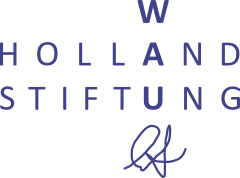

<video controls style="width:560px; max-width: 100%;"><source src="https://delta.chat/video/diff-invitation2-2025.mp4" type="video/mp4"></video>
طی ۷–۱۷ ژوئن بسیاری از مشارکت‌کنندگان ما و پروژه‌های همسایه در فرایبورگ در جنگل سیاه گرد هم می‌آیند.
از بیرون و درون قدیمی‌ترین «مدرسه آزاد و دموکراتیک» آلمان، «Kapriole» استفاده خواهیم کرد.
DIFF فعلاً مخفف «Decentralized Internet Federation Fusion» است.

## چه کسانی می‌آیند؟ در DIFF چه خبر است؟

افراد زیادی از [توسعه‌های chatmail](https://chatmail.at)، از Delta Chat Android/iOS/Desktop/UbuntuTouch، بات‌های چت،
[توسعه اپ webxdc](https://webxdc.org) و همچنین پروژه‌های [Iroh](https://iroh.computer) و [rPGP](https://github.com/rpgp/rpgp) خواهند بود،
و سپس کسانی که با احیای اشتراک‌گذاری فایل Peer-to-Peer درگیرند، یا [Watch2Gether](https://w2g.tv/en/) را توسعه می‌دهند.
افرادی از گروه‌های همبستگی بین‌المللی به ما می‌پیوندند،
یک هنرمند ویدیو و عکس اوکراینی، نوازندگان پیانو و noise
و احتمالاً یک حرفه‌ای تئاتر که در ساخت نمایش «Can you arrest a protocol?» کمک می‌کند
درباره سه پرونده دادگاهی ضد-رمزنگاری ... که ممکن است در طول DIFF اولین نمایش آزمایشی ببیند.

دعوتید به هر کدام از این‌ها بپیوندید.
اگر می‌خواهید دوستان یا همدستان بیاورید، مهمان ما باشید.

## هم‌کاری، هک متقاطع و سرگرمی‌ها

تا ۱۲ مه ۳۰+ نفر خود را برای آمدن تنظیم کرده‌اند،
با حدود یک دوجین که در کل بازه زمانی می‌مانند.
در بعضی روزها، بعضی احتمالاً از فرصت بالا رفتن از تپه‌های نزدیک، پریدن در رودها یا دریاچه‌ها،
یا مشغول شدن به سرگرمی‌های دیگر استفاده می‌کنند.
شاید به‌اصطلاح [Union of Egoists](https://en.wikipedia.org/wiki/Union_of_egoists)
ارجاع کاملاً نامناسبی از نحوه پیش‌رفتن معمول گردهمایی‌هایمان نباشد.
همچنین ممکن است با خواندن گزارش درباره [گردهمایی در کیف چند سال پیش](https://delta.chat/en/2019-05-08-xyiv) حس‌وحال بگیرید.

مدرسه عموماً از صبح تا عصر باز خواهد بود
و همه ممکن است همچنین در گروه‌های کوچک کنار هم بمانند، اتاقی بگیرند و جلسات داخلی پروژه هم انجام دهند.
سعی می‌کنیم مقداری غذا و نوشیدنی تنظیم کنیم. مکان‌های غذای تجاری در فاصله پیاده‌روی هستند.
در بعضی روزها احتمالاً شب‌های ارائه/دمو داریم و عمومی اعلام می‌کنیم.
مکان همچنین به‌طور استثنایی برای حضور بچه‌ها مناسب است و فرایبورگ
عموماً منطقه تعطیلات است، با سفرهای قطار سریع به سوئیس و فرانسه.

## حضور و پیوستن به DIFF

اگر شما، شاید همراه با گروهی از افراد هم‌فکر، می‌خواهید به DIFF بپیوندید، هنوز کاملاً ممکن است!
اگر فردی هستید که به هر یک از موارد بالا علاقه‌مندید، کمک می‌کنیم احساس خانه و خوش‌آمد کنید.
لطفاً به [استانداردهای جامعه](https://delta.chat/en/community-standards) ما توجه کنید.

لطفاً پیام مستقیم به حساب Fediverse ما [@delta@chaos.social](https://chaos.social/@delta)
یا به [آدرس تیم delta](mailto:delta@merlinux.eu) ([لینک دعوت](https://i.delta.chat/#56136E70473FB9E59331D760C007984652839B20&a=delta%40merlinux.eu&n=Delta%20Chat%20team&i=ZVfPYn6j2fvtpc_0M6V45uEP&s=WWjjkBKJJ3So8AfuHGXNjcyE))
بفرستید و از آنجا شما را به گروه چتی اضافه می‌کنیم که از ویرایشگر webxdc و سایر اپ‌های چت برای هماهنگی بیشتر استفاده می‌کند.
باید خودتان برای محل اقامت مراقبت کنید.
همچنین امکاناتی برای اشتراک اتاق یا فضا اگر کمی تجهیزات خواب بیاورید وجود دارد.
DIFF همچنین به‌عنوان بستر آزمایشی برای تنظیم onboarding رویداد و ارتباطات در گروه‌های چت و اپ‌های چت
قبل، حین و بعد از گردهمایی عمل می‌کند.

## سپاس از Wau-Holland Stiftung

سپاسگزار حمایت [Wau-Holland Stiftung](https://wauland.de) هستیم
که موافقت کرد اجاره مکان و کمک‌هزینه سفر را تأمین مالی کند. بسیار سپاس!
