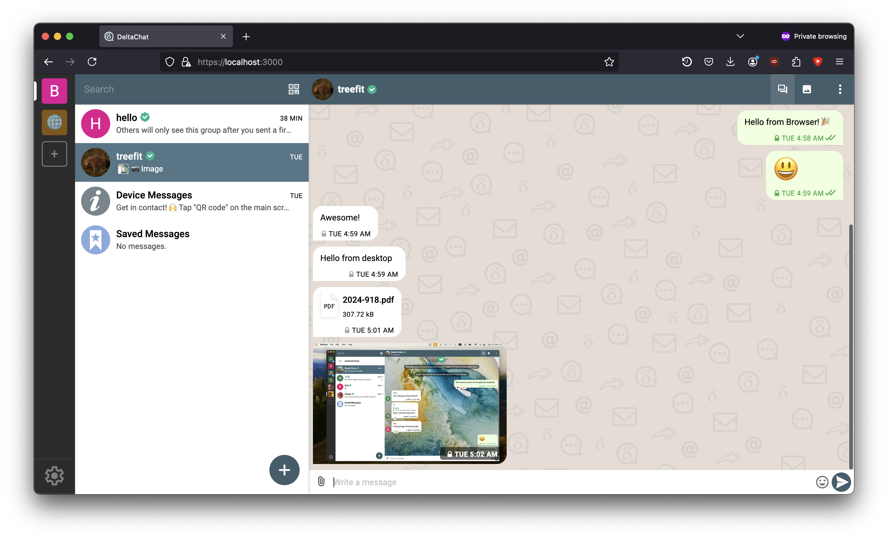
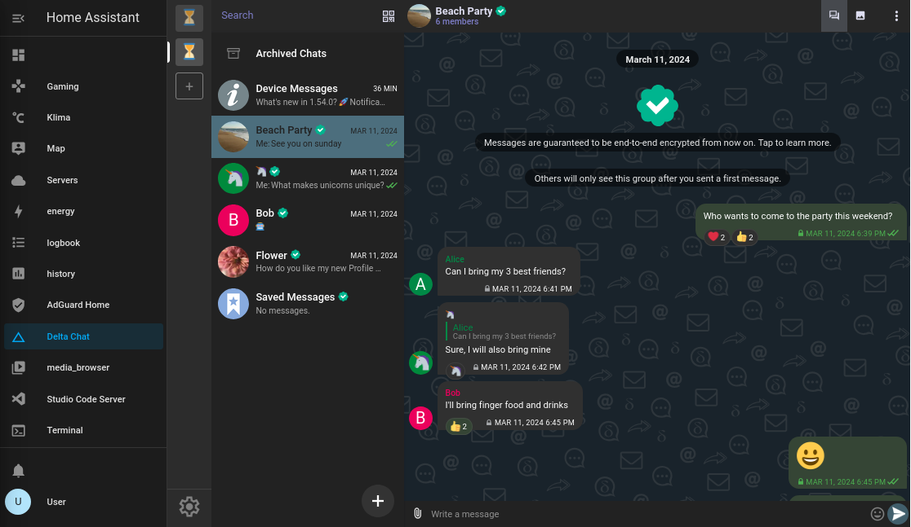
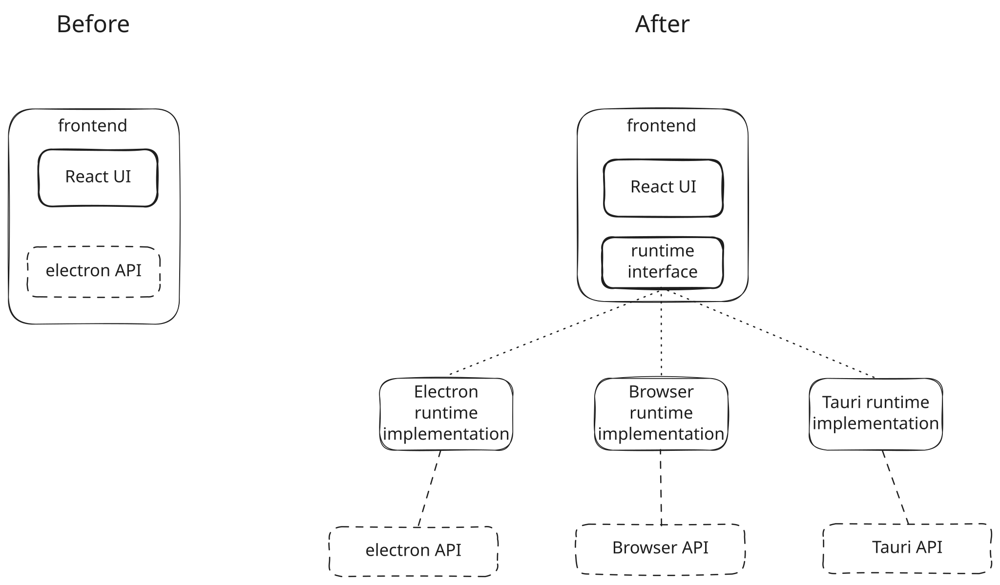

به‌عنوان بخشی از پروژه پورت Delta Chat Desktop از Electron به Tauri[^3]، راه‌اندازی‌ای را نمایش می‌دهیم که اپ دسکتاپ ما در Firefox اجرا می‌شود و دیگر به Electron یا Chromium وابسته نیست. این ویدیو و پست آنچه از قبل کار می‌کند و آنچه کار نمی‌کند را مرور می‌کند و عموماً برای توسعه‌دهندگان و کاربران متخصص هدف‌گذاری شده.

<figure>
    
    <figcaption>
        Delta Chat، در حال اجرا در مرورگر Firefox
    </figcaption>
</figure>

ویژگی‌ها:
- ☑️ کارکرد پایه (مانند ارسال و دریافت پیام)
- 📎 ارسال پیوست‌ها
- 🔔 اعلان‌ها (تا وقتی تب باز است)
- 1️⃣ شمارنده نشان (عدد در عنوان تب)
- 🦊🧭🏐 کار در Firefox، Safari و Chrome
- 🔐 HTTPS با گواهی خودامضا
- 🔑 محافظت با گذرواژه
- ⬇️ دانلود پیوست‌ها یا باز کردن در مرورگر (مفید برای PDF)
- ℹ️ راهنمای محلی هم کار می‌کند
- 🌐 زبان بر اساس مرورگر

اینجا ویدیویی است که نسخه مرورگر را در عمل نشان می‌دهد:

<video controls style="max-width: 100%;" alt="Demo video of the Delta Chat Web version in action"><source src="https://delta.chat/video/browser-edition-blogpost-demo.mp4" type="video/mp4"></video>

هرچند مستقل نیست؛ هنوز به مؤلفه سرور نیاز دارد چون هسته Chatmail[^1] هنوز نمی‌تواند به WebAssembly کامپایل شود تا کاملاً در مرورگر اجرا شود، اما بعداً بیشتر درباره آن.

### چرا نسخه مرورگر ساختیم

پس چرا نسخه دسکتاپی ساختیم که در مرورگر کار کند؟ سه دلیل داشتیم:
1. افراد زیادی به‌درستی وابستگی به Chromium گوگل و Electron پرمصرف[^electron] را نقد کردند.
2. برای دادن دسترسی به ابزارهای توسعه و add-onها روی همه مرورگرها.
3. برای بازگرداندن تست یکپارچه‌سازی خودکار برای Delta Chat Desktop.

### موارد استفاده آینده ممکن {#future-usecases}

راه‌های بسیار بیشتری برای استفاده از این نسخه وب فراتر از موارد ذکرشده وجود دارد:

-  «Delta Chat Web» - هسته را روی دستگاه موبایل اجرا کنید و از رایانه روی شبکه محلی برای تجربه‌ای شبیه WhatsApp web به آن متصل شوید.
- Delta Chat به‌عنوان سرویس (مثلاً شرکتی می‌تواند نمونه‌ها را برای همه کارکنانش میزبانی کند).
- می‌تواند راهی برای پورت Delta Chat به سیستم‌عامل‌های خاص[^2] باشد که مرورگر و پشتیبانی rust دارند، اما پشتیبانی Electron یا Tauri[^3] ندارند.
- اجرای Delta Chat Web روی Raspberry Pi / سرور خانگی و اتصال از دستگاه‌هایتان
	- treefit از قبل [افزونه‌ای برای اجرا روی home assistant](https://codeberg.org/treefit/deltachat-homeassistant-addon) ساخته

<figure>
    
    <figcaption>Delta Chat Web داخل Home Assistant</figcaption>
</figure>

### غوطه‌وری عمیق‌تر در جزئیات فنی

برای مستقل کردن UI وب Delta Chat Desktop از Electron، نیاز داشتیم کدمان را ماژولارتر کنیم:

- به API JSON-RPC سوئیچ کردیم که در [پست وبلاگ قبلی](https://delta.chat/en/2025-02-11-why-jsonrpc-bindings-exist) برجسته کردیم.
- رابط جدید `Runtime` ساختیم و همه فراخوانی‌های مستقیم به Electron را به کلاس `RuntimeElectron` که این رابط را پیاده‌سازی می‌کند منتقل کردیم.
- همچنین تقریباً همه منطق را به کد frontend/UI منتقل کردیم، پس runtimeها حتی برای ساخت و نگهداری ساده‌ترند چون کد کمتر و ساده‌تری دارند.

در عمل، UI مبتنی بر وب کلاینت دسکتاپ از Electron یا Chromium مستقل شد.
برای افزودن Runtime جدید فقط باید رابط runtime را پیاده‌سازی کنید و هنگام شروع اپ بارگذاری کنید.

کد رابط runtime: <https://github.com/deltachat/deltachat-desktop/blob/main/packages/runtime/runtime.ts#L29>

    
معایب و نکات نسخه فعلی مرورگر

    
رویکرد فعلی نکات زیر را دارد که باید در ذهن داشته باشید

    <ol>
        <li>
            اگر مؤلفه سرور را روی VPS میزبانی کنید، آنگاه VPS جایی می‌شود که پیام‌ها رمزگشایی می‌شوند، پس فرض رمزنگاری سرتاسری را می‌شکنید: «دستگاه انتها به دستگاه انتها».
        </li>
        <li>
            باید مؤلفه سرور را برای هر کاربر میزبانی کنید، پس اگر می‌خواهید این را برای پروژه/محصول SaaS استفاده کنید باید نرم‌افزار مدیریت بسازید.
        </li>
        <li>
            در حال حاضر فقط یک کلاینت می‌تواند هم‌زمان به هسته Chatmail متصل شود، چون فقط یک صف رویداد واحد وجود دارد.   اگر همین حالا چند کلاینت متصل کنید، رویدادها را از یکدیگر می‌دزدند.
        </li>
        <li>
            امنیت فعلی می‌تواند بهبود یابد: سرور WebSocket اعتبارسنجی origin انجام نمی‌دهد و لاگین timeout/cooldown روی گذرواژه‌های اشتباه ندارد. اما افزودن آن‌ها آسان خواهد بود.
        </li>
    </ol>
    

        همچنین، بعضی ویژگی‌ها هنوز در نسخه مرورگر غایبند:
    

    <ul>
        <li>اپ‌های webxdc اشتراک‌گذاری‌شده در چت</li>
        <li>نقشه‌ها/location-streaming آزمایشی</li>
        <li>مشاهده ایمیل‌های HTML</li>
    </ul>
    

        این ویژگی‌های غایب، و به‌ویژه sandboxing اپ webxdc، کار بیشتری می‌طلبند. <a href="https://delta.chat/en/2023-05-22-webxdc-security">پست وبلاگ امنیت Webxdc</a> را برای غوطه‌وری عمیق در مسائل ببینید.
    

### آنچه بعد می‌آید به دست‌های کمک‌کننده و مشارکت نیاز دارد

جدا از مسائل یادشده، نسخه وب Delta Chat که کاملاً تضمین‌های رمزنگاری سرتاسری را برآورده کند نیاز دارد کتابخانه هسته Rust Chatmail در مرورگر اجرا شود. Rust عموماً به [WebAssembly (WASM)](https://webassembly.org/) کامپایل می‌شود. مثلاً، کتابخانه رمزنگاری سرتاسری حسابرسی‌شده [rPGP](https://github.com/rpgp/rpgp) کاملاً در Rust پیاده‌سازی شده و به‌طور مداوم با هدف‌های WebAssembly تست می‌شود. با این حال، چالش‌های کلیدی برای نسخه وب «مستقل» وجود دارد:

- یافتن راه‌حل برای ذخیره پایگاه‌داده (در حال حاضر هسته Chatmail از SQLite به‌عنوان کتابخانه C تعبیه‌شده استفاده می‌کند) و تنظیم ذخیره فایل سریع برای فایل‌های رسانه، آواتارها و غیره.

- یافتن راه‌حل برای ناتوانی مرورگرها در انجام پروتکل‌های شبکه SMTP یا IMAP؛ این می‌تواند شامل [رله‌های Chatmail](https://chatmail.at/relays) باشد که رابط HTTP/WebSocket حداقلی برای پر کردن شکاف ارائه دهند.

- پشتیبانی شبکه‌سازی P2P بلادرنگ webxdc و پشتیبانی اجرای [بازی چندنفره بلادرنگ Quake III Arena داخل‌چت](https://chaos.social/@delta/114517181096683376)؛ دوستان ما در [Iroh](https://iroh.computer) خودشان روی نسخه‌های وب کار می‌کنند

- کاوش اینکه کد async Rust هسته Chatmail چقدر خوب می‌تواند در WebAssembly اجرا شود؛ این می‌تواند شامل بازنویسی‌های زیادی باشد.

موضوع [نسخه وب در انجمن Delta Chat](https://support.delta.chat/t/what-would-be-needed-for-a-standalone-web-version-without-a-server-component/3789) را برای بحث بیشتر ببینید.

اگر واقعاً اهل برنامه‌نویسی نیستید، ممکن است سخت باشد بفهمید این مسائل چقدر سخت‌اند.
اما نگران نباشید، حتی اگر برنامه‌نویس باشید، یا حتی با خودمان به‌عنوان متخصص موضوع، پیش‌بینی سخت است :)

## دعوت به DIFF ۷–۱۷ ژوئن در فرایبورگ

بهترین راه برای بحث با بسیاری از ما حضور در گردهمایی حضوری جامعه است. در این سال دیوانه ۲۰۲۵ [به گردهمایی DIFF دعوت می‌کنیم](https://delta.chat/en/2025-05-12-diff-invitation) که فقط چند هفته دیگر شروع می‌شود.

## نیاز به کمک‌های مالی

در حالی که بخشی از کارمان از طریق نهادهای عمومی تأمین مالی می‌شود، بخش زیادی نیست. لطفاً اگر می‌توانید و از تلاش‌هایمان قدردانی می‌کنید و می‌خواهید بیشتر را ممکن کنید [مشارکت پولی بفرستید](https://delta.chat/en/donate). سپاس!

اگر می‌خواهید نسخه آزمایشی مرورگر را خودتان امتحان کنید، دستورالعمل‌ها را در <https://github.com/deltachat/deltachat-desktop/blob/main/packages/target-browser/Readme.md> پیدا می‌کنید.

[^1]: قبلاً به‌عنوان Delta Chat Core شناخته می‌شد. کتابخانه هسته‌ای است که همه پیاده‌سازی‌های UI ما استفاده می‌کنند.

[^2]: به طعم‌های BSD، Haiku، یا سایر سیستم‌عامل‌های نادر علاقه‌مندان فکر می‌کنم

[^3]: Tauri جایگزینی برای Electron است که کوچک‌تر است، چون از web view ارائه‌شده توسط سیستم‌عامل به‌جای گنجاندن کل مرورگر Chromium استفاده می‌کند. همچنین به زبان کامپایل‌شده حافظه‌ایمن rust نوشته شده که مزایای امنیت و سرعت ارائه می‌دهد. به‌زودی پست وبلاگ دیگری با جزئیات بیشتر خواهد بود؛ در این میان می‌توانید در <https://tauri.app/> بیشتر یاد بگیرید.

[^electron]: هرچند باید گفت که علی‌رغم نقص‌هایش، Electron سال‌ها خوب به ما خدمت کرده و سپاسگزاریم که وجود دارد. اما هرگز خوب نیست خیلی وابسته به یک framework واحد باشید، به‌ویژه یکی که این‌قدر منابع تلف می‌کند و برای ما گسترش یا مشارکت بازگشت سخت است.
