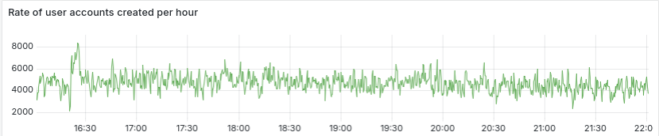
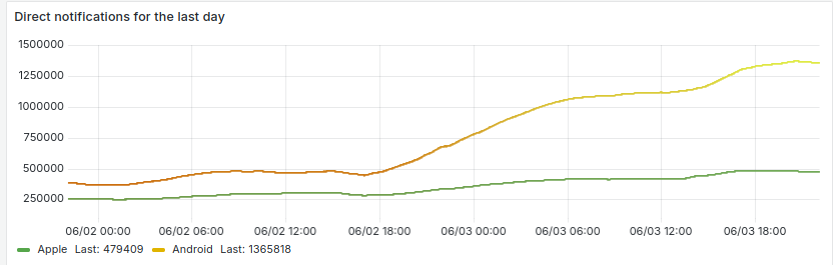
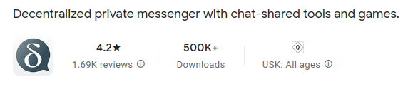

اوایل ژوئن شاهد موج ناگهانی استفاده از Delta Chat به‌ویژه در ایالات متحده و کوبا بودیم.
دینامیک اجتماعی پشت آن را نمی‌دانیم اما احتمالاً کمک می‌کند که
اپ‌های Delta Chat مقاومانه روی همه پلتفرم‌ها کار می‌کنند و رابط کاربری دلپذیری ارائه می‌دهند
که خانواده‌ها، گروه‌ها و جوامع فزاینده‌ای قدردان آن‌اند.
هر چه باشد، بیایید به بعضی شاخص‌های موج اخیر نگاه کنیم،
سپس ریسک‌های تمرکز و تلاش‌های کاهش‌مان را برجسته کنیم.

## ۵۰۰۰ کاربر جدید در ساعت روی رله پیش‌فرض chatmail

حقیقت جالب: پس از بعضی تنظیمات عملکرد Dovecot،
سرور فیزیکی کوچک با
۲۰٪ CPU و ۲۰٪ فشار IO بدون مصرف قابل‌توجه فضای دیسک به کار خود ادامه می‌دهد.

## ۱٫۸ میلیون اعلان push گوگل/اپل در روز

این عدد روزانه پیام‌های ورودی برای کاربران chatmail
که اپشان را از Google Play یا فروشگاه Apple نصب کرده‌اند بازتاب می‌دهد.
کاربران F-droid، دسکتاپ یا ایمیل کلاسیک در این عدد بازتاب ندارند.
تعداد اعلان‌های push روزانه اواخر فوریه ۲۰۲۵ حدود ۳۵۰ هزار بود.

## دانلودهای Google Play اندروید از ۵۰۰ هزار گذشت

توجه کنید که عموماً F-droid یا سایر منابع غیرگوگل برای نصب اپ‌های Delta Chat را توصیه می‌کنیم
و فقط حدس نسبتاً آگاهانه‌ای داریم که حداکثر نصف کاربران اندروید از منابع غیرگوگل استفاده می‌کنند.

## تأمین مالی برای شبکه رله chatmail با مقیاس جهانی

[رله‌های chatmail](https://chatmail.at/relays) جامعه‌محور زیادی در همه قاره‌ها هستند
اما بیشتر کاربران جدید رله onboarding پیش‌فرض در آلمان را انتخاب می‌کنند،
و **مسئله شناخته‌شده پیشنهادهای به‌طور رسمی غیرمتمرکز اما در عمل متمرکز** را بازتولید می‌کنند.
در دو حوزه کلیدی تحقیق و توسعه درگیریم
تا اساساً این گرایش تمرکز را کاهش دهیم
و مقیاس توزیع‌شده همراه با تاب‌آوری و حریم خصوصی بهبودیافته به دست آوریم:

- **تقویت رمزنگاری**: استفاده از آدرس‌های ایمیل به‌عنوان انتقال اما نه به‌عنوان
  منبع هویت؛ پنهان کردن هویت‌های رمزنگاری از انتقال‌ها؛
  و به حداقل رساندن بیشتر دیده‌شدن فراداده در پیام‌ها.

- **چند-انتقال**: اجازه به پروفایل چت برای استفاده از چندین رله chatmail
  به‌صورت قابل‌تعویض، رها کردن کاربران و گردانندگان از «انتخاب‌های مادام‌العمر»
  به نفع انتخاب‌های «تا وقتی کار می‌کند».

با این حال، تأمین مالی عمومی برای این تلاش‌های زیرساختی کلیدی اوایل ۲۰۲۵ ناگهان خشک شد،
و توانایی‌مان برای پیگیری کار همیشه کاربردپذیری‌محورمان را مختل کرد.
اکنون به‌دنبال تأمین مالی کار توسعه کلیدی از طریق کمک‌های مالی هستیم،
با هدف ارائه زیرساخت پیام‌رسانی امن غیرمتمرکز در مقیاس جهانی،
همه باز برای پیوستن طرف‌های ثالث به سرگرمی به‌صورت بدون-مجوز.
دنیای Minecraft-مانند برای پیام‌رسانی.

<a href="https://opencollective.com/chatmail" class="cta-button">کمک مالی به OpenCollective جدید زیرساخت chatmail (اروپا)</a>

<a href="../../en/donate" class="cta-button">کمک مالی به توسعه‌های اپ Delta Chat (Libera, BTC, IBAN, OC)</a>

## هیچ‌چیز مثل گردهمایی‌های حضوری متقاطع‌پروژه نیست: DIFF!

در نهایت نه کم‌اهمیت‌ترین، اگر به جزئیات فنی بیشتر علاقه‌مندید
و می‌خواهید با تیم‌های مشارکت‌کننده و جوامع مختلفمان درگیر شوید،
جای درست [DIFF در جنگل سیاه که این آخر هفته شروع می‌شود](https://delta.chat/en/2025-05-12-diff-invitation) است
یا، وگرنه، فعلاً راهتان را در مخازن توسعه
و ماز پیچ‌درپیچ گروه‌های چت جامعه و مشارکت‌کنندگان پیدا کنید :)
