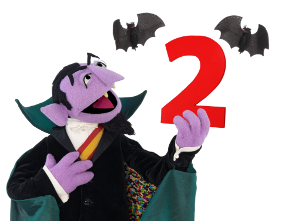
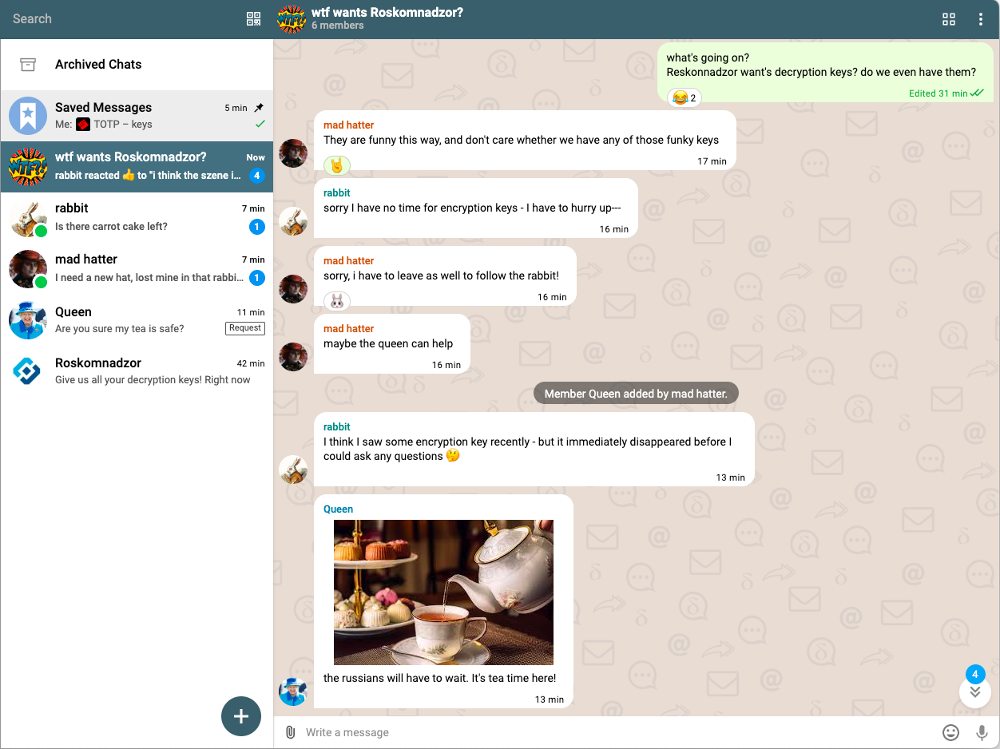
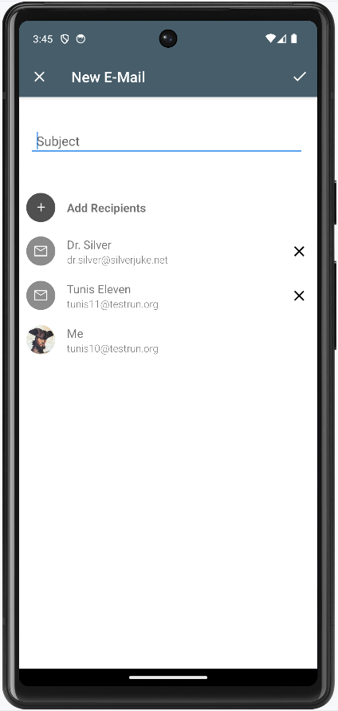
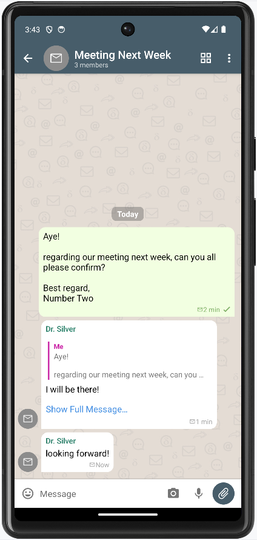
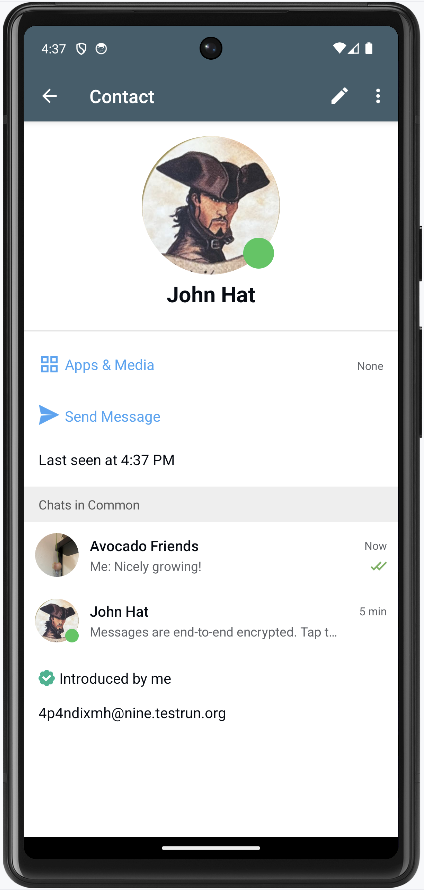
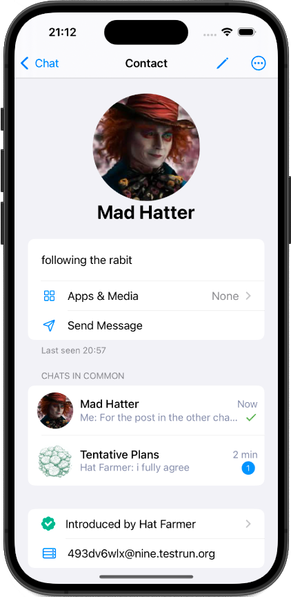
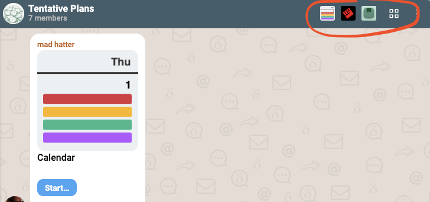

**با Delta Chat نسخه ۲، چت‌ها همیشه و به‌طور پیش‌فرض رمزنگاری سرتاسری دارند.**
قبلاً ممکن بود چت‌های بدون تیک سبز حاوی پیام‌هایی بدون رمزنگاری سرتاسری باشند.
دیگر نه.
در نتیجه، نسخه ۲ همه آیکون‌های قفل، بیشتر تیک‌های سبز و چند دیالوگ «مشکل رمزگشایی» را حذف می‌کند،
رابط کاربری را ساده‌تر می‌کند و کف نتایج امنیتی دنیای واقعی را بالا می‌برد.
بالاخره، بیشتر کاربران نمی‌خواهند در نظریه‌پردازی و بررسی رمزنگاری سرتاسری درگیر شوند.
زندگی واقعی برای زندگی دارند و چالش‌های کافی از قبل برای مقابله.
آن‌ها *فقط* پیام‌رسان قابل‌اعتماد و لذت‌بخشی می‌خواهند که چت‌ها، پیام‌ها و مخاطبینشان را خصوصی نگه دارد.
گفتمان دهه‌ای درباره چگونگی رسیدن به این «فقط» ادامه دارد و انتشارهای V2 سهم ما در آن است.

## انتشار ارتقاهای امنیتی عمده در اکوسیستم‌های فدرال

انتشارهای V2 سازگاری با نسخه‌های قدیمی‌تر را حفظ می‌کنند،
حتی هرچند ارتقای امنیتی عمده را
روی صدها هزار دستگاه، در ده‌ها اپ و بات، در نقاط زمانی نسبتاً تصادفی منتشر می‌کنند.
طی ۸ سال توسعه، هرگز نیاز نداشتیم از کاربران یا توسعه‌دهندگان «ارتقای هماهنگ» بخواهیم
مثل مثلاً [Matrix](https://matrix.org/blog/2025/07/security-predisclosure/)
و [Session](https://getsession.org/blog/groups-v2-how-to-upgrade) در ۲۰۲۵.
اما چگونه از درخواست چنین هماهنگی دردناکی اجتناب کردیم، وقتی سایر پروژه‌های پیام‌رسانی فدرال تقلا می‌کنند؟

**اول از همه،** سیستم ایمیل در مقیاس سیاره‌ای بالغ است
و جداسازی بین پروتکل‌های انتقال و فرمت‌های پیام دارد.
تغییر ناگهانی در پروتکل‌های SMTP که ۳۶۰ میلیارد پیام در روز تحویل می‌دهند وجود ندارد.
پیاده‌سازی‌های سرور آزمایش‌شده در میدان زیاد است.
ارتقای هر یک از [کلاینت‌های chatmail](https://chatmail.at/clients) زیاد
تا حد زیادی نامرتبط به نحوه ارتقای سرورها است.

**دوم،** Delta Chat و همه کلاینت‌های chatmail دیگر
کتابخانه [هسته Rust chatmail](https://github.com/chatmail/core/blob/main/README.md) را تعبیه می‌کنند.
این یعنی یک مکان مرکزی واحد وجود دارد که «حرکت دادن اکوسیستم» می‌تواند پیاده‌سازی شود.
[کار کلیدی v2 در کتابخانه هسته Rust chatmail](https://github.com/chatmail/core/pull/6796)
۴۶۹۶ خط اضافه و ۶۲۹۹ خط حذف کرد، با **حذف خالص ۱۶۰۳ خط کد**.
اساساً نحوه مدیریت «هویت» و رمزنگاری سرتاسری در پیام‌رسانی chatmail V2 را تغییر داد.
کلاینت‌های Chatmail؟
بیشتر از کشیدن نسخه هسته V2، حذف بعضی عناصر UI، تطبیق چند API
و لذت بردن از مزایای امنیتی و سازگاری وسیع نیاز ندارند.
به همان اندازه که به نظر می‌رسد آرامش‌بخش است (به‌جز توسعه‌دهندگان هسته chatmail که بار اصلی را اگر چیزی اشتباه شود تحمل می‌کنند).

**سوم،** توسعه‌های سطح‌پایین هسته chatmail به اهداف UI و UX لنگر شده‌اند،
و شامل [تحقیق مداوم امنیت کاربردپذیر در سیستم‌های پیام‌رسانی فدرال](https://passthesalt.ubicast.tv/videos/always-more-secure-analyzing-user-migrations-to-federated-e2ee-messaging-apps-trimmed/) هستند.
متخصصان پروتکل و رمزنگاری ما محدودیت طراحی‌هایشان را می‌پذیرند
تا با اهداف واقعی UI و UX جور شوند، نه برعکس.
ارائه ارتقای توزیع‌شده روان در سراسر اکوسیستم هدف کلیدی UX است که همه تیم‌ها برای آن هدف می‌گیرند.

**چهارم،** شانس. شاید با در نظر گرفتن همه‌چیز فقط خوش‌شانس بوده‌ایم :)
معماری متمرکز هسته Rust و پروتکل‌های ایمیل بالغ با جداسازی انتقال/محتوا کمک می‌کنند
اما تضمین نمی‌کنند که هرگز مجبور نشویم سؤالات ناخوشایند از کاربران بپرسیم یا طلب بخشش کنیم.
«هیچ‌چیز همیشه کار نمی‌کند» میم دیرپایی در محافل chatmail است، با معنای دوگانه.
احتمالاً حول دومین [گردهمایی ۱۰ روزه در کیف ۲۰۱۹](https://delta.chat/en/2019-05-08-xyiv) ابداع شد.

## رله‌های Chatmail: لایه دوم اجبار E2E

[رله‌های Chatmail](https://chatmail.at/relays) برای onboarding پیش‌فرض کاربران Delta Chat استفاده می‌شوند و

- آدرس‌های ایمیل سازگار تصادفی بدون درخواست هیچ اطلاعات خصوصی ارائه می‌دهند،

- رمزنگاری سرتاسری OpenPGP با بهینه‌سازی فراداده را برای همه ایمیل‌های ارسال و دریافت‌شده اجباری می‌کنند،

- امنیت لایه انتقال (TLS) سخت‌گیرانه و امضای کلید دامنه (DKIM) را اجباری می‌کنند

رله‌ها و اپ‌های Chatmail هر کدام به‌طور مستقل رمزنگاری انتقال و سرتاسری را
در سراسر اکوسیستم رو به رشد جهانی [chatmail امن](https://chatmail.at) اجباری می‌کنند.
رله‌های جدید بر اساس رمزنگاری و استانداردهای IETF به‌طور خودکار سازگارند.
هیچ مجوزی از ما لازم نیست.

## استفاده از ایمیل کلاسیک بهبود یافت اما نیاز به opt-in دارد

نمی‌توانید پیام بدون رمزنگاری سرتاسری دریافت یا ارسال کنید
وقتی با [رله‌های chatmail](https://chatmail.at/relays) onboard می‌شوید،
اما می‌توانید دستی حساب ایمیل کلاسیک راه‌اندازی کنید، همچنین به‌عنوان پروفایل اضافی.
پیام‌های بدون رمزنگاری سرتاسری آنگاه با آیکون نامه علامت می‌خورند.
فقط پروفایل‌های ایمیل کلاسیک اقدام UI جدید «new email» را ارائه می‌دهند
که اجازه می‌دهد موضوع تنظیم کنید و گیرندگان آدرس ایمیل اضافه کنید
قبل از ارسال ایمیل متن‌واضح.
با انتشارهای نسخه ۲، ایمیل‌های بدون رمزنگاری سرتاسری
عموماً آسان‌تر شناخته می‌شوند چون آواتارهای چت هم از همان آیکون نامه کسل‌کننده استفاده می‌کنند
و پیام‌های چت در چت‌های نامه هرگز رمزنگاری سرتاسری نمی‌شوند.

## پروفایل‌های مخاطب روی همه پلتفرم‌ها زیباترند

در حالی که کاربران مشکل کمی در ناوبری هویت‌ها در حلقه‌های خصوصی کوچک دارند،
پروفایل‌های مخاطب جدید زیباتر هدف دارند به ناوبری حلقه‌های چت بزرگ‌تر کمک کنند
جایی که اعضا اغلب اضافه یا حذف می‌شوند.
پروفایل مخاطب جدید هدف دارد به کاربران کمک کند
اعضای گروه و طرف‌های چت را آسان‌تر شناسایی کنند.

## میانبر به اپ‌های اخیراً استفاده‌شده در چت‌ها

همه کلاینت‌های Delta Chat اکنون دسترسی مستقیم در نوار عنوان چت به [اپ‌های webxdc](https://webxdc.org/apps) اخیراً استفاده‌شده ارائه می‌دهند.
برای پس‌زمینه بیشتر، اخیراً درباره کشف پالایش‌شده اپ، اعلان‌ها و یکپارچگی صفحه اصلی نوشتیم
در [جایگزینی پلتفرم‌های میلیاردرگونه با فایل‌های zip](https://delta.chat/en/2025-01-23-webxdc-no-billionaires)،
و درباره معرفی [شبکه‌سازی Peer-to-Peer بلادرنگ](https://delta.chat/en/2024-11-20-webxdc-realtime)،
و سپس [اجرای بازی چندنفره Quake هماهنگ‌شده بین همتاهای chatmail](https://chaos.social/@delta/114517181096683376).

## پس‌نوشت: اکوسیستم chatmail در حرکت است

در ۲۰۱۶، بنیان‌گذار Signal Moxie Marlinspike در [the ecosystem is moving](https://signal.org/blog/the-ecosystem-is-moving/)
ادعا کرد که سیستم‌های فدرال، و به‌ویژه ایمیل، اساساً نمی‌توانند رمزنگاری سرتاسری انجام دهند:

> پس در حالی که خوب است که می‌توانم ایمیل خودم را میزبانی کنم، همین هم
> دلیل این است که ایمیلم رمزنگاری سرتاسری نیست، و احتمالاً هرگز
> نخواهد بود. در مقابل، WhatsApp توانست رمزنگاری سرتاسری را
> به بیش از یک میلیارد کاربر با یک به‌روزرسانی نرم‌افزاری واحد معرفی کند. تا
> وقتی فدراسیون یعنی رکود در حالی که تمرکز یعنی حرکت،
> پروتکل‌های فدرال در جو نرم‌افزاری که امروز حرکت می‌طلبد
> مشکل وجود خواهند داشت. (Moxie Marlinspike ۲۵ ژوئیه ۲۰۱۷)

چالش پذیرفته شد :)
امروز، اکوسیستم [chatmail](https://chatmail.at) از اپ‌ها، سرورها و بات‌ها
اثبات زنده است که پیام‌رسانی رمزنگاری‌شده سرتاسری مبتنی بر ایمیل نه فقط ممکن است،
بلکه حتی انتشار ارتقاهای امنیتی بزرگ در سراسر سیستم فدرال می‌تواند کار کند.
اما پیچش بامزه‌ای وجود دارد که استدلال اصلی «تمرکز یعنی حرکت» Moxie را *تقویت* می‌کند:
[هسته Rust chatmail](https://github.com/chatmail/core/blob/main/README.md)
از نظر یک codebase متمرکز واحد
که در همه [کلاینت‌های chatmail](https://chatmail.at/clients) استفاده می‌شود، Signal را *شکست می‌دهد*.
همه پروتکل‌های فدراسیون و استانداردهای IETF در این یک کتابخانه متمرکز
با یک schema پایگاه‌داده واحد پیاده‌سازی می‌شوند، در حالی که نسخه‌های Android، iOS و Desktop سیگنال
هر کدام از پایگاه‌داده‌های متفاوت استفاده می‌کنند (مهاجرت بین پلتفرم‌ها را سخت می‌کند)
و زبان‌های متفاوت برای پیاده‌سازی شبکه‌سازی، ساختارهای داده سطح بالاتر
یا حتی بعضی ویژگی‌های رمزنگاری مانند [Sealed Sender](https://delta.chat/en/help#sealedsender).

در اتاق‌های ماشین رمزنگاری،
تلاش‌های متمرکز هسته chatmail با کتابخانه حسابرسی‌شده [rPGP Rust](https://github.com/rpgp/rpgp)
که پروتکل‌ها و الگوریتم‌های رمزنگاری سرتاسری پیشرفته را پیاده‌سازی می‌کند هم‌تکامل می‌یابند.
کمتر کسی می‌داند که Delta Chat از همان crate امضای Ed25519 Rust که Signal استفاده می‌کند بهره می‌برد،
که chatmail فقط از *زیرمجموعه حداقلی با دقت انتخاب‌شده* OpenPGP استفاده می‌کند،
و اینکه همکاری OpenPGP امروز بین بازیگران مختلف نسبتاً لذت‌بخش است.
کلاینت‌های Chatmail هیچ جنبه‌ای از پروتکل‌های OpenPGP، TLS یا ایمیل را پیاده‌سازی نمی‌کنند.
هسته تعبیه‌شده Rust chatmail و rPGP همه کار سنگین را انجام می‌دهند،
هر دو با چندین [حسابرسی امنیتی](https://delta.chat/en/help#security-audits) پشتیبانی می‌شوند.

برای کوتاه کردن داستان طولانی، اخیراً درباره [تعهداتمان به فدراسیون](https://chaos.social/@delta/114710708299242142) پست کردیم:

> ما اساساً کاری را می‌کنیم که #signal و به‌ویژه Moxie از انجامش خودداری کرد، یا غیرممکن اعلام کرد: فدراسیون.
>
> هر دو اکوسیستم #email و #activitypub تماماً درباره فدراسیون هستند.
>
> با این حال، #deltachat به‌صورت عمودی متمرکز است به این معنا که همه UIها از همان هسته #rust استفاده می‌کنند که همه شبکه‌سازی، رمزنگاری، منطق چت/گروه/پیام را در یک مکان متمرکز واحد پیاده‌سازی می‌کند. شبکه رله ایمیل اکنون بیش از ۴۰ #chatmail توسط کد متمرکز هدایت می‌شود.
>
> در هر سطح، تکثیر و فدراسیون تعبیه شده است.

## پس‌پس‌نوشت: آنچه بعضی از شما ممکن است کنجکاو باشید

ما [پرسش‌های پرتکرار رمزنگاری و امنیت](https://delta.chat/en/help#e2ee) را بازبینی کردیم
و یادداشت‌هایی درباره [Forward Secrecy](https://delta.chat/en/help#pfs)،
[Sealed Sender](https://delta.chat/en/help#sealedsender)
و [رمزنگاری پساکوانتومی](https://delta.chat/en/help#pqc) گنجاندیم.
برای شنیدن تصوراتمان از امنیت کاربردپذیر و برنامه‌های آینده
می‌توانید [دو سخنرانی امنیتی از ژوئن ۲۰۲۵](https://chaos.social/@delta/114794093068029745) را ببینید.

## پس‌پس‌پس‌نوشت: آنچه کاربران نهایی معمولی می‌پرسند :)

مدتی پیش، والد یک مشارکت‌کننده و کاربر بلندمدت Delta Chat
برگشت و گفت: «همه‌چیز خوب است! اما چرا هر پیام یک کیف دستی دارد؟»

