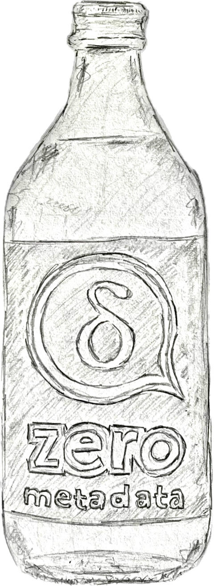
**با آخرین نسخه‌های ۲٫۴۸+،
یک پیام چت تقریباً صفر فراداده به سرورها فاش می‌کند.**
برای رمزنگاران و علاقه‌مندان پیام‌رسان، نکات کلیدی درباره اینکه چگونه ایمیل را خیلی نزدیک به فراداده-صفر کردیم:

**بدون هدرهای Auto-Submitted یا threading متن‌واضح.**
علاوه بر Subject، To و هدرهای عضویت گروه، اکنون همچنین از
Auto-Submitted، References و In-Reply-To محافظت می‌کنیم.
این یعنی همه فراداده هدر معنادار اکنون منحصراً در بخش رمزنگاری‌شده پیام‌ها زندگی می‌کند،
و [Header Protection (RFC 9788)](https://datatracker.ietf.org/doc/rfc9788/) کامل را پیاده‌سازی می‌کند.
سرورهای انتقال فقط یک پاکت بیرونی به‌اصطلاح حداقلی می‌بینند.

**هدر Date تصادفی‌شده.**
Date بیرونی ۵ روز تصادفی است و از همبستگی زمانی
توسط مهاجمان با دسترسی به بایگانی‌های موقت پیام سرور جلوگیری می‌کند.
Delta Chat اصلاً به این هدر نیاز نداشت،
اما تصمیم گرفتیم سازگاری با سایر اپ‌های ایمیل رمزنگاری‌کننده
و سرورهای ایمیل کلاسیک را حفظ کنیم،
که اغلب برای کارکرد اصلاً به این هدر Date بیرونی نیاز دارند.

**SecureJoin v3 هویت‌های رمزنگاری را پنهان می‌کند.**
وقتی کاربر کد QR را اسکن می‌کند یا روی لینک دعوت کلیک می‌کند،
چندین پیام اداری رد و بدل می‌شود
تا چت برقرار و راه‌اندازی رمزنگاری تأیید شود.
[پروتکل جدید SecureJoin (لینک حاوی نقاشی‌های دستی زیباتر!)](https://github.com/chatmail/core/issues/7396)
همه پیام‌های اولیه را رمزنگاری می‌کند،
و همچنین نشان می‌دهد
چگونه پروتکل را ماهرانه تکامل دهید تا هم سازگار به جلو و هم به عقب باشد،
و در نتیجه هیچ اصطکاکی برای کاربران ایجاد نشود.

**دیگر هیچ اطلاعات کلید رمزنگاری در پیام‌های OpenPGP نیست.**
سرانجام [گیرندگان ناشناس OpenPGP را فعال کردیم](https://github.com/chatmail/core/issues/7384)
پس از پنج ماه انتظار تا به همه وقت ارتقای کلاینت‌های chatmailشان را بدهیم.
لطفاً مطمئن شوید همه دستگاه‌هایتان و دستگاه‌های مخاطبینتان حداقل از
[انتشارهای ارتقای امنیتی v2 از اوت ۲۰۲۵](https://delta.chat/en/2025-08-04-encryption-v2) استفاده می‌کنند.
به‌ویژه اپ‌های قدیمی‌تر از ژوئن ۲۰۲۵ ممکن است در غیر این صورت پیام‌های «unable to decrypt» ببینند.

**هنوز «Sealed Sender» نیست،** اما همچنین هیچ شماره تلفن یا داده خصوصی
در رله‌های chatmail ثبت نمی‌شود.
پروفایل‌های Chatmail با آدرس‌های تصادفی ساخته می‌شوند
و بدون درخواست هیچ اطلاعات شخصی.
ایده‌هایی درباره پیاده‌سازی نهایی «Sealed Sender» داریم،
اما محتمل‌تر است اول به [پشتیبانی Autocrypt2](https://autocrypt2.org) هدف بگیریم؛
پیش‌نویس مشخصات جدید IETF برای رمزنگاری پساکوانتومی و حذف قابل‌اعتماد («Forward Secrecy»).

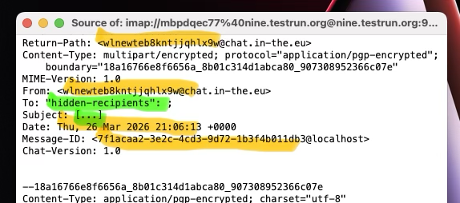 _نارنجی: تصادفی، سبز: پنهان، هر چیز دیگر: بدون داده معنادار_

## تماس‌های بومی روی Android و iOS!

تماس‌های صوتی و تصویری روی Android و iOS
اکنون مثل تماس‌های تلفنی بومی رفتار می‌کنند:
می‌توانید **تماس را در پس‌زمینه نگه دارید**
در حالی که به چت متفاوت یا حتی اپ دیگری سوئیچ می‌کنید.
مورد استفاده مفید دیگر **صحبت هنگام بازی** بازی‌های داخل‌چت مثل شطرنج است!
زیر پوست، تماس‌ها از [WebRTC](https://github.com/deltachat/calls-webapp) peer-to-peer
با signaling از طریق پیام‌های معمولی Delta Chat استفاده می‌کنند.
ویژگی هنوز پشت تنظیم «debug calls» است اما احتمالاً در انتشار بعدی دیگر نه.

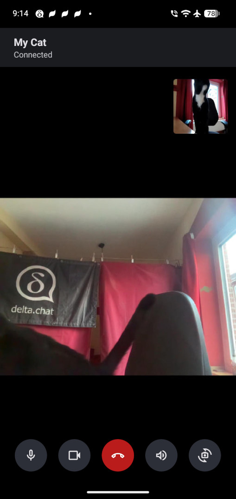
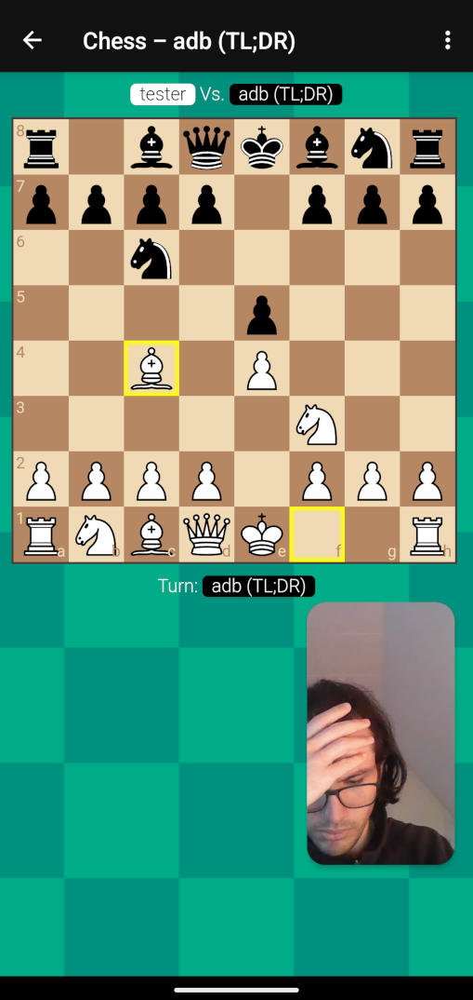 &nbsp; &nbsp;
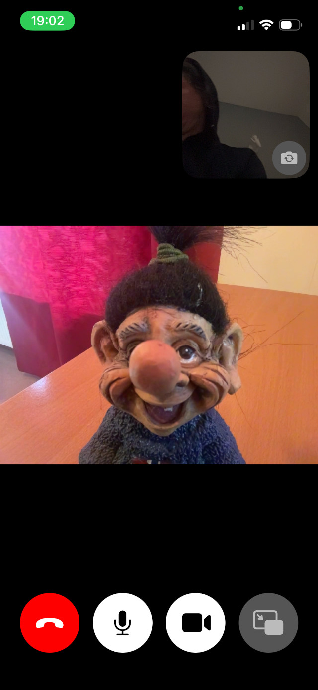
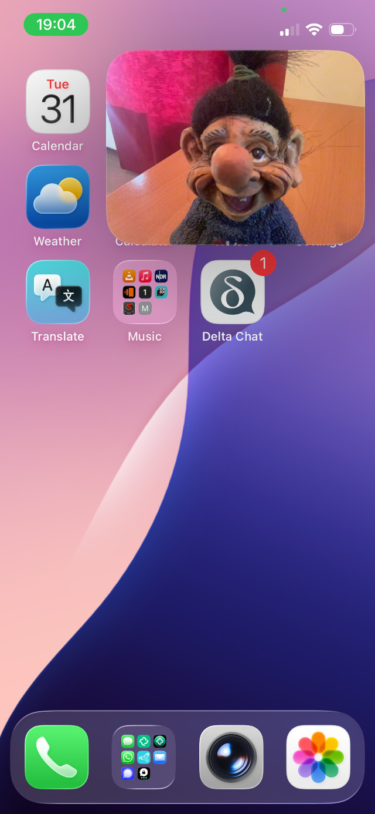

## تماس‌های تصویری بومی روی DeltaTouch (Ubuntu Touch)

گوگل و اپل مراجع متمرکز بسیار مشکل‌سازی برای اکوسیستم موبایل هستند،
به همین دلیل از توسعه‌ها روی **اکوسیستم‌های موبایل جایگزین**
تا حد توانایی‌ها و منابعمان پشتیبانی می‌کنیم.
خوشبختانه، بعضی اهداکنندگان خصوصی از توسعه DeltaTouch به‌خصوص پشتیبانی می‌کنند؛
کلاینت Delta Chat تقریباً هم‌تراز ویژگی که روی بسیاری از پلتفرم‌های «Lomiri» در دسترس است.
DeltaTouch اخیراً همچنین **تماس‌های صوتی/تصویری سازگار با Delta Chat و همه کلاینت‌های chatmail دیگر** را فرود آورد.
اگر دانش و علاقه C++ و QT دارید،
حتماً کمک در [مخزن Codeberg DeltaTouch](https://codeberg.org/lk108/deltatouch)
و توسعه‌دهندگان دوستانه و ماهر پشت آن را در نظر بگیرید.

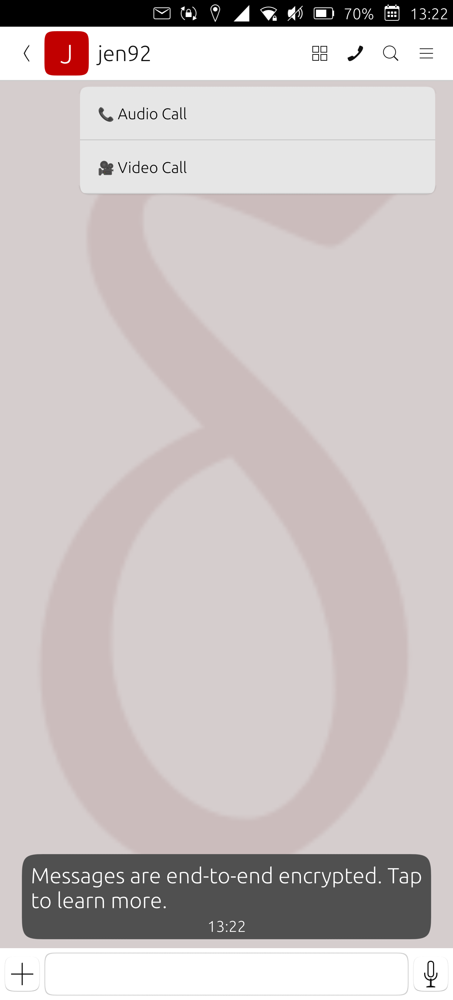 &nbsp;
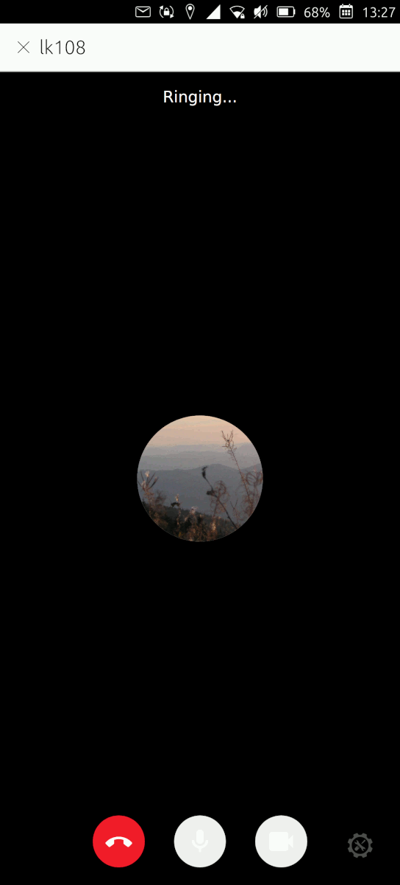 &nbsp;
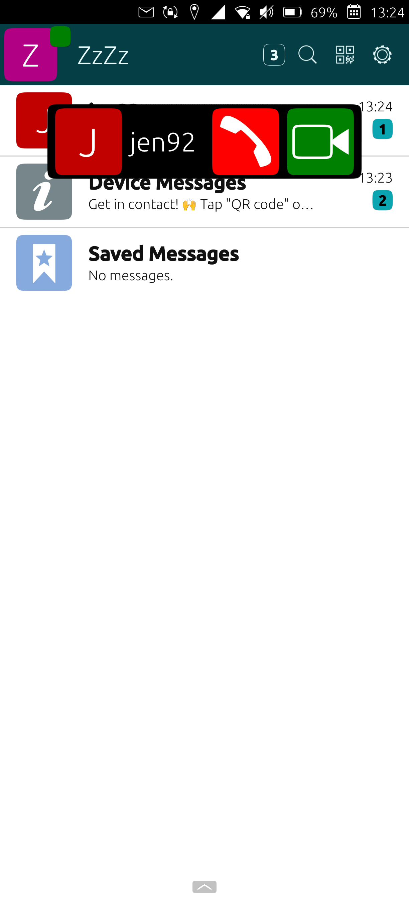 &nbsp;
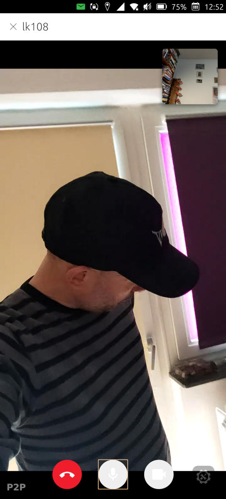

## توضیحات گروه و کانال

گروه‌ها و کانال‌های پخش اکنون از [توضیحات](https://github.com/chatmail/core/pull/7829) پشتیبانی می‌کنند
که اعضا در پروفایل گروه می‌بینند.
توضیحات رمزنگاری سرتاسری‌اند و با افزودن اعضا همگام می‌شوند،
و گفتن اینکه گروه درباره چیست به اعضای جدید را آسان می‌کنند.

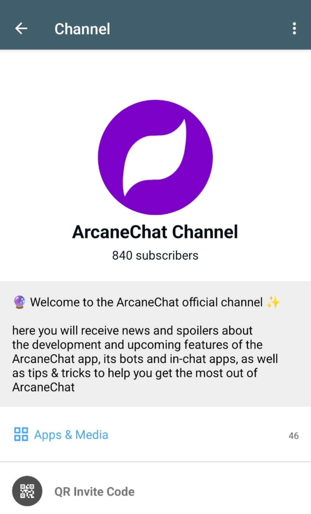 &nbsp;
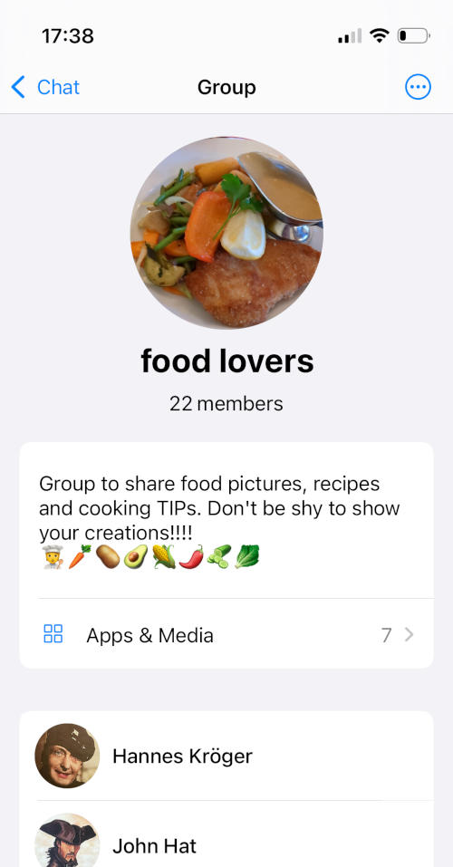

## پخش‌کننده پیام صوتی پس‌زمینه

برای کسانی از ما که دوست دارند از طریق پیام‌های صوتی تعامل کنند، این طلاست:
هم دسکتاپ و هم اندروید اکنون از **پخش پیام‌های صوتی در پس‌زمینه** پشتیبانی می‌کنند.

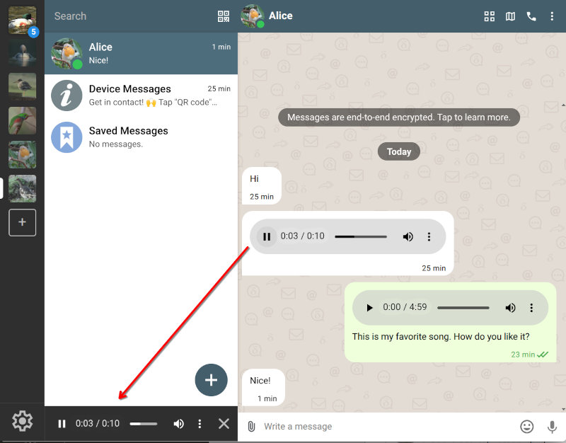
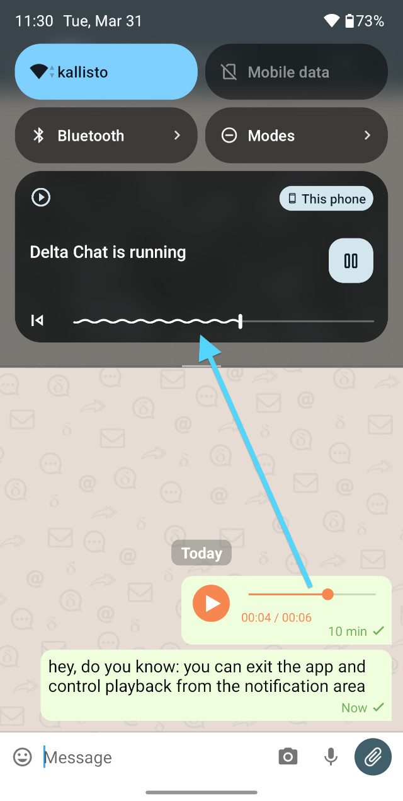

## دانلود بر اساس تقاضا بازطراحی شد (چه سفری!)

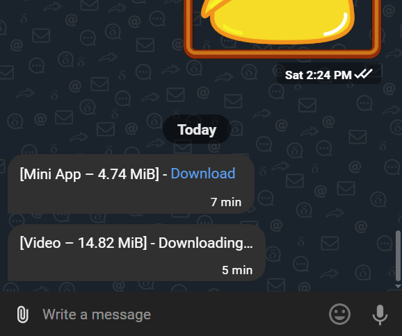

مجبور شدیم ویژگی سال‌ها قدیمی «download on demand» را اساساً دوباره پیاده‌سازی کنیم،
چون به «هدرهای متن‌واضح» تکیه داشت که دیگر در دسترس نیستند (مقدمه فراداده-صفر بالا را ببینید).
برای پیام‌های بزرگ‌تر و پیام‌های با پیوست،
Delta اکنون داخلی دو پیام می‌فرستد، یکی کوچک و یکی بزرگ.
این به گیرنده‌ها انتخاب می‌دهد اول همه پیام‌های کوچک را دانلود کنند،
و به‌طور خودکار یا اختیاری پیام‌های بزرگ‌تر را دانلود کنند:

- تماس‌ها می‌توانند بدون اول دانلود احتمالاً مگابایت‌ها پیوست رد شوند.

- اعلان‌های Delta Chat iOS بدون کرش روی پیام‌های بزرگ کار می‌کنند.

- پیام‌های هنوز کاملاً دانلودنشده درست در چت‌ها قرار می‌گیرند (به‌جای پیام‌های ایمیل ۱:۱ عجیب).

هنوز از چند کاستی خبر داریم اما باید بیشتر فقط خوب کار کند.
برای علاقه‌مندان به گستره تلاش‌های پیاده‌سازی گذشته و در حال انجام،
[«pre-messages» را جستجو کنید](https://github.com/chatmail/core/issues?q=pre-message)
و دعا کنید زیرساخت ظاهراً فزاینده vibe-coded گیت‌هاب نتایج را عطا کند.

## نیازهای کاربر «در معرض خطر»: ۱. در دسترس بودن ۲. تلگرام ۳. امنیت

بیش از یک دهه، پیام‌رسان‌های امنیت‌محور تشویق شده‌اند
که با جدیدترین پروتکل‌های رمزنگاری همگام شوند، و Signal اغلب به‌عنوان استاندارد طلایی ذکر می‌شود.
با انتشارهای فعلی در حال بستن شکاف‌های امنیتی و حریم خصوصی بین Delta Chat و Signal هستیم.
اما می‌خواهیم با مهربانی به همه یادآوری کنیم که تلگرام به بیش از یک میلیارد کاربر رسیده.
یک میلیارد نفر! بسیاری از آن‌ها تجربه کاربری و ویژگی‌های UI را اولویت می‌دهند،
و با خوشحالی محتوای پیام و فراداده را به دستان میلیاردر
آقای پاول دوروف می‌سپارند، که چیزی بیش از نگرش «به من اعتماد کن، داداش!» ارائه نمی‌دهد.
مهارتش در پروپاگاندای امنیتی از هیچ‌کس دوم نیست!

<a href="https://chaos.social/@delta/116243542449596112">
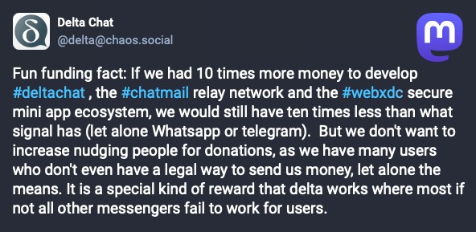
</a>
Delta Chat همیشه پروژه عمل‌گرای UI-محور بوده.
هدفمان ارائه **ویژگی‌هایی است که کاربران انتظار دارند بدون دام‌های تمرکز و انحصار**.
حتی با منابع محدود نسبت به غول‌های فناوری
جدیدترین انتشارهایمان همچنان کاربردپذیری و ویژگی‌های UI مدرن را پیش می‌برند.
رویایی غیرممکن برای کاربران کانال‌های تلگرام،
**کانال‌های پخش رمزنگاری‌شده Delta Chat** در حال تکامل برای ارائه **جایگزین امن‌تر و خصوصی‌تر** هستند.
همچنین، [چالش عمومی «پیام‌رسانی با onboarding راحت‌تر پیدا کنید»](https://chaos.social/@delta/115479392746850836)
ما برای ارسال‌ها باز می‌ماند. هنوز رقیب قوی‌ای ظاهر نشده :)

با ورود به ۲۰۲۶، ظهور اقتدارگرایی تاب‌آوری ارتباطات را
برای تعداد فزاینده‌ای از کاربران «در معرض خطر» همه‌جا حیاتی می‌کند.
**اگر ابزاری مسدود یا در دسترس نباشد،
ویژگی‌هایش، امنیتی یا غیره، دقیقاً صفر فایده دارند.**
در دسترس بودن دنیای واقعی خودِ بنیاد امنیت در موقعیت‌های اضطراری است،
و در این زمینه، اپ‌های Delta Chat احتمالاً از هیچ‌کس دوم نیستند.
حتی [نیویورک تایمز به نظر موافق است](https://www.nytimes.com/2026/03/31/world/europe/russia-internet-restrictions.html)
و هنوز کاملاً از توسعه ویژگی‌های تاب‌آوری بیشتر دست نکشیده‌ایم ...

## به حداکثر رساندن در دسترس بودن و تاب‌آوری از طریق تحویل چندمسیره

سیستم‌های پیام‌رسانی تک‌مسیره از نقص بنیادی رنج می‌برند:
اگر سرور اصلی‌تان مسدود شود یا پایین بیاید، ارتباط متوقف می‌شود.
سرویس‌های متمرکز مانند Signal، WhatsApp یا Telegram به‌راحتی هدف قرار می‌گیرند
و اگر خودشان پایین بیایند، هیچ درمانی اصلاً نیست.
همچنین Matrix غیرمتمرکز نیاز به وابستگی به یک home server واحد دارد،
و نقطه شکست واحد پایدار ایجاد می‌کند.

انتشارهای جدیدمان **تحویل پیام چندمسیره تاب‌آور** را معرفی می‌کنند.
هر پروفایل اکنون می‌تواند از چندین رله یا سرور ایمیل برای ارسال و دریافت پیام استفاده کند.
اگر یکی مسدود شود، پیام‌ها به‌طور خودکار از دیگری جریان می‌یابند.
با اتصال به [شبکه رو به رشد رله‌های chatmail](https://chatmail.at/relays)،
کاربران Delta Chat سرانجام می‌توانند افزونگی واقعی لایه انتقال به دست آورند،
و گردانندگان انتقال می‌توانند بهتر بخوابند
با دانستن اینکه اگر رله‌شان پایین بیاید از چت کاربران جلوگیری نمی‌کند.
می‌توانید آن را به‌عنوان ارائه چندین مسیر فرار برای کسانی تصور کنید
که می‌خواهند از چشم همه‌بین نظارت و کنترل متمرکز بگریزند.
برای متخصصان Rust علاقه‌مند به پیاده‌سازی،
از [issue توسعه «multi-relay»](https://github.com/chatmail/core/issues/7357) شروع کنید.

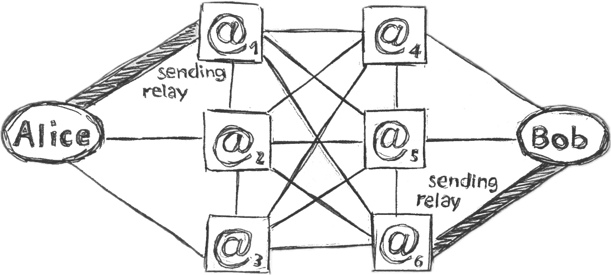 
_هر یک از دو رله آلیس یا باب می‌تواند شکست بخورد، اما چت کار می‌کند_ &nbsp;

در حال حاضر، افزودن رله‌های ثانویه گام دستی در «Advanced Settings -> Relays» است.
**قبل از فعال کردن این ویژگی مطمئن شوید همه دستگاه‌هایتان به نسخه ۲٫۴۸ یا بعد ارتقا یافته‌اند**.

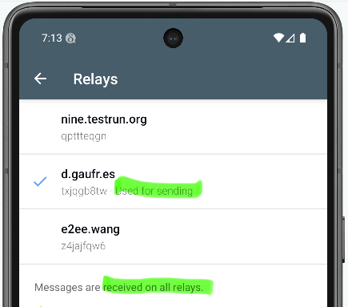

پس از انجام تحقیق بیشتر و روان‌سازی تکراری عملیات چندمسیره،
هدفمان خودکارسازی فرایند onboarding است تا پروفایل‌ها به‌طور ارگانیک درباره رله‌های جدید بیاموزند.
هدف دیوانه‌وار برای خودمان می‌گذاریم:
ارائه تجربه پیام‌رسانی اینترنتی توقف‌ناپذیر، در مقیاس سیاره‌ای و بسیار خصوصی،
در حالی که از پروتکل‌های پیام‌رسانی اینترنت IETF (ایمیل) استفاده و بهبود می‌دهیم،
با فضا برای توسعه‌ها، تطبیق‌ها و تنوع‌های جامعه در هر سطح.

اگر می‌خواهید از تلاش‌هایمان پشتیبانی کنید، لطفاً
[مشارکت یا کمک مالی](https://delta.chat/en/contribute)،
اجرای [رله chatmail](https://chatmail.at/relays)،
یا کاوش در بیابان لذت‌بخش استفاده یا ساخت [مینی‌اپ‌های امن](https://webxdc.org)
بدون وابستگی به هیچ فروشگاه اپ یا سرور میزبانی را در نظر بگیرید.

♥ **سپاس برای دنبال کردن و حمایت از ما** ♥
