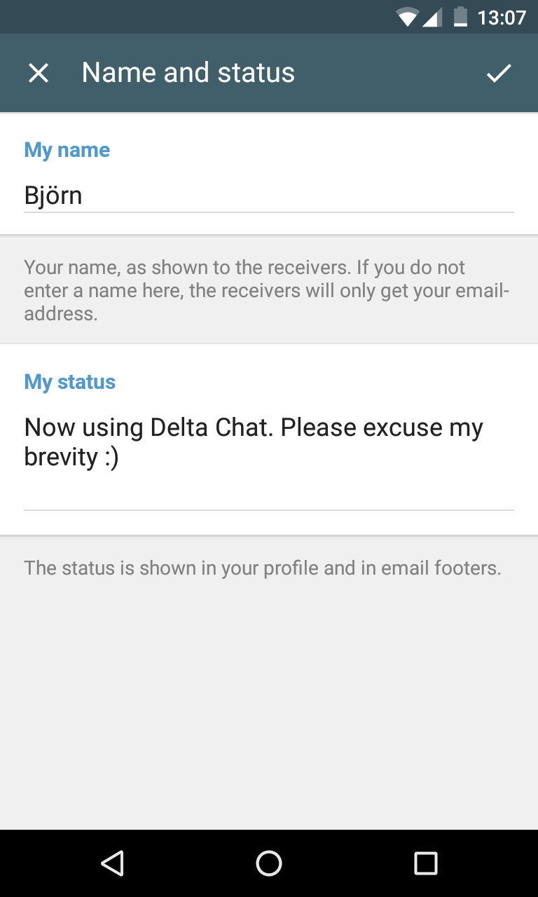

Back from the summer break: Delta Chat 0.9.4 with new **Group images**, new **Status** functions, **Locale** updates 
[and more](https://github.com/deltachat/deltachat-android/blob/master/CHANGELOG.md#unreleased) is out - and already
available on [F-Droid](https://f-droid.org/packages/com.b44t.messenger/) just in this moment :)

Regarding translations: Also this homepage is translateable - our newest language is Italian - [delta.chat/it](https://delta.chat/it) - Grazie, Claudio!

Finally, we also like to thank [NEXTLEAP](http://nextleap.eu/) to get involved in Delta Chat in various ways.

