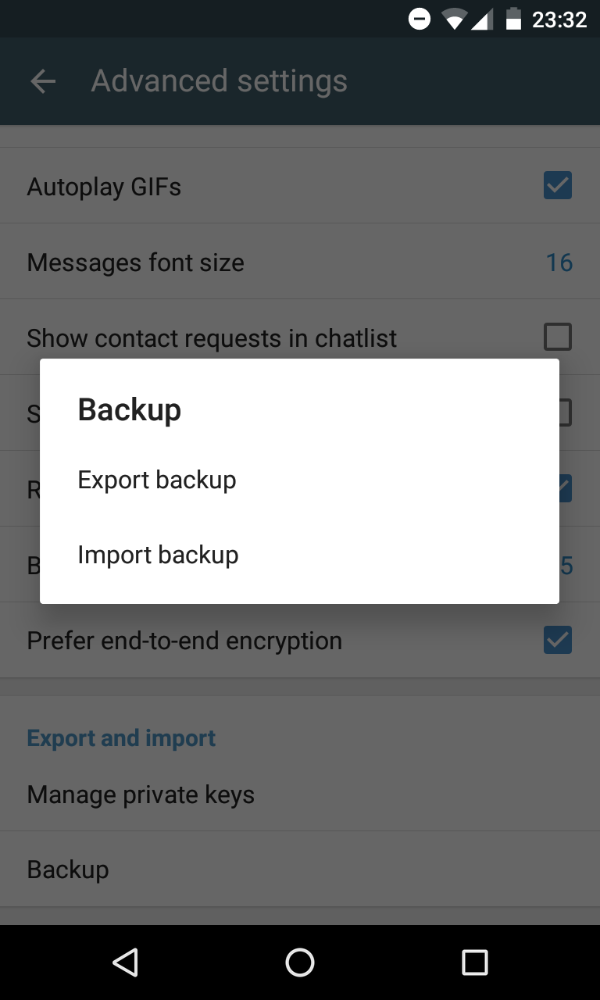

Here is Delta Chat 0.9.5 with a new **backup functionality.**
The function writes all relavant data to a single file - this includes all chats, images, contacts, videos, voice messages, all files and more.
When you reinstall the app later - either on another device or from another source -, you can import the exported file just in the "Welcome" screen.
Very useful :)

Further changes are ...

* Backup export and import function
* Query password before export
* Move replies from normal E-Mail-Clients to the "Chats" folder
* Improve helping MUAs on showing chat threads
* Improve onboarding
* Add URL to default footer
* Test a different approach for battery saving in this release
* Update French, Italian, German, Polish, Portuguese, Russian and Ukrainian translations

... we did not finish the "reduce unwanted messages" issues and there are still some things to test for battery - however, we did not want you to wait too long for the
other features - so, here it is - as always available on [F-Droid](https://f-droid.org/packages/com.b44t.messenger/) in the next time.

BTW: Also this homepage is translateable - our newest language is Russian - [delta.chat/ru](https://delta.chat/ru) - Спасибо, Dmitry!

And another thing: We are always searching for **testing devices.** 
If you have some older, but functional, Android or iOS (!) devices in your drawer - if you do not need them any more, feel free to send them to 
_Delta Chat, Friedrich-Ebert-Str. 1 B, 25348 Glückstadt, Germany_
