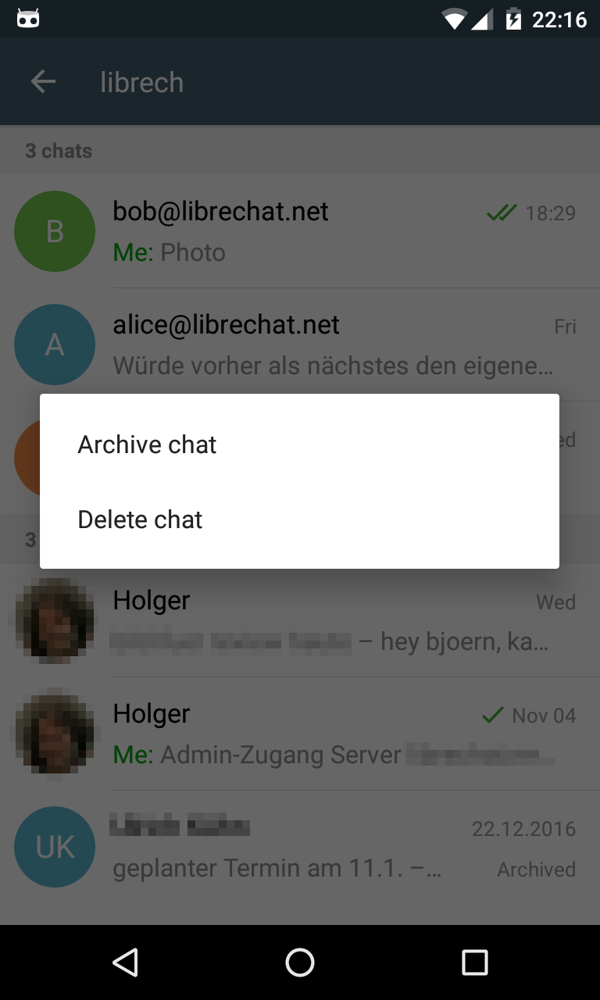

We've just released Delta Chat 0.9.7, with some new major features:

* **Archive chats** by a long press
* Notify the user in the chatlist about contact requests of known users or of other Delta Chat clients
* Show messages only for explicitly wanted chats
* [and more ...](changelog)

As always, the version will be available on [F-Droid](https://f-droid.org/packages/com.b44t.messenger/) soon.

Moreover, there are good news for all **iPhone and iPad** users: Jonas and Basti have started Delta Chat for iOS :)

Of course, this will take its time, but its on the way.  I took the chance and cleaned up the core library (which is the same on Android and iOS)
and start documenting it - [deltachat.github.io/deltachat-core/html](https://deltachat.github.io/deltachat-core/html/) - 
which will be hopefully useful for upcoming binding to other languages and systems (yes, there are some plans :)

EDIT: Just hours after 0.9.7 I released 0.9.8 with a [bugfix](changelog); I think the latter one will overtake the buggy one on F-Droid. Sometimes it is good that F-Droid is not _that_ fast :)
