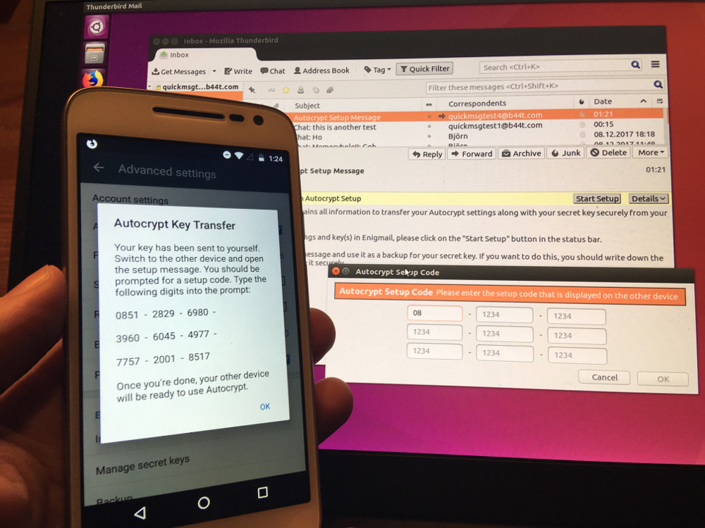

After months of working on different things but the Autocrypt Setup Message, well, finally it is done :)

But wait - **what _is_ the Autocrypt Setup Message?**

Well, the Autocrypt Setup Message solves the problem about how to 
**transfer secret key data in an convenient and secure way** to another device.

For this, one just initiates the transfer on the _source device_ (left) and enter the displayed code on the _target device_ (right):

This works with all clients implementing the new Autocrypt standard, eg. from _Delta Chat_ (left) to _Thunderbird/Enigmail_ (right):

But there are even more new features in this new release, eg. with the **Gossip**
function, in a group chat all public keys of all recipients are sent together
with encrypted messages. This allows all group members to reply encrypted without 
worrying about keys.  
The gossip feature is not visible and works completely automatically in the background - but you will notice it in group chats by the ability to reply encrypted :)

The version is available in the [Downloads section](download) now
and on [F-Droid](https://f-droid.org/packages/com.b44t.messenger/) soon.

## What else?

* On the [Internet Freedom Festival](https://internetfreedomfestival.org/) in Valencia, 
  there is going to be an [Autocrypt Intro + Demonstration session](https://platform.internetfreedomfestival.org/en/IFF2018/public/schedule/custom/238)
* Delta Chat has a [french homepage](https://delta.chat/fr/) now - Merci, Arnaud :)
* The Delta Chat homepages default to _HTTPS_ now and use [HTTP Strict Transport Security](https://en.wikipedia.org/wiki/HTTP_Strict_Transport_Security) to protect against protocol downgrade attacks

