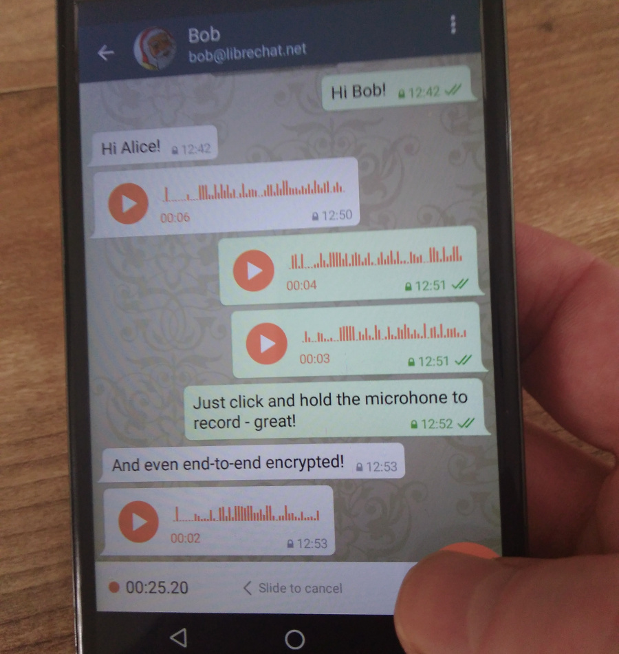

Delta Chat supports **voice messages** for some time, however, there were some 
issues with them that we have fixed in [Delta Chat 0.15.0](download).

The voice messages should work on all devices now and the waveform should be
rendered properly. To record and send a voice message, just
**click and hold the microphone in the lower right corner:**

Further changes can be found in the [Changelog](../en/changelog)
and, as always, it will take some days until the F-Droid version is updated.

## Elevate Festival

Xenia and Holger are going to participate in a panel
["Risk a radical shift"](https://elevate.at/diskursprogramm/e18radicalshift/)
and a session
[“Riot in the Matrix – What’s next?”](https://elevate.at/diskursprogramm/e18riotmatrix/)
involving Autocrypt and Delta Chat as topics.

"The [Elevate Festival](https://elevate.at/) is an annual festival that takes
place around the Schloßberg in Graz, Austria. The aim of the festival is to
create a better understanding of the most important issues of our time and to
discuss groundbreaking alternatives, innovative projects, and various intiatives
in the realm of civil society, social movements and dedicated activisms."
\[[Wikipedia](https://en.wikipedia.org/wiki/Elevate_Festival)\]

## What else?

* Delta Chat has a new **Albanian homepage** at <https://delta.chat/sq/>, thank you Besnik!
* On the [Internet Freedom Festival](https://internetfreedomfestival.org/) in Valencia, 
  there is going to be an [Autocrypt Intro + Demonstration session](https://platform.internetfreedomfestival.org/en/IFF2018/public/schedule/custom/238)

