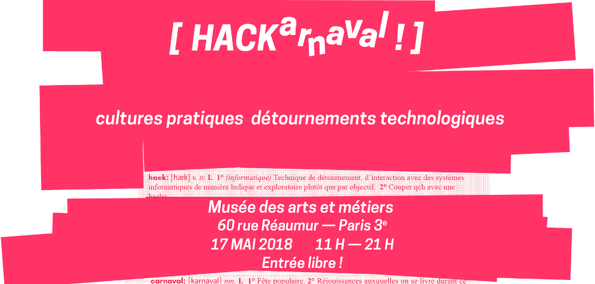

Janka and Holger are going to have a session in the track "Securité Informatique" on
the HACKarnaval in Paris: ["Delta.chat, introduction pratique"](https://hackarnaval.online/abstracts-fr/delta-chat.html)

Planned topics are a quick intro to how Delta.chat works and how it satisfies the EU General Data Protection Regulation (GDPR) followed by a hands-on-session.

The session will start on Thursday, May 17th at 11 am, Musée des arts et métiers, 60 rue Réaumur, Paris. The entrance is free.

UPDATE: There is also another session about Autocrypt and probably [EFAIL](2018-05-15-delta-chat-not-vulnerable-to-efail): Holger's service announcement: _Intending to inject talking about EFAIL, skys falling during this session:_ [Securing Autocrypt: Reversing the Panopticon](https://hackarnaval.online/abstracts-fr/autocrypt.html)
