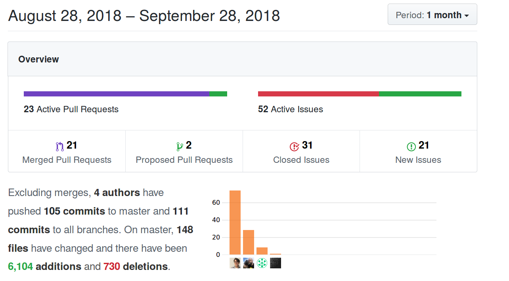
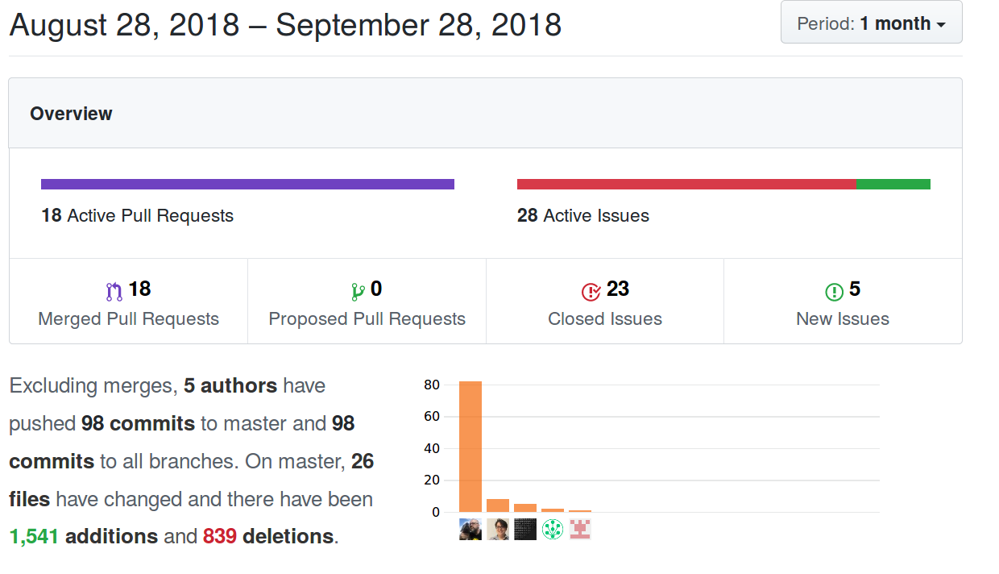
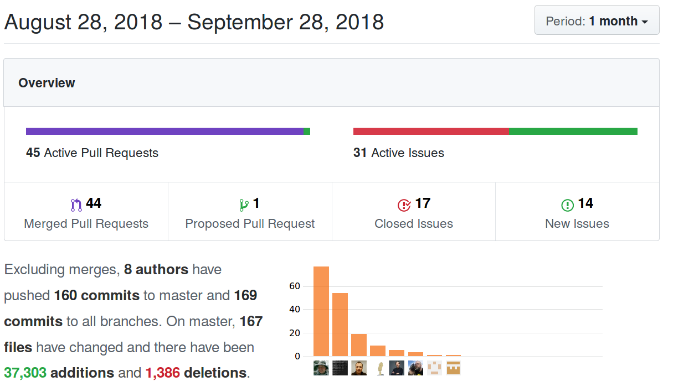
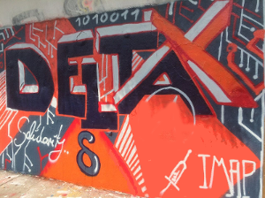

Following this blog or the mailing list you might think not much is happening
with Delta.Chat but ... nothing could be further from the truth :) 
An incredible lot has happened and is happening but communication 
happened in different ways:

- **in issues/pull-requests in the various [development
  repositories](https://github.com/deltachat)**
  Some repositories are quite new, like the Delta/Desktop one which uses the node-bindings
  from Delta/Node.  Here are "activity screenshots" from three core github repos
  for the last month:

  **deltachat-desktop github activity Sept 2018**
  

  **deltachat-node bindings github activity Sept 2018**
  

  **deltachat-core and python bindings github activity Sept 2018**
  

- **on our informal chat** -- with 4814 human posted lines in the
  freenode #deltachat channel in September 2018 alone.  Btw, 
  you may [join the chat through the web](https://webchat.freenode.net/?channels=deltachat) 
  but in order to post you need to register by typing
  `/msg nickserv register PASSWORD EMAIL` which will ask a confirmation
  e-mail. Without registration you can read but not post messages. 

- **during a one-week "Delta-X" gathering of 20-30 people end July
  2018** in Freiburg (see below for a bit more info).  There is nothing like
  meeting up in person in a stimulating, relaxed sourrounding and getting 
  away from sitting isolatedly in front of screens.  Just talking
  about the ongoings of this week would be another "Big update" blog post
  of its own. 

- **an estimated 40 Audio/Video sessions** and phone calls between people 
  because sometimes keyboard-mediated communications don't cut it. 

- **on the experimental [user-support forum](https://support.delta.chat)**
  which we could use some help with (administratively and socially). 
  It is less intimidating than things like github issue trackers
  but probably the layout of "discourse" based forum could be simplified
  (they are going a bit crazy with "Badges" by default).

But let's get away from the "metadata statistics" of what happened to the actual
things happening. Contrary to popular belief, metadata is not telling that much, is it? 

Below is a "July-September 2018" report we shared with 
various [Open-Technology-Fund (OTF)](https://opentech.fund) projects yesterday. If you didn't know -- our **Delta.Chat robustness and usability** proposal was accepted by OTF 
and **we will receive and distribute around two-hundred thousand USD to 
the various people involved**, in the course of one year (July 2018-June 2019).
The following report is focused on this OTF proposal -- there are 
actually several more developments and background ongoings ... expect
some more "big" updates soon ;) 

# Delta.Chat development highlights July-Sept 2018 

## OTF Proposal abstract summary

**[Delta.Chat](https://delta.chat) is a unique effort in the messaging ecosystem which offers a
modern "chatty" messaging user interface on top of e-mail. Delta.Chat has
no own servers but re-uses the existing, massive e-mail provider infrastructure
to send and receive messages. End-to-end encryption is achieved using
[Autocrypt](https://autocrypt.org), which makes use of standard OpenPGP-based cryptographic
operations (but doesn't use `gpg`). Our OTF efforts are to deliver a
well usable and robust Android app and a freshly developed
cross-platform Desktop application.  We are driving our technical
developments by needfinding and user-testing activities in the Ukraine.**

## Needfinding in Ukraine

Let's start with needfinding. We conducted 16 interviews with
trainers, journalists and activists in Ukraine in the last month.
The interviews focused on 3 key aspects:

1. identifying routine workflows (usage of mobile versus desktop, OS,
   user habits, popular encrypted messaging applications and email clients,
   usage of group chats and so on);

2. identifying users' perceptions of risks and adversaries;

3. understanding their needs and gathering desired features, security and
   UI properties of a secure messaging tool suitable for their work and activism.

We are currently transcribing and analyzing the material, have sketched
the outline and want to publish a needfinding report by November 2018.

## Android/Desktop/Node/Python releases

We heavily developed on several fronts and released new sites and packages
which are laying the groundwork for the upcoming months:

- **Two Delta/Android maintenance releases 0.19.0 and 0.20.0** fixing usability issues
  and adding new translations (now over 20 translations but of varying quality).
  We worked on improved robustness and some preparatory internal refactorings.

- **Initial Delta/Desktop preview releases** allowing text messaging
  and a basic UI already for multi-device synchronization.
  You can find downloads for Linux and Mac (Windows in the works) at
  [https://github.com/deltachat/deltachat-desktop/releases/](https://github.com/deltachat/deltachat-desktop/releases/).

  Delta/Desktop can be run standalone,
  without running Delta/Android on a mobile phone. The remainder of
  the project will continously improve the desktop which we still
  consider alpha-level and only fit for trying it out.

- **Node-bindings to Delta/Core** were incrementally built and continously
  released to the node-js community website:
  [https://www.npmjs.com/package/deltachat-node](https://www.npmjs.com/package/deltachat-node)
  While some issues remain mostly with respect to Electron/Desktop
  integration, the bindings already function well for Delta/Desktop.

- **Python bindings and tests** against the Delta/Core 
  C-library were published in a first release, see:
  [https://py.delta.chat](https://py.delta.chat)
  for how to get started writing a bot or other interactions (or UIs)
  with Delta.Chat apps. We are using pytest to run a growing test suite
  against Delta/Core to increase stability and reliability, here
  is an example for creating two contacts, one group-chat and checking
  membership:
  [https://github.com/deltachat/deltachat-core/blob/master/python/tests/test_account.py#L155](https://github.com/deltachat/deltachat-core/blob/master/python/tests/test_account.py#L155)

## Delta-X: Community sprint with partnering projects

A lot of the above work was happening and discussed during the "Delta-X"
gathering in Freiburg July 16-24th. Particularly at its Saturday unconference
day we had productive and fun discussions with around 30 people from different
projects and contexts, ranging from OTF project planning, a new PGP/Rust implementation
to GDPR questions or new crypto schemes to avoid metadata leakage. Hanging out
in the sun with Sofa's on a terasse, or at Cafe Bicicletta (wow cappucino!), 
or doing an OTF kickoff meeting at the cold "Dreisam" river, taking a
bath and sleeping overnight at a remote lake ... even the people attending
couldn't really give a full summary of this week, i bet ;) 

One notable community effort started there which we support and hope will
come to fruition soon: Delta-Dev/Android which is using the UI code of
Signal/Android because it provides a better base than the Telegram-UI
code which Delta/Android is still using in its current F-Droid releases.
Moreover, there is another OTF-independent effort, namely Delta/iOS. To
get a testflight invite for this early iPhone version, mail ios@getdelta.org.

## Git repositories for all activities

You can find the repositories for each of the above efforts and releases
under our [deltachat github organization](https://github.com/deltachat).
In case you wonder ... we might want to migrate to something else than github --
you are btw very welcome to help care for 
sysadmin/infrastructure/packaging/docs/css/UX/translation/integration/privacy/legal
issues as much as contributing to C/JS/Python/Swift/Java/Rust programming :)

# Congratulations

Thanks, you made it to the end of this very long blog post :) 
