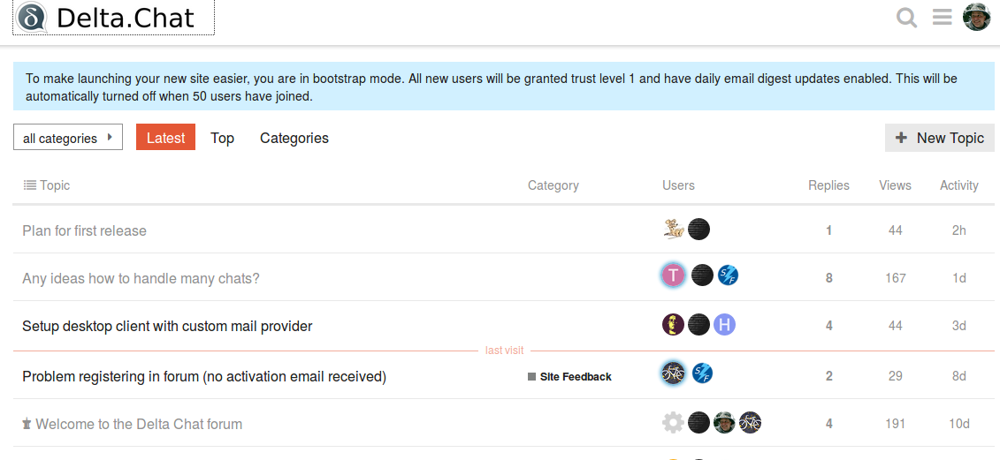

Two months ago, we experimentally launched the new [support.delta.chat site](https://support.delta.chat)
but we only now sorted out problems with e-mail delivery and thus also registration. The support site is meant as an easier entry point for users who are not aware of git or github.  

One great way for how you can help the [current delta.chat
developments](https://delta.chat/en/2018-09-28-big-update) is by
registering and being present on that support forum.  Ideally, following
from discussions there, we create github issues on one of the [deltachat
repositories](https://github.com/deltachat) and link relevant support
forum discussions.  

Oh and anyone who can or wants to help with administering the underlying
software, [discourse](https://discourse.org), is welcome.  We are just
newbies ourselves in managing this site.  See [contact channels](https://delta.chat/en/contribute) for how to get involved and in particular how to join #deltachat freenode IRC where a lot of
DeltaChat folks hang out daily and nightly. 

  **Screenshot [https://support.delta.chat](https://support.delta.chat)**
  
