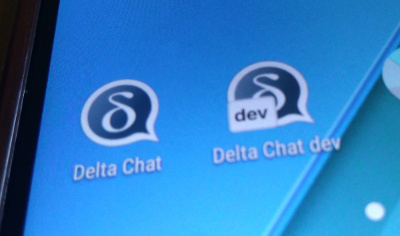

We're currently working on a new Android App for Delta Chat,
[android-dev](https://github.com/deltachat/deltachat-android-ii/issues).

The new App recreates the UI, however, the core mainly stays unchanged;
the same core is used for deltachat-desktop and deltachat-ios, btw.

The reason for this rewrite is that the existing ui code,
which is based on another popular messenger,
uses non-standard programming methods in many cases.
This makes it hard to maintain and to enhance, especially for new contributors.

We were thinking about this step for months, however, finally, it is started :)

While we'll get a much better source base by this step, 
we also take this as a chance to improve many things in the new IU, eg.

* Sending text together with images
* Edit images before sending, eg. marking something
* Reviewing messages before sending
* One central send buttons (gives us options eg. to force encrypted/unencrypted)
* Dark theme
* More consistent bahaviour in the app, 
  eg. long-clicks work similar in all activities
* Improved accessibility, Always-show-date, swipe-to-archive and
  [much more](https://github.com/deltachat/deltachat-android-ii/issues/25)

Many of these points are not yet completely finished,
however, it's on it's way and there is a fast progress, every day.

We'll add another post to this blog if we have a more or less feature-complete beta-version.

If you can't wait, you'll find a preview-version at
<https://github.com/deltachat/deltachat-android-ii/releases/>
(we'll also upload new APKs every few days there).

Please note that this version is not even "alpha" -
**use at your own risk** and please give feedback to
[github](https://github.com/deltachat/deltachat-pages/issues),
not to the user-support forum.

Cheers!
