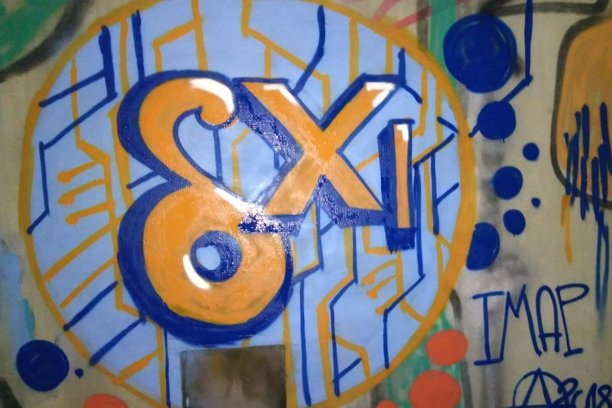
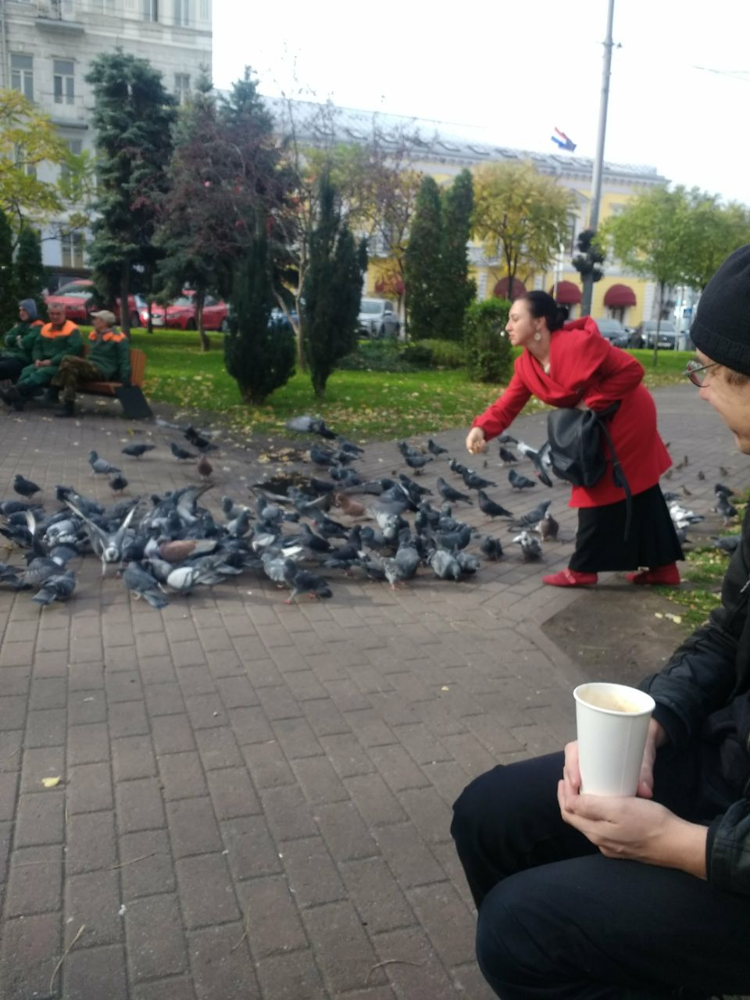
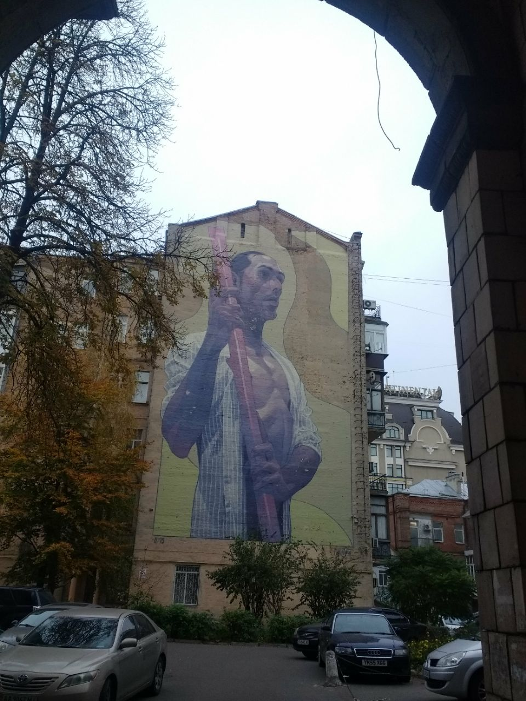
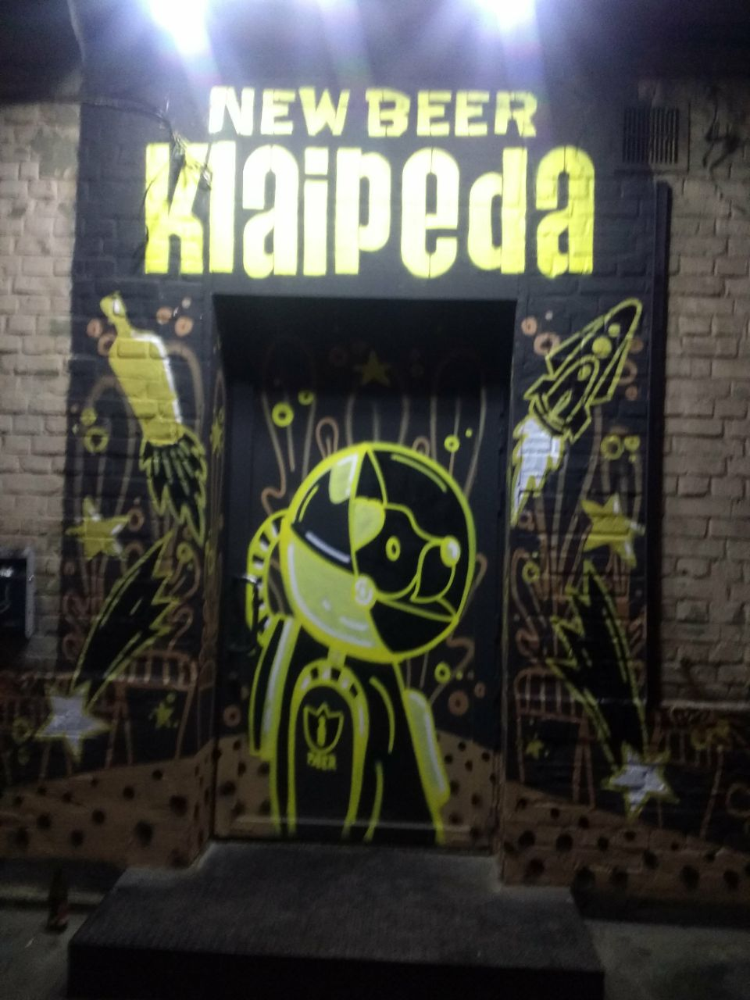
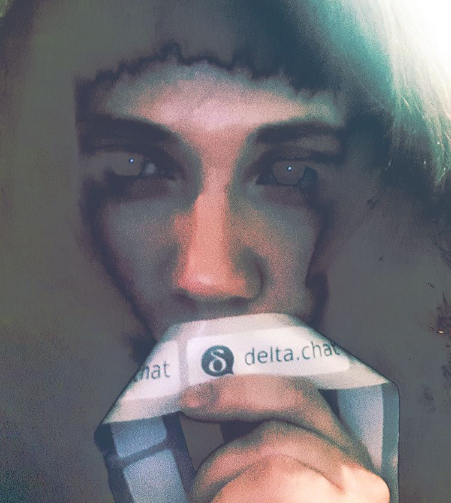
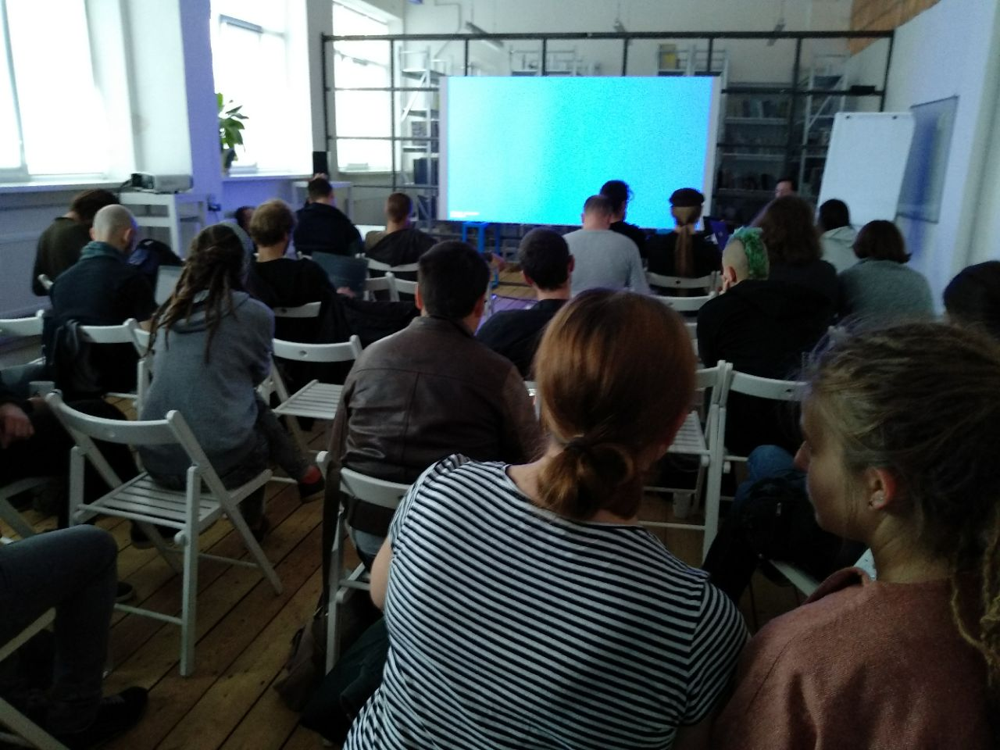
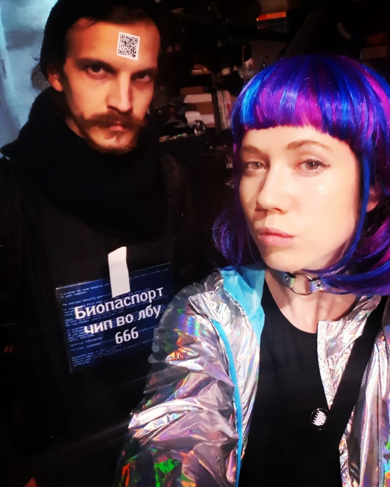
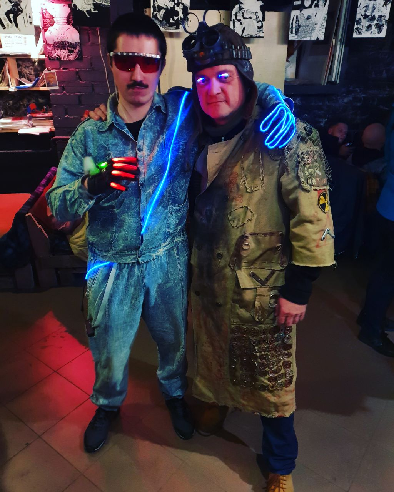
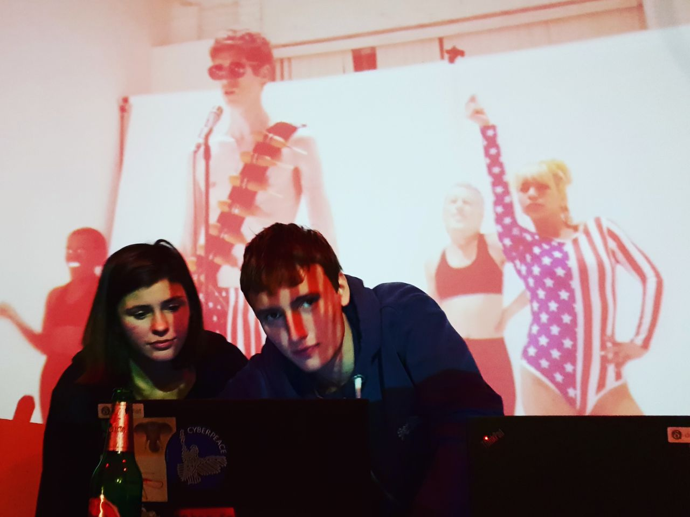
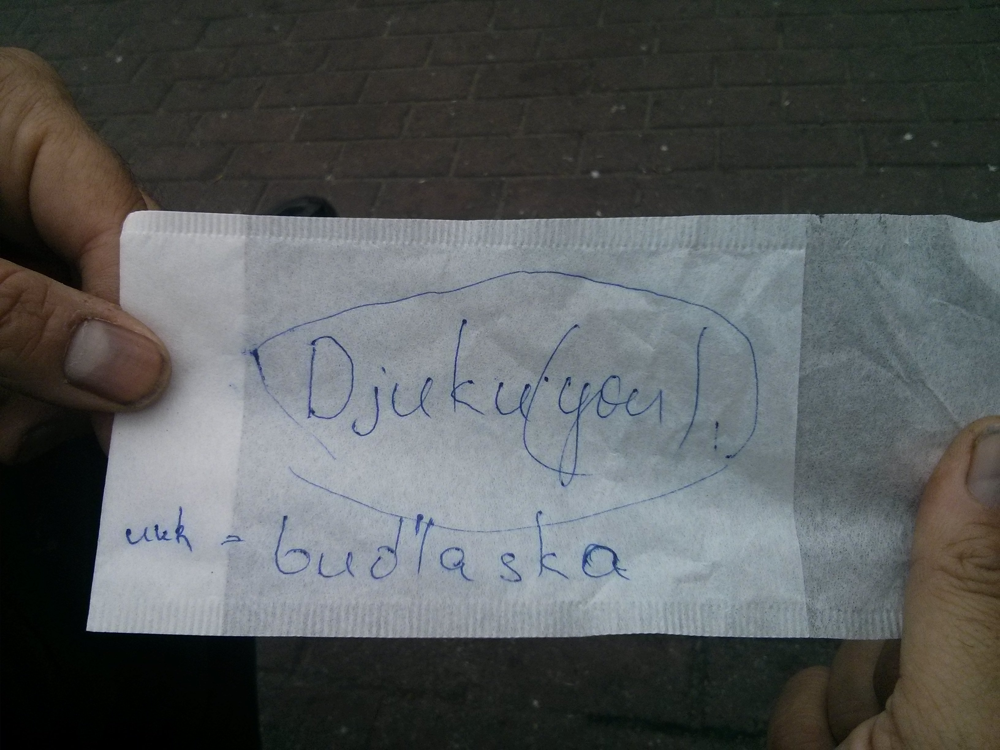

 
More than a dozen people gathered for a week in Kyiv, Ukraine 
for "Delta-XI", with more things happening than can be reported. 
This post is a try to both give you some picturesque glimpses of the
gathering and also highlight technical developments and results from the
rich discussion and collaboration originating in Kyiv at the end of
November/beginning December 2018. The gathering was intentionally
intertwined with two user-testing sessions which Xenia and
Vadym professionally conducted with select groups of journalists,
trainers and activists early in the gathering week.  There were
also many other significant results which we'll only briefly
report up front here: 

- after substantial legal research on licenses and several discussions
  we re-licensed deltachat-core and released 0.24.1 under the 
  [Mozilla Public License](https://github.com/deltachat/deltachat-core/blob/master/LICENSE). 
  The move from GPL to MPL is meant to be more inviting for also commercial
  collaborators as it is now easier to incorporate the core chat/contact and 
  IMAP/SMTP/Autocrypt implementations in all kinds of offerings. 
  "Chat over e-mail" is a huge quite open space which relates to
  a large diversity of players, non-profit and commercial already
  operating in the e-mail space. 

- the [single-folder
  milestone](https://github.com/deltachat/deltachat-core/milestone/2?closed=1)
  evolved to completion and is available in
  [Android-dev preview releases](https://github.com/deltachat/deltachat-android-ii/releases)
  and soon also desktop preview releases. What remains before this can become
  the offical F-droid release is concluding on how we support "shared account" 
  usage which earlier in October caused a big discussion on the mailing list,
  basically around the question whether to recommend/aim for using DeltaChat
  on existing or on dedicated standard e-mail accounts.

- many UI and other improvements to Delta/Desktop which as a result
  is increasingly able to be used for real. [Desktop releases](https://github.com/deltachat/deltachat-desktop/releases) are still labeled preview and there are ongoing struggles to get
  it to work on Mac and Windows -- if you can advise or help 
  with packaging OpenSSL in Electron apps, please visit us on github
  or on #deltachat IRC on freenode.

The morning coffee and other surroundings
-----------------------------------------

 

Mornings often started around the "coffee-bus" and the plaza next
to it. While many of us had anxiously prepared for arctic winter it
turned out we could nicely sit outside most of the time.
We caught the last warm days as just a week after we left 
it started to snow. 

In between social and technical discussions at "basecamp" and other
places we took time out to walk across parks, hills, abandoned bridges, 
visit old soviet monuments and appreciate the secluded hills and woods 
serendipitously chanced upon while exploring the cultural and historical 
offerings of an ex-Soviet capital.

Testing, talking and walking with at-risk users 
-----------------------------------------------

 
Decentralization is not just a technical idea but also about social
and geographical de-centering. Ukraine is currently going through a
challenging process of political transformation. Four years after the
Revolution, how did people manage to maintain and work with infrastructures?
One of the goals of Delta-XI was to meet with people who really need and will 
use our technologies: Local journalists going to war zones in the East of
Ukraine or to the annexed Crimea; activists facing the right-wing
uprising in big cities like Kyiv or Lviv; and human rights defenders
working everyday with war refugees or other at-risk groups.

The week included two dedicated evenings of user-testing of the
Delta.Chat Android app. Real world users from diverse projects and
groups in Ukraine joined us at a local cultural centre to test
installation, navigation and usage of the app, under observation by
digital security trainers and researchers. Strictly no interruptions,
guidance or even hinting allowed from developers whilst they did it!

 
After the sessions, testers and developers met up in local bars to
chat further and share insights about useful and desirable features,
user-experience updates and context-specific use-cases. It was both fun
and insightful to hang out with participants some of which afterwards
repeatedly joined us at our basecamp flat or in going around Kyiv.  At
the end of the week these repeated meetups culminated in better shared
understanding and in new directions that DeltaChat is aiming for in the
next couple of months, see also below.

new planned features for at-risk and other users
------------------------------------------------

 
The user-testing coordination crew combined the outcomes of the
user-testing and needfinding interviews and gave an in-depth
presentation to the dev team and contributors on the results. Both
needfinding and user-testing results will also be made publically
available in written form.  From subsequent discussions, also involving
journalists and human right activists, DeltaChat has some new directions
and features planned that are missing from most if not all other Chat
messengers today: 

- **One-side emphemeral channels** which one can set as a new channel
  mode.  As soon as a video/audio/message has reached the smtp-server it is
  deleted on the device.  The activists asked for this as they have an
  asymetric situation: 1-2 persons in a relatively safe space, often
  abroad, and several people on the ground under recurring threats of
  device seizure and police detention.  Some steps supporting this feature
  were already taken after Kyiv after a good suggestion from Justus 
  (who attended together with Neal from the Seqouia Rust/PGP project),
  namely that deltachat-core will immediately encrypt all sent messages 
  to recipients -- in one-side ephemeral mode we simply don't encrypt
  to ourselves.  Even if the device is seized before the SMTP-queue
  is cleared, the messages can not be decrypted. But "encrypt-immediately"
  is to also speed up message sending and works better with flaky networks
  because right now, the actual e-mail message is re-constructed and re-encrypted
  each time network becomes available.

- **GPS-position streaming** is another facility that we'd like to introduce.
  With this, one reports GPS position changes regularly to a contact
  or a group.  This helps with finding the last positions of people
  after they have been detained. But it can also be useful for
  friends who are moving together in a city and want to offer
  their locations. Note that with DeltaChat there are never any
  servers or "clouds" involved: You report GPS positions E2E-encrypted
  to contacts of your choice. 

- **automated burner account creation** to make it easy for a group
  to setup temporary e-mail accounts and Chat groups for a particular
  action eg reporting on a demonstration or investigating the whereabouts
  of missed persons.  Idea is that one "inviter" deltachat device 
  will receive a token from the email provider - other deltachat devices 
  scan the token, get random accounts that are deleted after one week and can
  choose their display name only. "Joiners" also land in a
  verified group meant to be safe active network/provider attacks. 
  Note that if somebody uses eg deltachat via gmail (lots of gmail usage in Ukraine) 
  messages are e2e-encrypted against the burner accounts - the temporary
  e-mail addresses can be used with any other e-mail address of lawyers,
  radio networks etc. 

None of these features are fully fleshed out yet. While we have
very concrete at-risk people in Kyiv in mind while going for these features
we aim for the development around them to improve DeltaChat's general 
architecture. Once starting to be usable in preview releases we will 
consult and user-test again with people in Kyiv ... 

Saturday unconference and the party ...
--------------------------------------------------

 
[Decentralization Unchained](https://delta.chat/en/2018-10-28-decentralization-unchained)
brought the developers, contributors, cryptographers, hackers, researchers who were 
attending the Delta.Chat gathering together with local digital security trainers,
activists and NGOs for a day of talks, discussions and workshops
around the topics of decentralizing infrastructures and communities,
building communication tools with users and for users.

Apart from DeltaChat introductions, key presentations were 
on topics brought up from locals and participants:

- The right to be plural: Decentralization of identities, pseudonymity and security.
- Digital security desires, fantasies and needs of real-world users. 
- The rise of extremism in countries across the world: 
  a conversation led by activists from Ukraine, Brazil, Germany and the US.

It being Halloween, the unconference closed with an afterparty at a
local DIY bar where we danced to experimental electronic music and
sci-fi psychedelic videos, drank home-made spirits and joined in a
speculative fiction team game about “cyber apocalypse” and how to save
the world from robots!

 
 
 

Returning to Kyiv in 2019
-------------------------

It was a very enjoyable and productive week… so much so that plans are
already incubating for a follow-up event to test the new developments in
spring. We'd like to thank in particular Anna, a local artist, who greatly
helped us ahead and during the meeting with organizational issues. 
See you all in Kyiv, 2019!

