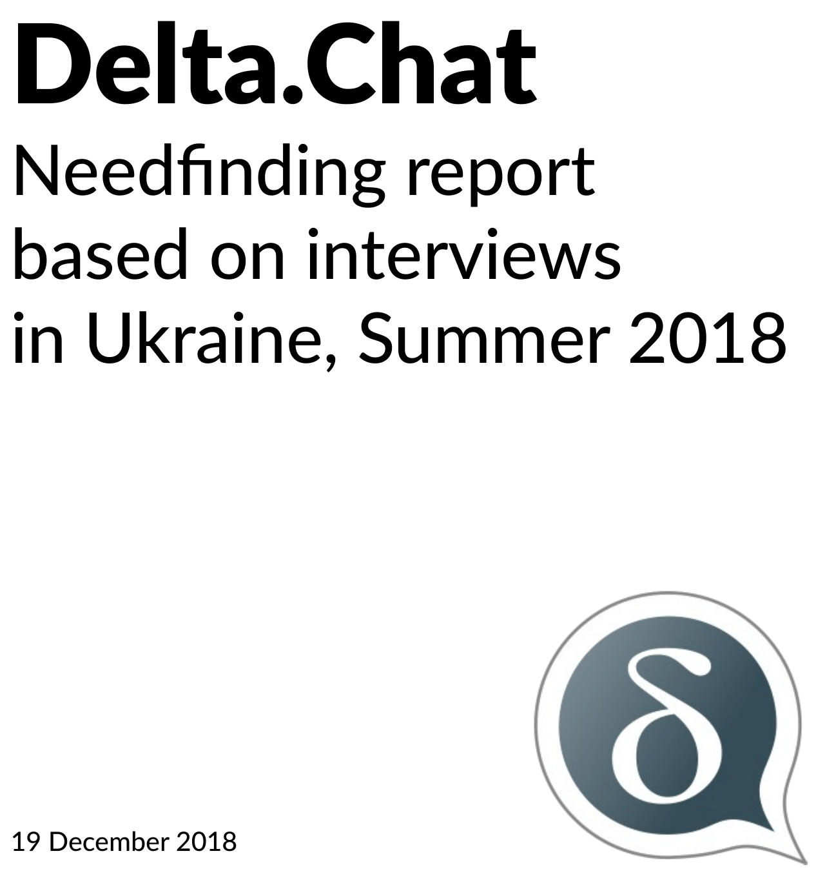

Our [Ukraine/needfinding report](../assets/blog/dcneedfindingreport.pdf)
is now out. It contains ten findings and "Delta.Chat takeaways". Some of those findings
have already influenced development, see "New planned features" from our november-blog
post about [our one-week Delta-XI gathering in Kyiv](https://delta.chat/en/2018-11-17-deltaxi).
Others await further conversations, bound to happen at the [!decentral assembly at 35c3](https://signup.c3assemblies.de/assembly/c51983c8-b560-4d2b-95a1-f07a98c8e322). 

