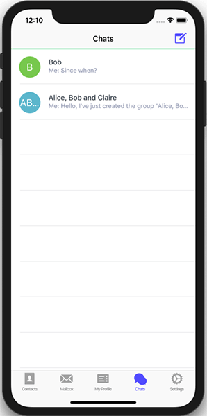

A lot of efforts in the last half year are coming to fruition ... release time!
You can now use DeltaChat not only on Android but also on Desktop and iOS 
and chats are usually synchronized quickly in common multi-device settings. 
Nothing ever quite works perfect but it's working well for many who used the incremental 
releases the last weeks, including for lots of private communications with friends. 
We consider our January 2019 releases, even if a significant milestone, 
only another beginning for more fun and interesting things to evolve ... 

 
 

**Delta/Android 0.100.0**: code was entirely revamped and we just
triggered an F-droid release and soon (tm) are aiming for G-play as
well. The [new Android code](https://github.com/deltachat/deltachat-android) 
is based on Signal's UI code instead of the Telegram UI code used for the previous
0.20 F-droid release.  By this bold half-rewrite, 20-30 long-standing issues could be closed
and we have a much nicer and more maintainable code base now -- yay! 

Note that we also worked hard to bring back the UX look and feel
of the Telegram version and there are still some things left to be done.
Tons of thanks to Bjoern Petersen, Angelo Fuchs, Daniel Boehrsi,
Florian Haar, Asiel Díaz Benítez, chklump, amplifier, testbird and many
others who contributed code and bug reports on a continous basis!
  
If you have installed and used Android dev releases (thanks!) you will need to run an 
export/import cycle if you install the F-Droid app or a [new dev apk release](https://github.com/deltachat/deltachat-android/releases). Current F-droid users will just be upgraded
and don't need to export/import.  Once Delta/Android actually appears on F-droid 
(may take a while) we'll see to do another blog post describing more of what's new.

 

**Delta/Desktop 0.99.0**: the brand-new Desktop app with 
[pre-built packages for Linux and Mac (help for Windows needed!)](/en/download). 
The Delta/Desktop effort has evolved over 6 months now and is working nicely
for many already. It re-uses parts of the Signal/Desktop application 
but again we worked hard on the UX side to get more of a Delta/Android and 
Telegram UX feel. Big kudos to Magnus/ralphtheninja, Karissa McKelvey, 
Jikstra, Simon Laux and several others who helped to make Delta/Desktop a reality. 

You can use Delta/Desktop standalone, i.e. without a mobile, or in conjunction
with a mobile app.  Chat messages and encryption can be shared between Delta apps
using the same e-mail account.  Desktop offers **multi-account support** which
all other platforms don't offer yet. 

**Delta/iOS Preview 7**: an iPhone app installable via Testflight.
Delta/iOS offers basic setup, (encrypted) chatting and sending and 
display of images, and scanning and verification of QR codes. 

Many thanks to Jonas and Alla Reinsch, Friedel Ziegelmayer, humanlikedesaster 
and the hundreds of folks who tried out earlier TestFlight releases.  

Help on iOS development is very welcome. Current development is moving slowly
but you will get quick feedback if you try to fix or improve things. 
Please checkout the [github repository](https://github.com/deltachat/deltachat-ios)
to report bugs or contribute code. 

 
**deltachat-core on Debian**: Micah Anderson who also advises DeltaChat on several levels, managed 
to bring [deltachat core 0.39.1 into Debian/Unstable](https://tracker.debian.org/pkg/deltachat-core). Many thanks to Drebs and Janka for helping this effort along! 

[new Transifex language repo](https://www.transifex.com/delta-chat/delta-chat-app/dashboard/)
which is now the new language base for all Delta apps.  If you speak
non-english please see if you can contribute.  Many thanks to Enrico
Bella who helped to organize things with translators and also
participates as a liason between translators and devs. 

When it comes to thanking and mentioning people i'd like to mention a few more specifically:

- Ksenia Ermoshina who is with DeltaChat (and Autocrypt!) since years
  now and has majorly helped to instigate the "DeltaChat Robustness and Usability" project 
  which got us funding from the OpenTechFund. Ksenia is also driving many key happenings 
  around DeltaChat, recently the [DeltaChat needfinding report](https://delta.chat/en/2018-12-19-needfinding) and the [Delta-XI Kyiv gathering](https://delta.chat/en/2018-11-17-deltaxi). 
  And there are rumors about new interesting things happening late spring 2019 in Kyiv ;) 

- Janka-X is with DeltaChat since almost a year now, has helped with
  sorting out licensing and GDPR issues and also is starting to contribute
  not only beautiful graphics but for example presented DeltaChat and its privacy story 
  to "DuD", a key german privacy conference mid 2018, see [here](https://github.com/deltachat/playground/blob/master/talks/dud-2018-delta.odp?raw=true) for the slides that gained a lot of praise. 
  Beware, she is also diving into hacking/coding and has contributed first PRs.

- Floris Bruynooghe who has contributed majorly to help with the build system
  (meson based on desktop and with core) and also with 
  the [python bindings](https://py.delta.chat) and various conceptual
  bits and pieces with Deltachat-core. 

- the many folks from befriended projects who [came to
  Delta-XI in Kyiv](https://delta.chat/en/2018-11-17-deltaxi),
  the [OpenPGPsummit 2018](https://delta.chat/en/2018-10-22-openpgpsummit) 
  and other gatherings.  We received and receive a lot of useful help
  and advise and continue to evolve collaborations with several people
  from projects such as K-9 Mail, DAT, Autocrypt, Sequoia/pEp, Briar, IPFS, Secure Scuttlebut
  to name a few. 
  
So thanks everyone and let's see what other interesting releases and
happenings are coming up in 2019 -- quite a few i can guess already, 
but this blog post is already long enough ;) 
