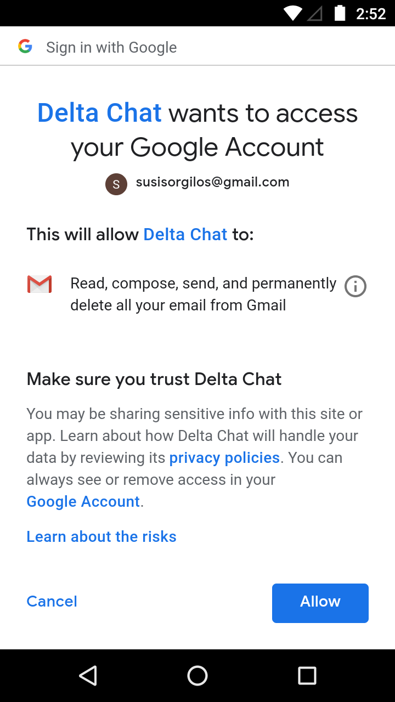
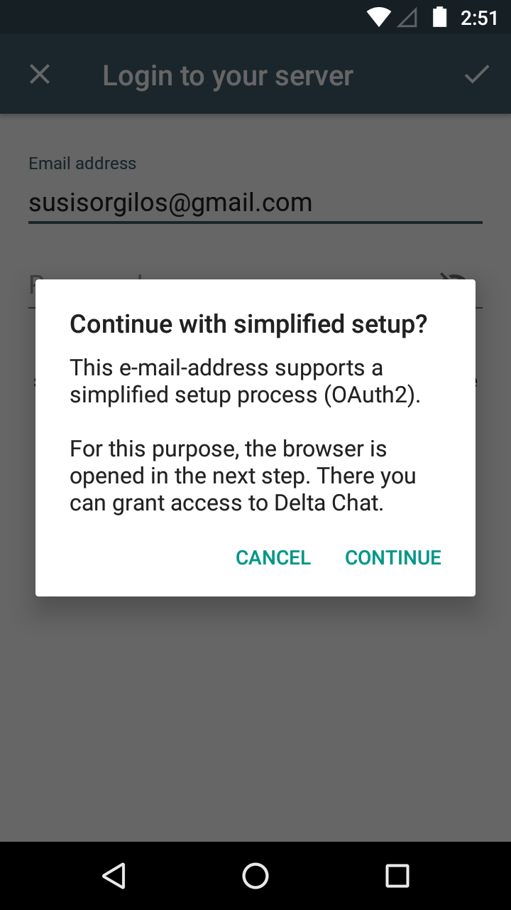
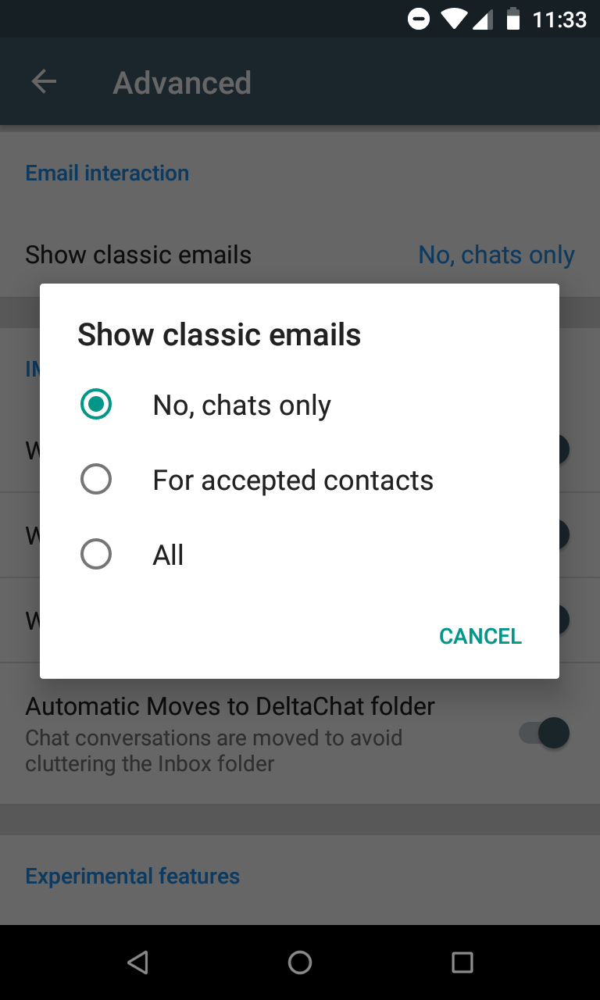

A new major Delta Chat Android release (0.200) is now on Google Play 
and soon on F-droid with lots of improvements addressing popular complaints and 
feature requests. Delta Chat remains marked as "Beta" because expectations 
are understandably high when it comes to using a new messenger. 
However, many of you know from everyday-usage that the Beta series work
increasingly well. Please continue or consider helping us to evolve Delta Chat 
by [providing feedback, contributing improvements or a little donation](https://delta.chat/en/contribute).  If you join our channels you'll also get to hear many of the upcoming 
good news earlier than here ;) 

But now on to the highlights of this release!

## Password-less logins for GMail and Yandex 

 

You can now configure your existing e-mail account without providing 
your password to Delta and you also don't need to enable "less secure apps" 
anymore. OAuth2 is currently supported for gmail.com, googlemail.com,
yandex.ru, yandex.com and yandex.ua. There is no longer the need to enable 
"Less secure apps" somewhere deep in settings. We've implemented OAuth2 independently 
from Google libraries.  The authorization just opens the system browsers and 
of course you still have the choice not to use OAuth2. 

This means that you only need to provide your e-mail address and GMail/Yandex 
will then ask you to confirm to give access to your e-mail account so that Delta 
can send and display chat messages. Please remember that **Delta Chat is serverless**
as well. All Delta Chat apps are Open Source and can be verified to not 
transmit your address/account information anywhere else than with the 
e-mail provider of your choice. 

## Streamlined Contact requests 

 

With Delta Chat you can message anyone if you know their e-mail address. 
They can read and reply with their standard e-mail app without
signing up anywhere or installing anything. However, we finally addressed
a popular complaint regarding which e-mails are shown as contact requests.
You will now by default only see e-mails as contact requests if the other side 
sent a Delta Chat message. Non-Chat e-mails will not show up unless they are a 
direct reply to a chat message that you sent before. 

If you want to see both chat and normal e-mails from an accepted contact, 
you can enable that in "advanced settings". Some people also like to read all
their e-mail with delta chat and they can enable seeing "all" messages
as contact requests. 

## Better moving of Chat messages to DeltaChat folder

We made the algorithm more robust that automatically moves chat messages
to the DeltaChat IMAP folder.  You should now see less clutter in your
INBOX with your regular e-mail app.  There were many community
discussions in the last year around this topic and we hope we finally
found a way that is robust and easy to understand. All chat messages
will be automatically moved to the DeltaChat folder. 
Also any reply you get to a chat message 
that you previously sent to a regular-email user. 

## Better provider configuration, message size, sharing of files

We fixed issues with several providers, among them 
the cuban "Nauta.cu". If you didn't know, Delta Chat had 
quite some uptake with Cuban users as any traffic that leaves the island 
is expensive while using the "cuban intranet" mail server 
is relatively affordable with mobile data plans. Whatsapp is practically
not available there -- a not so uncommon reality that large parts of 
the western world experienced during #facebookdown a few days ago. 

We also reduced message size for group-chats by not gossiping
encryption keys with every chat message anymore.  Also there is a higher 
compression options for images. 

There is better support for sharing files from other apps
through Delta Chat channels.

## Details about this release, who did it? 

The [Android v0.200.0 changelog entry](https://github.com/deltachat/deltachat-android/blob/master/CHANGELOG.md#v02000) and the [Core v.0.41.0 changelog entry](https://github.com/deltachat/deltachat-core/blob/master/CHANGELOG.md#v0410) contain more details. The following contributors were involved in release issues and commits: Alexandex, Angelo Fuchs, Asiel Díaz Benítez, Björn Petersen, Besnik, Christian Klump, cyBerta, Daniel Böhrs, Enrico B., ferhad.necef, Florian Haar, Floris Bruynooghe, Friedel Ziegelmayer, Heimen Stoffels, Holger Krekel, Iskatel Istiny, Lech Rowerski, Moo, Ole Carlsen, violoncelloCH.

