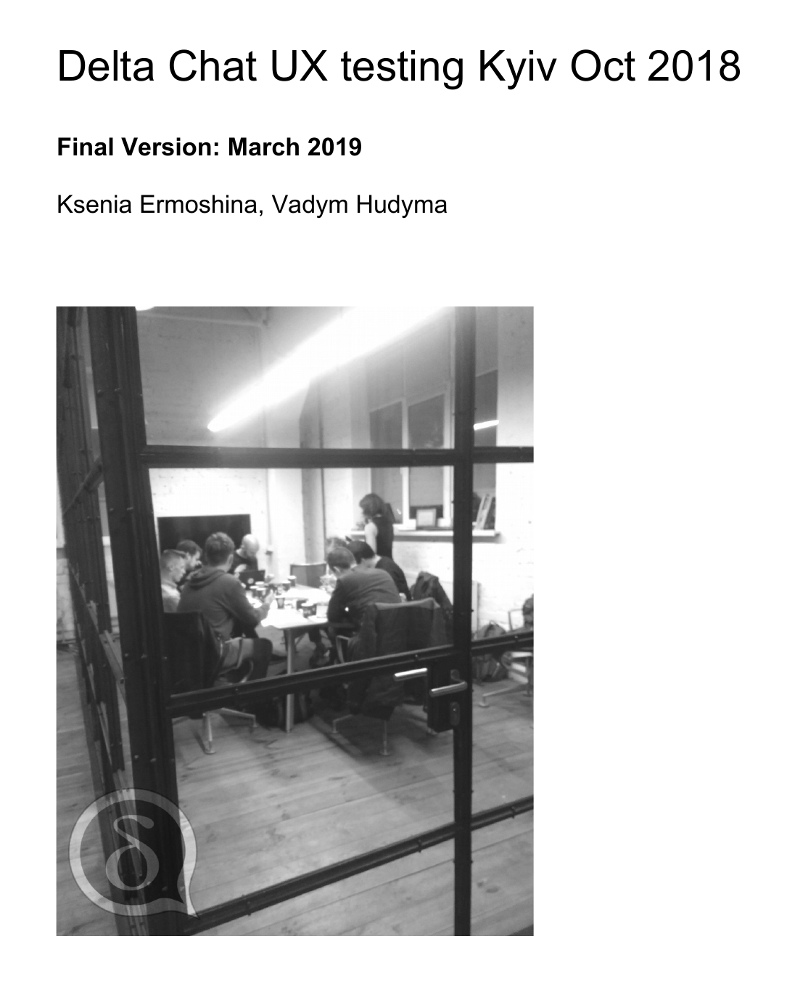

Our [first user-testing report](../assets/blog/Delta-Chat-UX-test-report1.pdf) is out.
The user-testing took place in Kyiv end October 2018 and involved 12 testers, 
10 coming from journalistic and NGO activist user-groups, and 2 being
local tech-enthusiasts. The report highlights seven key findings and 
references some of the work that already happened since the testing happened.

