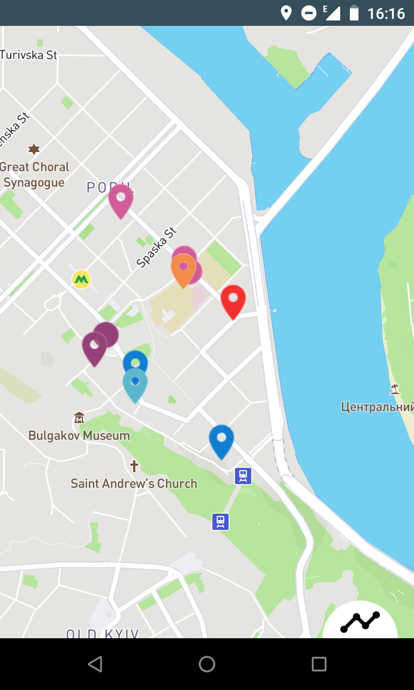
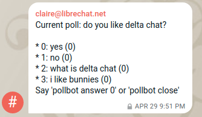

 
In the last couple of weeks, location mattered deeply for Delta Chat, the "Chat over E-mail"
messenger. It does make a difference if software development is situated in a Starbucks
in San Francisco or around a refurbished coffee-bus in Kyiv, the Ukrainian capital just 200km away both from a war zone and from Chernobyl. Some of you noticed already the appearance of "on demand location streaming" in the advanced Android app settings. This unique feature was only silently released ahead of our "Xyiv" gathering which happened in the last week of April 2019.  This post provides glimpses into what happened that week -- with the foreshadows of the coming *Rustocalypse* and evolving new takes on enmeshing UX, crypto and implementation activities in the wider decentralization space.

Despite this post being a little long, there is a lot we don't mention here. After all, around 25 people arrived for "Xyiv", some by car and train, and some by plane from the other side of the planet (Hawaii).  Ages ranged from 8 years to well over 50. People forked off in sub groups at all times and even at basecamp, our 160 qm base main gathering place, there were typically 3-5 different groups engaged with one topic or another. 

## On-demand location streaming 

 

Developed after our [UX discussions at the "Delta Xi" gathering in 2018](https://delta.chat/en/2018-11-17-deltaxi#new-planned-features-for-at-risk-and-other-users), location streaming allows to send location data and map incoming messages and photos from those who send location data in a chat. It is meant for
*asymetric* usage scenarios where "basecamp" monitors users at risk of
detention and abduction. Nevertheless it can also be used between
friends and in fact was tested by developers with each other in the time
leading up to our April gathering.  After enabling "on-demand location streaming" in "advanced settings" you
may, in any chat, click the "attach" button and select "location".  You
then get a choice about how long you want to stream location data. 
This will attach GPS locations to all messages, including photos and other media.
All locations and messages are usually end-to-end encrypted and location
data is not shared with third parties -- that is if your phone is generally configured 
to not share location data with Google or other parties. 

 
While Bjoern and Richy were heavily preparing the Android side of location streaming
in the last weeks, Nico was greatly pushing ahead the Desktop side of things
which is not released yet but merged already into mainline "master" development. 
We envision that "basecamp" users will rather use the Desktop version 
for co-ordination as it offers more screen space.  This *asymetric scenario* also
played out in a special game we played in the streets of the Podil quarter and 
the harbor of Kyiv ... but more on this at the end of this post ;) 

Delta Chat currently uses the [mapbox Open Source libraries](https://docs.mapbox.com/android/maps/overview/) and retrieves map data from mapbox servers, but it does *not* share precise locations with 
the mapbox servers. Note that an observant contributor quickly [noticed unintended data leaks](https://support.delta.chat/t/mapbox-sends-too-many-data-to-their-servers/393) which we quickly fixed and
released to GPlay and F-droid. In the long term we would like to integrate properly decentralized 
map servers and are conspiring with substack who was, also during Xyiv, pushing forward [new ways to store, compute and share map data](https://github.com/peermaps/eyros), with an eye to later Delta
Chat integration. Meanwhile mapbox does the job and was convenient enough to integrate 
on both Android and Desktop. 

# The coming Delta Chat Rustocalypse 

 
A line of heavy activities in the last weeks happend around 
[RPGP](https://github.com/rpgp/rpgp), the world's first full-Rust
implemenation of OpenPGP from [Friedel Ziegelmayer](https://github.com/dignifiedquire/). His new Rust library supports Autocrypt 1.1 primitives and will allow us to switch from RSA
to the shorter and more modern ED25519 keys for e-mail encryption within
the next releases.  RPGP is working in development builds already. 
Expect some news around arranging a security review from a third party soon ;) 

For those of you who haven't heart about it: Rust is a new
systems-programming language from Mozilla.  It is widely hailed for its
security and robustness properties, for example [Diane Hosfelt has
analyzed](https://hacks.mozilla.org/2019/02/rewriting-a-browser-component-in-rust/):
"*Over the course of its lifetime, there have been 69 security bugs in
Firefox’s style component. If we’d had a time machine and could have
written this component in Rust from the start, 51 (73.9%) of these bugs
would not have been possible.*" 

 
The "X" in Xyiv can be taken to symbolize the "unknown", the twisted and winded paths
of developments one can not predict nor expect. And the unexpectable did arrive 
during our Kyiv gathering. Friedel played with [C2Rust](https://c2rust.com/),
a new tool to convert C-code to Rust and, applying a few more magical spells, managed to produce a rough Rust version of Delta Chat Core (DCC). The new code even remained readable and almost compiled!
Several discussions and hacking-day-and-night sessions later, the Rustocalypse appears 
to be approaching, with the [new Delta Chat Rust core](https://github.com/deltachat/deltachat-core-rust/) poised to become the new base for all Delta Chat apps. The C2Rust translation was 
possible only because DCC is written in plain C -- by contrast, C++ code can not 
be translated this way. 

However, there are now a lot of - in Rust par langue - *unsafe* code parts.
These unsafe code parts are actually as safe as the current C code. Moving to
Rust does thus not cause degradations. To make a longer story short,
several Delta Chat developers are now learning Rust from the [Community
Rust Book](https://doc.rust-lang.org/stable/book/) and are following
DCC-Rust developments closely. Maybe some of you will join the fun and
do Pull Requests to make [the new DCC Rust core safer?](https://github.com/deltachat/deltachat-core-rust/) 

# UX testing sessions with Journalists and Activists 

 
The Xyiv gathering started off with **two user-test sessions with journalists and activists**, 
performed by Xenia and Vadym who in March had published their findings on the [first round of UX tests in 2018](https://delta.chat/en/2019-03-30-uxreport). Delta Chat is a deeply UX driven project
and in contrast to the many "casual" tests on various occassions, and from feedback on the lively [support forum](https://support.delta.chat), our Kyiv UX tests are carried out in a more systematic, scientific manner.  One warm-up task was to interpret prototype drawings for explaining how Autocrypt encryption works. The drawings are part of an attempt to educate with other images than the rather abstract "locks" and to convey that Autocrypt encryption is established opportunistically, instead of "up-front". A first confusion arose on the first panel of the drawing: people thought that the first message was already encrypted (because of the "weird characters") - this is in fact misleading, so we will try to change to a "clear text" phrase like "hey, let's party". Second, folks who were not drinking did not understand the metaphor of clanging glasses together, however, others liked this metaphor a lot, one tester said "when I come to Schottland I first feel that I do not understand their English, but after the first whiskey I understand everything".  The second phase of the testings involved testers looking carefully at Delta Chat screenshots for three minutes and telling what they saw and understood. 

 
After these two warm-up tasks, testers had to perform and evaluate prepared tasks in 
four categories: 

- Account Creation and Onboarding
- Group chat creation and group management
- Verified groups and verified group management
- Location streaming 

The general feedback was quite interesting: users said they liked Delta Chat but would like to know what exactly is different about it, as compared to other messengers. They said that the « welcome messages » (onboarding messages) were rather strange and looked like marketing from other apps (« better / faster / stronger »). Instead of security they suggested to focus on decentralization / federation, and the community behind this project. There was a lot of feedback on several details and the upcoming UX test report is to discuss and evaluate those and suggest refinements and conclusions. 

# The many, many other Xyiv sessions 

 
Several folks associated with the Heart of Code hackerspace in Berlin participated in Xyiv happenings. At the unconference, Cat and Martha presented and discussed the least years of diverse female hackerspace activities in germany.  In Kyiv, there currently is no hackerspace at all, though. Evolving a collective structure to open up self-organized spaces is riddled with challenges.  Some of the Xyiv group want to see about helping to bootstrap such a space in spring 2020, when Delta Chat is likely returning to Kyiv for another bigger gathering.  Donna from Syster Servers told about her 20 years of running infrastructure and giving workshops for women, and also participated in various other discussions around Delta Chat and sysadmin happenings. 

 
Figuring out good ways to explain and refine Delta Chat's "decentralized key exchange" was the 
topic of UX sessions at the unconference. Integrating explanation drawings is a pending topic 
with Delta Chat and part of efforts to [improve the FAQ](https://delta.chat/en/help#what-is-delta-chat).  A lot of discussions during Xyiv revolved around Delta Chat's opportunistic falling back to cleartext messages.  It happens when the "Autocrypt logic" determines that some chat members may otherwise not be able to read messages.  Not yet widely known, and not well explained, you can create "verified groups" which enforce e2e-encryption and which have been [determined by EU researchers to be safe against even active network or provider attacks](https://countermitm.readthedocs.io/en/latest/new.html). 

 
Some folks with experience in running collective e-mail infrastructure did sessions 
around evolving [testrun.org](https://testrun.org), an experimental e-mail server used
for UX tests with Delta Chat. Coming from four countries and as many different contexts, 
they discussed their experiences and how to run new e-mail servers safely and simply,
without requiring cloud-scale tooling. It started from the insight that if you do not 
want or need to scale up beyond 10K users, you do not need to engage with tooling
and infrastructure that typically aims to support millions of users. 
 
The sysadmin sessions involved thinking about how to easily share secrets (DNS,
hosting, ssh-keys), how to version system configuration files, and how
to evolve a *long-running* service that survives people leaving and
joining the project. One guiding idea is to get to "low-effort"
practises because running collective infrastructure typically is often 
done "on the side" and not as a dedicated job. Another guiding idea is
to see how Delta Chat could be used to support such activities. To that
end, a verified e2e-encrypted group was boostrapped where talking continues ... 
quite safe against compromised e-mail providers or network attackers who actively 
try listening in. 

 
During the Xyiv week, Jikstra, Magnus, Nico, Floris and Karissa worked out several improvements
to Delta Chat Desktop. It is now possible for for linux distros to have a system wide install
of Delta Chat with multiple per-user Desktop instances. Dependency management was improved for Mac
and several architecture improvements (for speedup), as well as the ability to "tag" a place
on the location-streaming map. Karissa [started playing (DELTAR!)](https://github.com/karissa/deltar/) with a new Webview/Rust architecture which could potentially allow to get rid of Electron and 
reduce the download size to 10 MB or less, on all Desktop platforms.  The small binaries 
would use the system browser and come packaged with a Rust-core which does all networking,
persistence and encryption. 

 
 
Kali and Karissa were also having fun with implementing Chat Bots in Python and 
Javascript, respectively.  It is quite easy to write and run Delta Chat bots.
All you need is a standard SMTP/IMAP account somewhere and the ability to run 
a lighweight, long running process on some machine. However, all bots so far, including
one from Simon which bridges IRC with Delta Chat, are prototypes and just a glimpse into
the future. Expect some news later in 2019 when the bots will be coming for you, 
riding on the waves of the coming Rustocalypse. 

 
Speaking of Rust, Sid, Franz and Matze were progressing continuously with their work on [Arso](https://arso.xyz/), a decentralized archiving project based on the [DAT P2P protocols](https://datproject.org/). Several conversations revolved around potential integrations of Delta Chat Bots with these decentralized archiving efforts. Conversations are about integrating decentralized approaches rather than trying to build "replace-the-world" platform projects that try to convince others to use and base everything on one's platform.  Arguably, decentralization projects often are overly focused on technical decentralization but produce island platforms that do not integrate with one another.  The future of decentralization maybe lies more on **integrations at the UX level** so that users can make actual use of the wealth of interesting decentralization projects -- rather than adding yet more clever technical algorithms to any single project. 

 
Speaking about the future, we had Eileen from [SimplySecure](https://simplysecure.org/) with us 
who helped facilitate UX/Dev sessions around planning our upcoming efforts. With Bjoern, Xenia, Holger, Vadym and Evgenia, they jointly did two longer sketching and planning sessions, bringing together current technical developments, UX testing insights and addressing needs from high-risk activists in human right missions.  Among other things, we worked out some unique selling points of Delta Chat for users from eastern europe (and in many other places): 

- **freedom of choice** of standards-compliant e-mail providers

- **hard to block e-mail servers** because of collateral damage to businesses and governments

- **e2e-encrypted verified groups**, safe against active network attacks

- **UX-driven technical developments (location streaming etc.)** because
  security is better considered as an outcome for people under threat, 
  and not just as the property of crypto protocols. 

It is maybe worthwhile to remind that all the forward secrecy and clever encryption doesn't help you
if someone threatens to break your fingers (or worse) until you provide access to your device.
It is in those situations where e. g. location streaming becomes a more important security feature 
than than the crypto algorithm because then your supporters can know where you are and 
better arrange for help. 

# Gaming with decentralization 

The game on sunday, secretly prepared by Xenia with graphics from Demian, marked kind of a culmination of an already eventful week. Participants, including locals, were put into two groups, "Cubes" and "Spheres".  Players from both teams drew a card and played a role -- journalist, whistleblower, spy, politician with each side co-ordinated by one person sitting on Delta Chat desktop at the "basecamp" location.  Players turned on location streaming and had to carry out a complex set of concurrent tasks, with a lot of fun ensuing dynamics and confusion.  Special points were gained when one side managed to "jail" the other side's politician or journalist.

Co-incidentally, the sunday was also a religious culmination in it being the main day of ortodox eastern where everybody is out in the streets and churches.  
 

So one of the ad-hoc tasks became taking photographs from inside a church. A Key task was to 
hunt for "dead drops" at 12 places inside the city. Dead drops contained further tasks that involved finding and placing stickers. The Dead drops were added as "Points of interests" to the maps that players could access during game play. This "add POI" feature was itself added just one day ahead of the game. 

 
The game play involved a lot of Delta Chat features. Both groups quickly setup 
"verified groups" as they provide an easy way to get everyone into a group quickly. 
It also involved much of the brand-new location-streaming feature and players chasing
each other through the city. One young "politician" in a blue jacket was
found hiding in strange places ... it was certainly telling how problems
and confusion escalated from the overall stress of trying to understand
what's happening, lost connectivity, "abducted" devices etc.

Several players were eager to repeat and refine the game in their home towns. Also some 
secretive talks were overheart around *Operation Werewolf* ... let further gaming commence :) 

# The party and special thanks to ... 

 
Lastly, after the game, we had a party that was so nice that almost nobody had time
to take pictures. There are rumors it took place in some cellar and that there was
projected live-graphic coding at play, as well as shortages and abundances of alcohol and that some folks only managed to get back well after the sun arose .... but in any case special thanks go to Anna who was our local support for arranging and caring for most of the infrastructures and places mentioned in this post. 

# Upcoming stabilization releases ... 

After this wild mix of images and impressions, you may be relieved to hear that the Delta
Chat core team also agreed to focus now first of all to deliver stable DC releases in the upcoming 
months.  This is also part of what we promised to the [OpenTechFund](https://opentechfund.com) who is funding many of the efforts described here in the post. Weekly sync meetings on the #deltachat IRC freenode channel, wednesday 9pm CEST, are to take place to synchronize release efforts. Visit our [channels and repositories](https://delta.chat/en/contribute) if you want to orient yourself and potentially help in some capacity. 

Lastly, thanks to everybody who made it to Xyiv ... see you all hopefully soon on differently named but similarly joyful and productive occassions!
