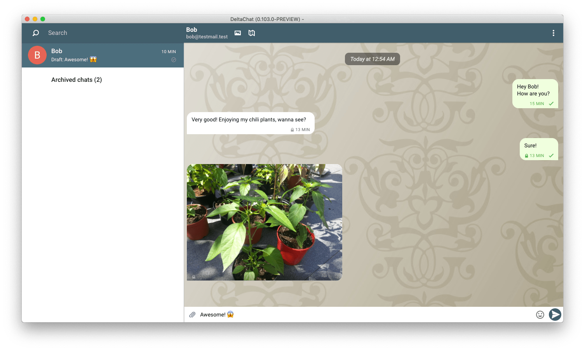
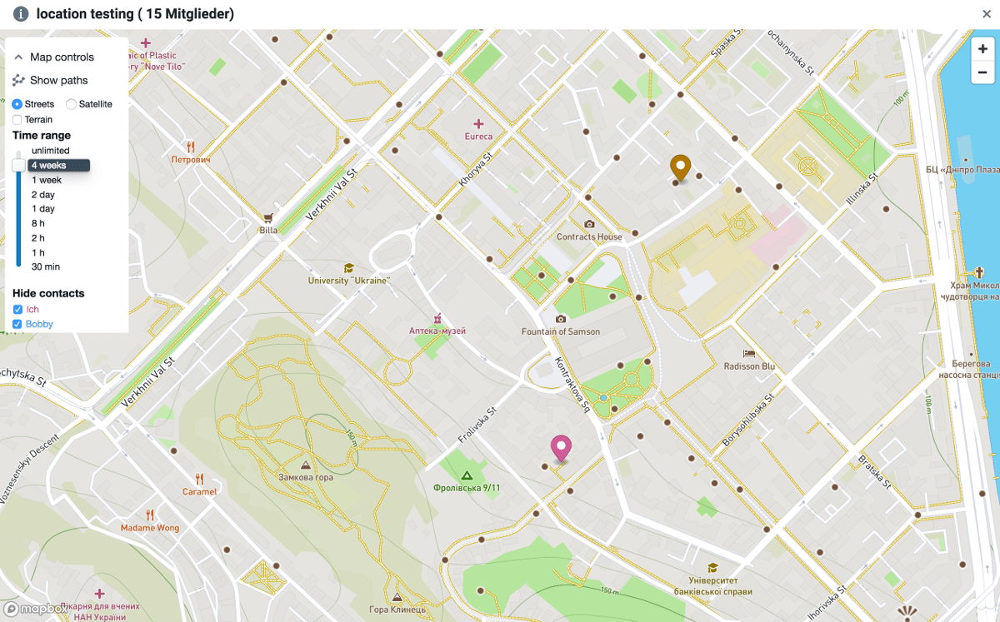

 
There are new Desktop releases with several major improvements: 

- We now use [RPGP](https://github.com/rpgp/rpgp), the world's first
  full-Rust implementation of OpenPGP, the underlying encryption format 
  that Delta Chat is using. This new Rust library supports [Autocrypt 1.1](https://autocrypt.org) 
  primitives and will allow to switch to ED25519 keys for e-mail encryption
  within the two next releases. The Desktop releases are the first 
  tangible sign of the upcoming [Rustocalypse](https://delta.chat/en/2019-05-08-xyiv#the-coming-delta-chat-rustocalypse). Many thanks to Friedel for his perseverance on RPGP and
  all the support with integrations!

- We integrated support for the Desktop side of [location
  streaming](https://delta.chat/en/2019-05-08-xyiv#on-demand-location-streaming).
  Desktop can show a map for a group and the last position(s) of its participants
  if they enable location streaming. Android devices can report location via "attach location" 
  after you enabled "on-demand-location streaming" in the experimental feature section of the settings. 
  You can set points of interest for a group and use the time range of historic 
  data to look at. Many thanks to Nico who pushed this feature majorly forward 
  in the last weeks so that we could use it [in the game](https://deploy-preview-162--deltachat.netlify.com/en/2019-05-08-xyiv#gaming-with-decentralization). 
   
- Lots of [improved Desktop packaging](download),
  majorly pushed forward by Jikstra the last weeks: 
  There are now **signed releases for Mac**
  which allows to install Delta Chat Desktop without fiddling with security settings. 
  Also openssl and all other dependencies are included in the dmg
  install file. This means no more `brew install ...` for mac users!

  There are now .deb archives for all major Ubuntu versions**
  They each pull in all needed dependencies for the particular Ubuntu versions, 
  so you don't need to install them manually anymore.  

  Good news for ArchLinux users too: the **updated deltachat-desktop-git AUR 
  package now uses RPGP too**.

Besides, many smaller features and fixes landed with this Desktop release: 

- draft new messages are now saved on a per-chat basis 

- some performance fixes which make the UI more fluid (more are coming!) 

- importing and exporting keys works again 

- a lot of refactoring of the backand/state handling took place,
  to simplify future changes and maintenance. 

- the desktop release now has support for simple markdown. Give it a try!

Here is the [attributed changelog](https://github.com/deltachat/deltachat-desktop/releases/tag/v0.103.0) with more details. 

If you have problems with this release you may check out the [Desktop
section in our Forum](https://support.delta.chat/c/desktop) or file
bug reports on github so we can have a look on it!
