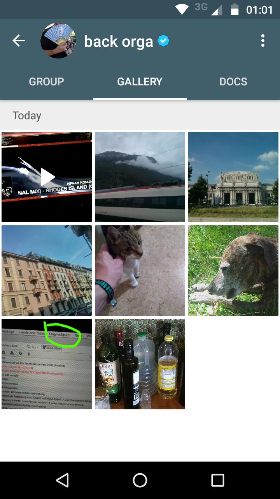
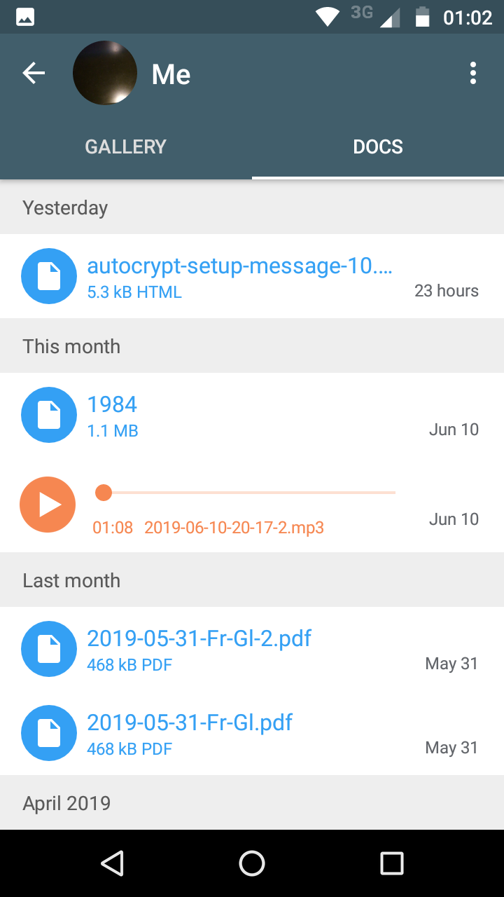
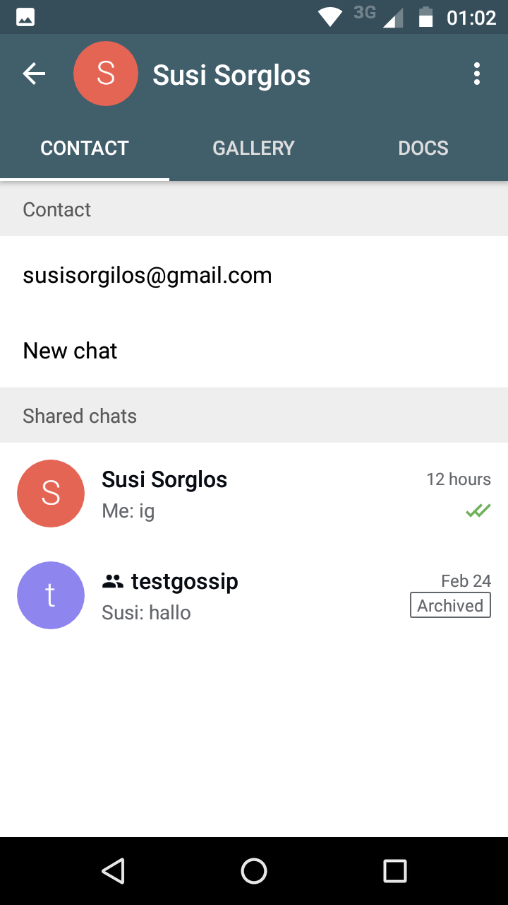
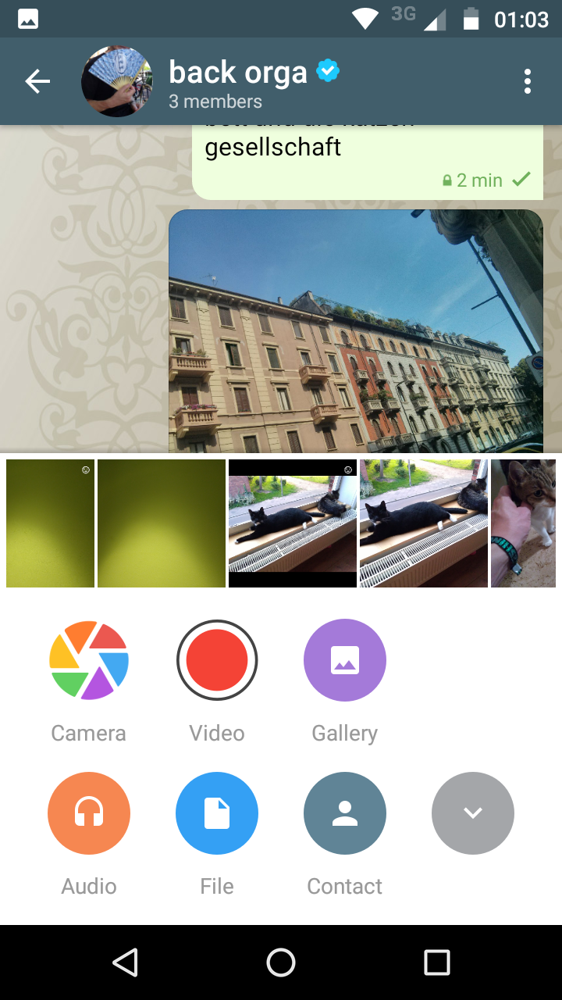
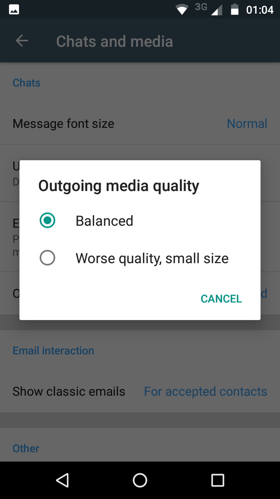
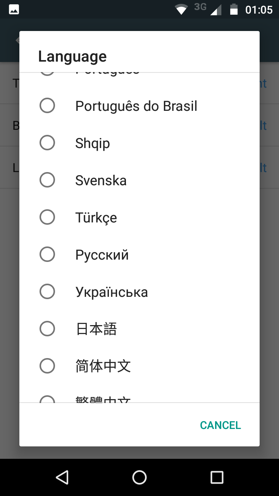

A new and much enhanced Android version (0.500.0) is released and available
on Google-Play and soon F-droid. It is the most feature-rich, UX-refined and robust 
version of Delta Chat to date and incorporates chinese translations now, along
with updates to 19 other localizations.  There now is a **revamped Chat
profile view** which combines gallery, document, settings and member list
in a new tab layout, apart from allowing to see "shared chats" with individual contacts. 

 
 
 

Other major highlights are:

- **video recording**, including automatic recoding to smaller size 
- **forward/share** allows creating new chats, searching, direct share and more
- improved **notification** handling, should now behave more intuitively
- improved **ui:** touch friendly, better looking
- improved **support for older phones**

See the [Android changelog](https://raw.githubusercontent.com/deltachat/deltachat-android/HEAD/CHANGELOG.md) for a more detailed overview - and also note the list of all the people who have **contributed** to this version,
**thanks a thousand times!**

 

On the [download page](download) you'll also find the [Delta Chat Desktop releases](https://delta.chat/en/2019-06-25-desktop) from yesterday. Delta Chat is multi-device capable. 

You are very welcome to contribute [PRs or concise bug reports](https://github.com/deltachat/deltachat-android) but note that feature discussions usually happens first on the [support forum](https://support.delta.chat). 
