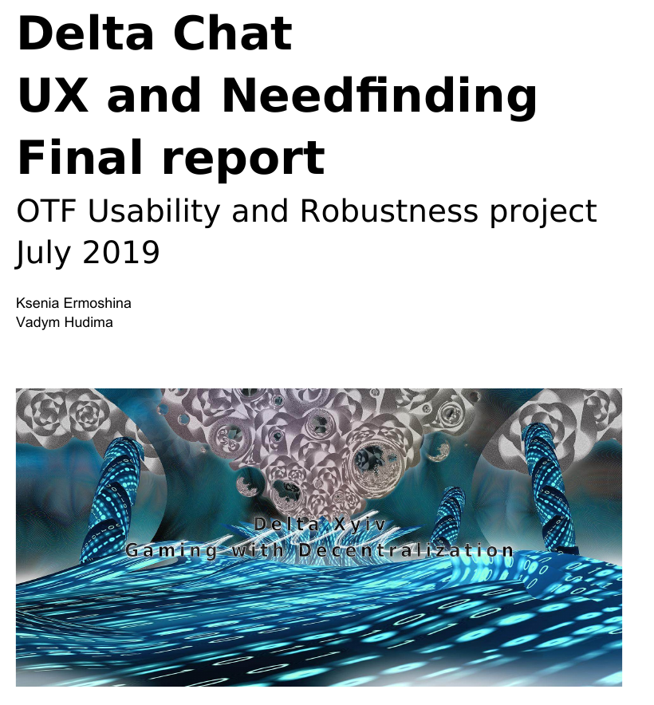

Our [final user-testing report](../assets/blog/Delta-Chat-UX-final-report-july2019.pdf) is out.
It summarizes a year of research with needfinding and UX testing activities and
marks the end of our one-year "OTF Robusness and Usability" project funded by [OTF](https://www.opentech.fund/results/supported-projects/delta-chat/).  

