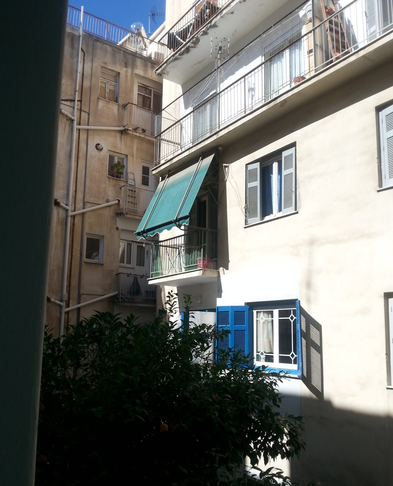

Recently, I had the chance to attend the [Eclectic Tech Carnival
(/ETC)](https://eclectictechcarnival.org) in Athens, a feminist event about
technology. It was full of self-organized learning - the people there really
reappropriated technology which is usually alienated to them.

Mostly women and nonbinary people attended, and brought a variety of skills
they could share between each other. I am used to the elitism of nerd culture -
the contrast was wild. I never saw a learning athmosphere like that, where
everyone could learn from each other, without being afraid to admit they don't
know everything.

Donna and Juga gave a workshop there about installing mail servers - a very
interesting topic for me, I installed my first own mail server only weeks ago.
The workshop was part of the effort to make [burner E-Mail
accounts](https://delta.chat/en/2018-11-17-deltaxi#new-planned-features-for-at-risk-and-other-users)
a widespread feature on more mail servers. But the main goal was to teach the
attendees that managing servers is no witchcraft (not that there would be
anything to say against witchcraft).

*Some people who attended /ETC - it was a lot of fun.* [(Photo:
/ETC)](https://eclectictechcarnival.org/etc/2019/athens/communications/group-photo/)

## How Delta Chat Can Benefit Feminists

Nine people attended to learn more about mail servers. Including me, 4 people
helped out, we shared our experience with Delta Chat and mail servers. We were
also available for questions, to ensure that no one is left behind.

First, Donna gave an overview about Delta-Chat. There was some discussion about
the possibilities of a messenger in the decentralized mail network, especially
that it's possible to communicate with people who use other Mail applications.
We could also show the strengths of Autocrypt as an encryption standard, which
is compatible with other clients as well.

Another emphasis was on burner accounts. Many participants were activists, and
had to think about protecting their identities not only once. (Queer-)Feminist
work can be dangerous, whether you have to deal with violent partners,
right-wing militants, or privacy-sensitive emotional support.

*We stayed at a quiet place in Athens, with a beatiful backyard.*

## Burner Mail Servers in a Workshop

After the theory part, it was time for more practice. Donna handed out seven
pieces of paper with login credentials, for virtual private servers (VPS) she
had created beforehand. Everyone started to login via SSH (a remote command
line), finding out how the SSH command works, struggling with the bad squat
Wi-Fi.

Juga took over from there to teach everyone how to install a mail server, and
what to watch out for. I teamed up with a friend to get started, the others
formed teams, too. We could look up the instructions in a pad for how to
install & configure a postfix SMTP server - that's the software which takes
care of sending mails, and receiving mails from other mail servers on the
Internet.

After everyone had a running SMTP server, the fun part came - using it to
communicate with each other!  With using Mutt on the server command line, we
sent each other mails to prove that it works. It was really good to see how it
actually worked, I didn't expect it to work for everyone so quickly.

But an SMTP server is only one half of a good mail server - you also need an
IMAP server, so Delta Chat can download the received mails from the server. So
we also installed dovecot, to be able to use the mail server with Delta Chat.

## So What Comes Next Time?

Unfortunately there wasn't enough time to directly try out the mail server with
Delta Chat. But with the feedback we got, maybe we will get to it next time -
we are definitely going to give this workshop more often, e.g. at the next
[Chaos Communication Congress](https://events.ccc.de).

When we have more time at the next workshop, we definitely want to set up the
burner accounts API, too. This is the part of the mail server which allows
people to create a temporary E-Mail account with a single request. This means,
that you will at some point only have to tap on a button in Delta Chat to
create an account.

So now a bunch of witches know that it's not much effort to install a mail
server! They did their first steps on the command line, and that was very
beautiful to see.

Unfortunately we had to delete the servers afterwards - but that is just more
motivation to set up their own servers themselves, where they have the control
;) And that's the important part of decentralization and empowerment.

*At another workshop we could create our own faraday bags. They are basically a
hardware airplane mode and look super cool.*

