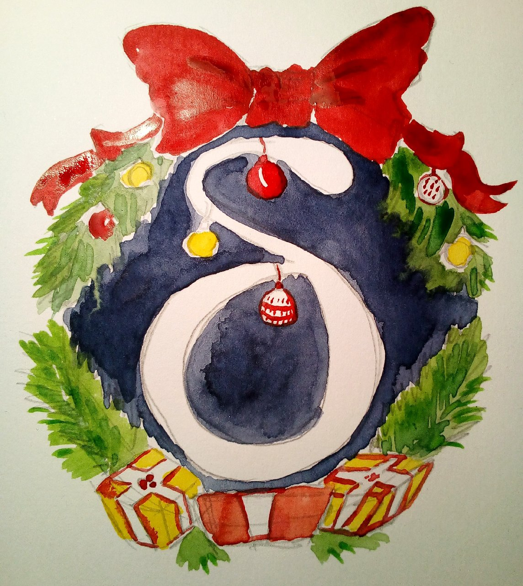

 
**After months of hard work, we just started the [Delta Chat 1.0 releases series 
for the Google Play store](https://play.google.com/store/apps/details?id=chat.delta), 
with lots of tangible improvements. Thanks to the many developers, testers, translators and 
contributors who made this happen! See below for details on all the good changes.**

Note that F-Droid is still offering the older version 0.510.1 for now. We'll get to it 
eventually but if someone wants to help along, see [F-droid 1.0.x issue](https://github.com/deltachat/deltachat-android/issues/1177). 

## Profile Pictures

 

One thing which makes Delta Chat much prettier are **profile pictures**. Or at
least, it makes Delta as pretty as its users ;) You can now set an
avatar image in your settings, and your contacts will see it when you
message them or when you "setup contact" with them through a QR-code. 

As with all other core features of Delta Chat, there is no
extra server (vulgo: "the cloud") involved, other than your email
provider for sending and receiving messages. Note that all avatars are
reduced to 192x192 pixels to spare everyone's bandwidth. 

For privacy reasons, no one sees your profile picture until you write a message
to them. This way, you can control who sees your picture without any extra
interaction. This is very typical for the Delta approach of privacy by design.

## Show Classic Emails as Contact Requests

 

Many Delta users use the messenger for all their emails, not only for chatting.
In the settings, they can set "show classic emails" to "all". Then they will
see normal emails as well, not only Delta messages.

With version 1.0, if you have set "show classic emails" to "all", emails from
new people will show up as contact requests - directly in your chat list. This
way, you will never miss an email. If you don't want to have a conversation
with your Delta Chat app, you can just decline the contact request.

## The Device Chat - Delta Infos Directly on Your Phone

 

With the new Android version for the Google Play Store, users get important
information directly as a chat.

The device chat will mostly be used for info about updates, or if there are
problems and warnings. In short - for all the boring stuff developers want 
you to know.

Previous to 1.0 Delta Chat showed pop-ups for warnings, like the infamous
one about battery optimizations. We are moving all such messages to the
device chat so you can more easily scroll back. Speaking of battery optimizations --
Delta Chat is pretty efficient with using your system resources and it is 
usually fine to allow it to run in the background. However, as disscussed 
in [Don't kill my app](https://dontkillmyapp.com/) Google doesn't always let us. 

## Better Robustness, Speed and Security

 

The core system used by all Delta Chat apps is now written
using the "Rust" language, widely hailed as the most robust and safe 
system programming language. This also has speed up message receiving
and delivery. Also, Android 9 is better supported regarding notifications 
and 64bit support.

For end-to-end encryption we are using [rPGP](https://github.com/rpgp/rpgp),
which passed a security review earlier in 2019. For Transport Layer Encryption
(TLS) we are using the native system libraries on each platform. For protection
against active attacks we have implemented and refined the [CounterMITM
protocols](https://countermitm.readthedocs.io/en/latest/new.html) which in turn
use rPGP. 

## New Delta Chat Intro video

At our last gathering we produced a little introduction video to Delta Chat. 
This is now also the front video for Delta Chat on Google Play. 
We hope you enjoy it or find it useful when talking with friends  :) 

<iframe src="https://invidio.us/embed/yPEjYpE_kvc" frameborder="0" allow="accelerometer; autoplay; encrypted-media; gyroscope; picture-in-picture" allowfullscreen style="float: left; margin: 10px;display: block;" ></iframe>

## Thanks to the dozens of people who helped! 

The whole Rust-rewrite and this release was a massive community effort. 
Thanks to all contributors, testers, translators, those who fetched mate & food
and/or cooked at the gatherings, reviewed pull requests, thanks to our
CI servers, and everyone else we forgot here.

Oh, and if you don't have an Android phone, no problem - Delta Chat is available
in preview versions for Windows, MacOS, Linux, and iOS. Those versions 
are all in Beta stage but are well usable already: 

[Get Delta Chat now!](https://get.delta.chat)

If you want to migrate from an F-Droid installation, you can export a backup,
install the app, and import the backup in the new app.

A lot has changed under the hood. Hopefully everyone has a good upgrade
experience. If not, please submit a new [Android
issue](https://github.com/deltachat/deltachat-android/issues) or visit the
[support forum](https://support.delta.chat). 

