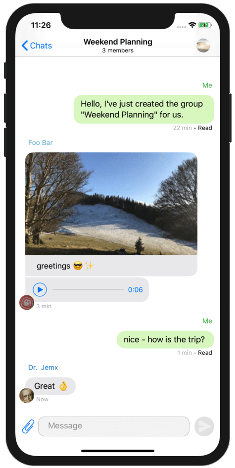
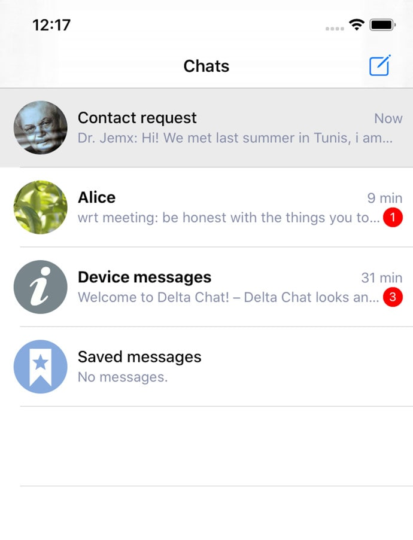
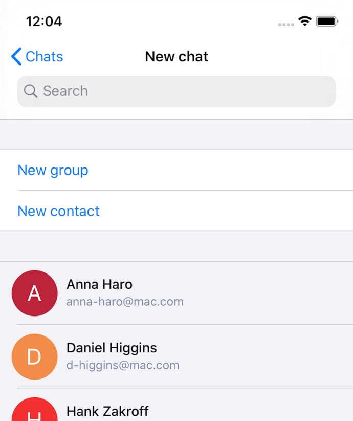

 
**Until yesterday, you could only use Delta Chat on Android, Windows, MacOS,
and Linux. Now you can have the Delta experience on all major platforms!**

With Delta Chat, you can write with everyone who has an email address. But if
both people use Delta Chat, it is even more convenient; then you can use many
other Delta features. 

A short, non-exhaustive list what you can do with the app:

- **End-to-End Encryption** with other Delta users, starting with the second message
- **Group chats** with your friends and family
- Record and listen to **voice messages** & other audio files
- Device chat for technical notifications
- Dark mode

More features will come in the next months.

## Add Your Friends!

If you want to write to your contacts, there are several ways:

- Just enter their email address and start texting
- Add other Delta users by scanning a QR code on their device
- Give others your email address - you will get contact requests when you
  receive emails from new people.

So tell your friends to download Delta Chat as well, whether they are on iOS or
not! You can get the iOS app here:

 

## What's Next?

Some features are still missing in the iOS version - they will follow in the
next months. Some examples are sharing
files with Delta Chat, and searching through your messages.

Stay tuned for new releases!

## Transfering Your Setup From Desktop to iOS

If you already use Delta Chat on other devices, you can transfer your
encryption setup with the "Autocrypt Setup Message". You can find it in the
settings. This way, you can **read encrypted messages on all of your devices.**

The Autocrypt Setup Message will only transfer your encryption keys. For
**transfering your entire chat history**, you need to export a backup on Desktop
and import it on iOS. You can find this option in the settings.

If you have problems with the app, please submit a new [iOS
issue](https://github.com/deltachat/deltachat-ios/issues) or visit the [support
forum](https://support.delta.chat). 

 

