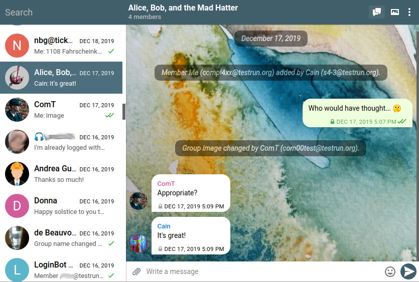
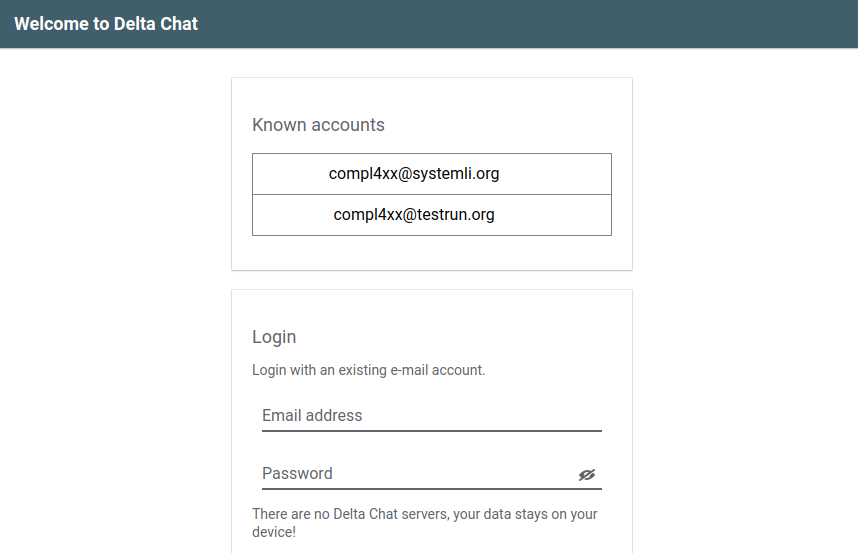
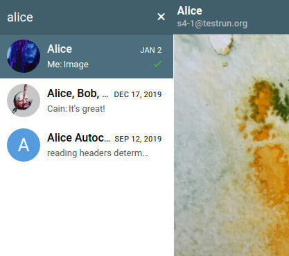
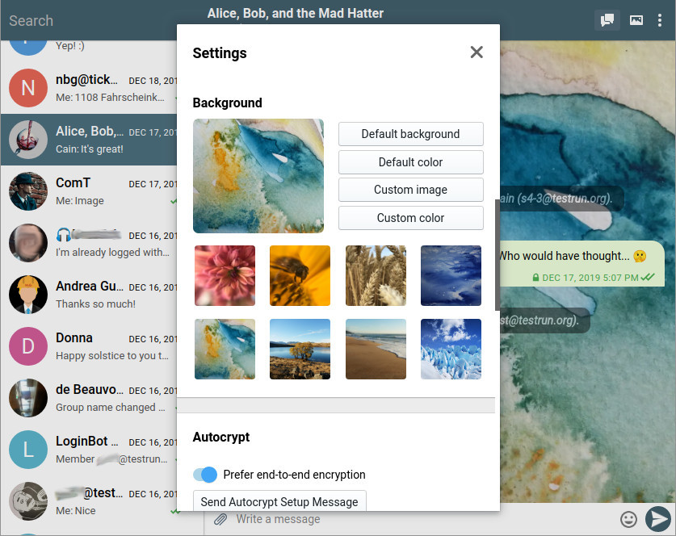
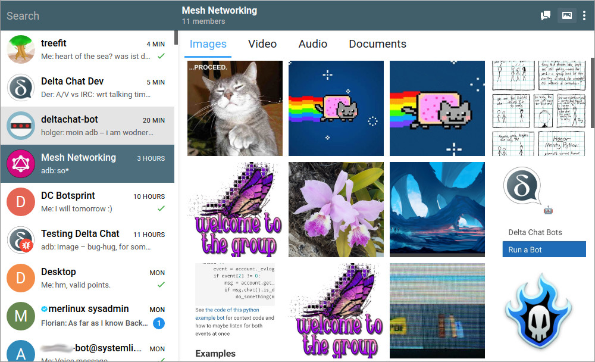

 
**Delta Chat is not only an Android app. You can use it on any device, even
without a smartphone. Since the latest release there are many new features!**

For many instant messengers you need a phone number, or at least a smart device -
not for Delta Chat. Even if you don't have a phone, you can use the Desktop
Client on its own.

Most messengers have the problem that you can only chat with others on the same
platform. With Delta Chat, you can write to anyone with an e-mail address.
This way, you are not locked into the userbase of WhatsApp, Signal, or
Telegram.

*If you have more than one e-mail address, you can switch between them.*

## Many New Desktop Client Features!

The Desktop Client is one of the tools making this possible! Thanks to the
many developers, testers, translators and contributors who made this release
happen. Here is a quick overview:

 
- New **Keyboard Shortcuts**: 
  - Press Ctrl + K to search for a contact or group chat.
  - move through your chat list with alt + arrow keys.
- There are new beautiful **background images** by
  [Paula](https://github.com/paulaluap) and [Nico](https://github.com/nicodh) -
  but you can also choose a custom image.
- **Profile pictures** make your client more beautiful to look at, too.
- You can now copy a link with a right click on the message.
- There is now also the Saved Messages & Device Chat which you might know already 
  from [the mobile apps](https://delta.chat/en/2019-12-18-google-play-store-release).

*You can choose between different beautiful background images.*

## Use Delta Simultaneously with the Android or iOS App!

If you want to synchronize a Desktop Client with an Android or iOS app, better
**export a backup and import it on the other device**. If you just send an
Autocrypt Setup Message, not everything is transfered. With a backup, you also
get your message history, and verified chats work better.

## Try it out Yourself!

The Desktop Client will soon be ready for the macOS and Windows Appstores; for
now, you can download them from [this website](https://get.delta.chat). Note
that there are can be a warning that Delta Chat is not an official app, because
we don't have official certificates for the appstores yet.

You can find the Desktop Client on [get.delta.chat](https://get.delta.chat).
Try it out!

*You can look at all files of a specific conversation in the Media View.*
