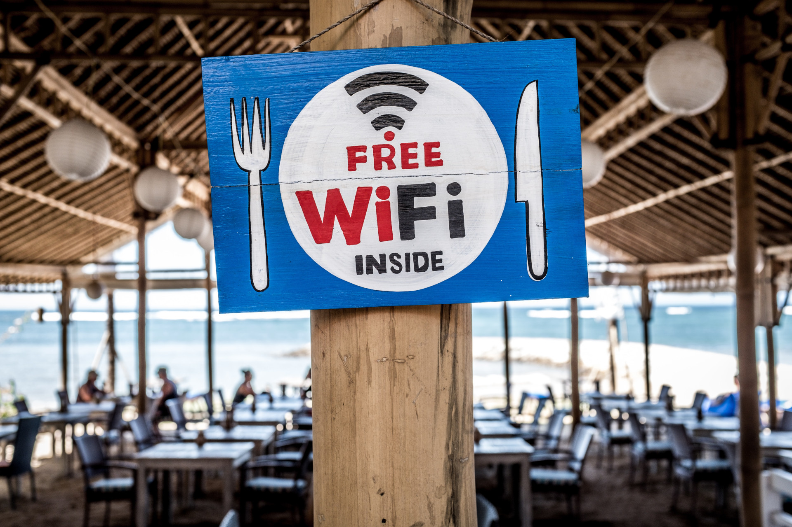

**In the last months, the Delta Chat developers put a lot of focus on saving
traffic. The result: using Delta Chat consumes far less data now.**

Everyone knows the situation of a web page taking ages to load, and messages
taking minutes to arrive. For many people, it's even a question of money;
Internet traffic can be quite expensive. But does it have to be this way?

In the effort to save network traffic, the developers improved Delta Chat a lot
in the last months. This helps everyone with an expensive data plan. It's
also useful if your Internet connection is throttled because you ran out of
data, but the month isn't over yet. In regions with bad Internet connection
it's always good not to burden it too much.

*Somehow free wi-fi became one of the main offerings of Cafés and Restaurants.*

It's easy to forget that many people still pay data plans by the GB - their
data traffic is **expensive, limited, and slow.** They all profit from a
smaller message size. In situations with low bandwidth, this can be the
critical difference: is an app usable at all, or does it use too much traffic?

## Which Improvements are Saving the Most Traffic?

A few things which were changed to reduce our data traffic consumption:

- We changed newly generated PGP Keys to the new ed25519 algorithm - those keys
  are a lot smaller. This is very important, as the keys are sent in every
  message at the moment.
- We now avoid downloading messages that Delta Chat doesn't display, e.g.
  messages from blocked contacts. This means:
  - No unnecessary traffic
  - No slowdown when getting online with a busy inbox
- What is more important than blocked contacts is ordinary emails with huge
  attachements. If you use DC with a normal email address and send PDFs around,
  DC used to download them and throw away.
- We optimized the traffic on idle, when the app isn't used. In 10 minutes, it
  used to consume 6 kB - [this was reduced down to 107 bytes.](https://github.com/deltachat/deltachat-core-rust/issues/506)
- Key Gossip (keys of other group members) is not sent with every message
  anymore. Sending one key is already a lot; in groups with 20 members, this is
  much more.
- We combined read-receipts into one message, when they are sent in the same
  moment. Before, there was an email for each read receipt.

## What Else is Possible?

This is already a start, and saves many people a lot of money, who have to live
with 50 MB per month. But there are even more ideas to reduce the traffic
Delta Chat generates:

- Disabling encryption: making it possible not to send Autocrypt headers at
  all. This is highly controversial; it might not be necessary with the new
  ed25519 keys.
- Sending the key fingerprint in a special header, so we don't always have to
  download the whole Autocrypt header.
- Sending small messages through a header, thereby saving IMAP commands in the
  background.
- Not sending a key per gossip if the key was gossipped by someone else in the
  last 48 hours.
- Maybe we can avoid sending the to/cc headers to groups where everyone uses
  Delta Chat. This is a security feature, but also saves traffic.
- And finally there are some ideas about leaving out the Autocrypt header,
  when encryption *probably* works. If it stops working, it could still be
  recovered by a simple message exchange.
