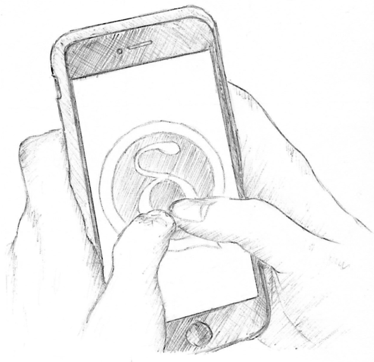
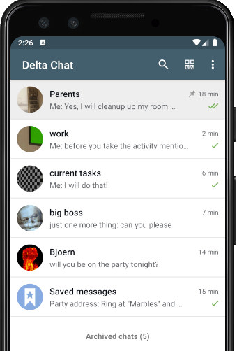
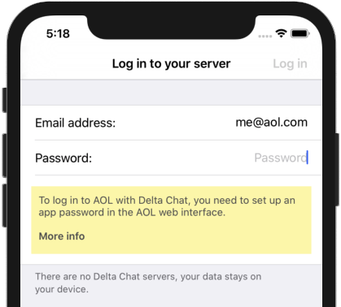

 
In the first months this year, we concentrated very much on fixing bugs,
adding features and getting releases out - and a bit less on blogging and marketing.

Might be, this is not optimal, however, i have the feeling it is better than the other way round :)

Anyway, here we are:

### What is going on feature-wise in Delta Chat 1.1 and 1.2?

**Never forget what is _really_ important:** Delta Chat now allows to "pin" any chat,
so it is always visible atop of the chat list.
In combination with the "archive chats" function, you have some nice tools to keep your things in order.

**_Lots_ of traffic-saving improvements,** too many for this blogpost.
We will get into details in a separate post therefore.

**Instant QR-code contact set up** - Delta Chat uses QR-codes for easy contact setup -
no need to type in complicated e-mail addresses or to compare even more complicated fingerprints.
- _In the past_, this took a moment as both devices had to be online and you had to wait for the handshake to finish.  
- _Now_ the handshake runs in background and there is no need to wait for it.
You can now start typing your first message even if one or both devices is offline!

**Built-in help and FAQ** just in case you want some help on some feature, it is now just a fingertip away.

**Know what to do when logging in to your e-mail provider:** As you probably know, 
Delta Chat does not has own servers, messages are sent with the provider of your choice.
For whatever reasons, some providers will require you to do some stuff before your can really use them.  
This is not the fault of Delta Chat - 
but if we know about these things, we will now show some hints on the log in screen.

As most things in Delta Chat, also the provider-database and the built-in-help are **integrated in the app**,
do not load information from external servers and cannot track you or can cause troubles on bad networks.

This is only a rough overview, there is much more,
see the different [changelogs](https://delta.chat/en/download#changelogs) for details.

### What else?

Lots of **new translations** were started by the community -
eg. Bokmål, Croatian, Esperanto, Korean, Serbian, Tamil and Telugu were just added to the apps.
They are all already pretty usable, however, if you want help on translating missing snippets, 
you are very welcome at <https://www.transifex.com/delta-chat/>

### Get the updates!

The new features will be available as updates in the known stores soon
or already today at <https://get.delta.chat> - for Android, iOS and also already partly for Desktop.