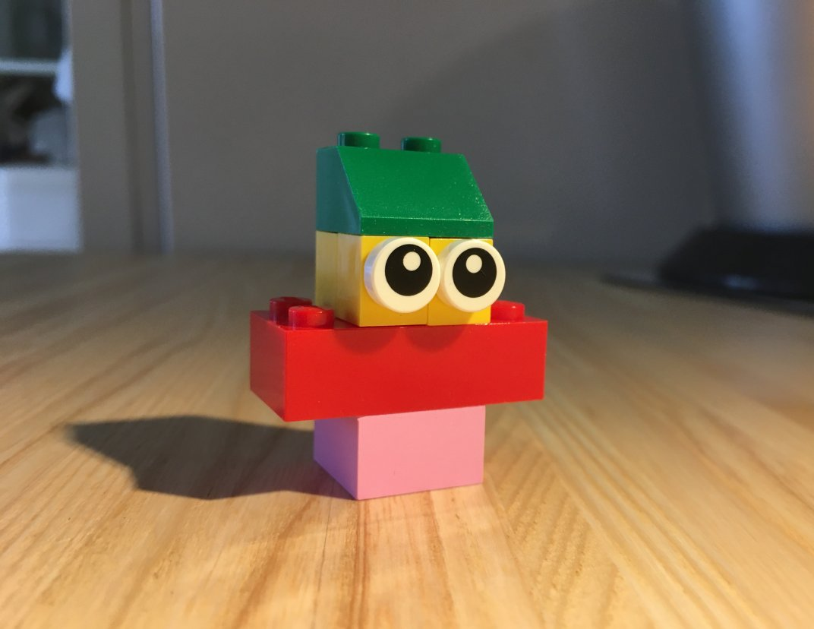
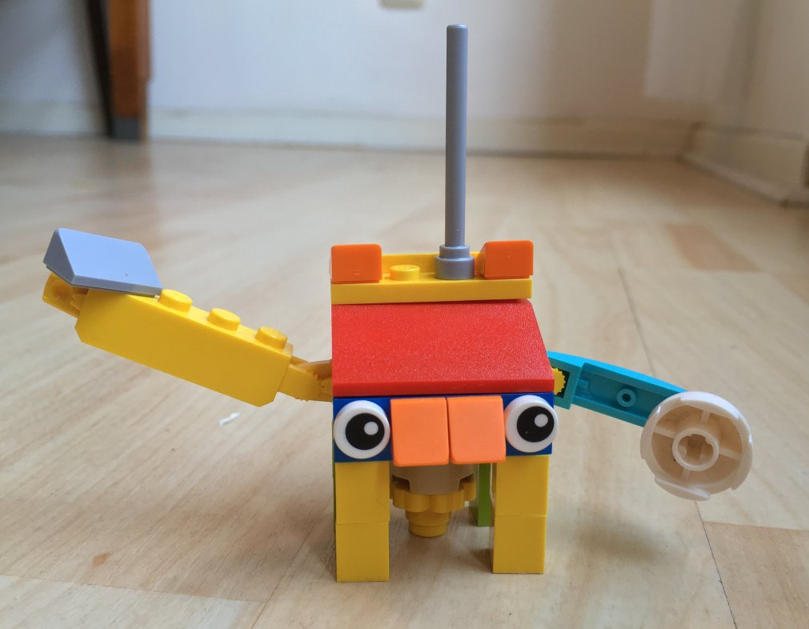

 
*In principle it has been possible to build and run Delta Chat bots for quite a while already. But it wasn't easy or well documented.
We changed that a little bit in the last weeks, and would like to hereby push the beginning of a Delta Chat bots ecosystem into the open!*

Bots in general and Delta Chat bots in particular can be very versatile — from quiz games to news channels, from sending daily reminders to managing large public groups and beyond, a lot can be done.

Also interacting with the web is possible: some of you may have noticed the option to log in to [our forum](https://support.delta.chat/) using your Delta Chat mobile app. This is provided by the [discourse-login-bot](https://github.com/deltachat-bot/discourse-login-bot) we wrote.

We as development team will continue to build and use bots to extend Delta Chat's possibilities.

But we also want *you* to build and use Delta Chat bots.

To help you to get started we built a small website: **[bots.delta.chat](https://bots.delta.chat) provides an overview**, links to API docs and language bindings, and explains some background details about Delta Chat's core engine.

Additionally a new **[forum category for bots](https://support.delta.chat/c/bots/9) show-cases some existing bots**, and is open for ideas, questions and discussion.

Happy bot'ting! 🤖

 
