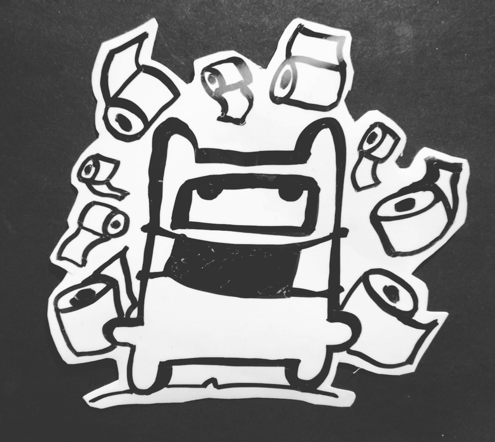
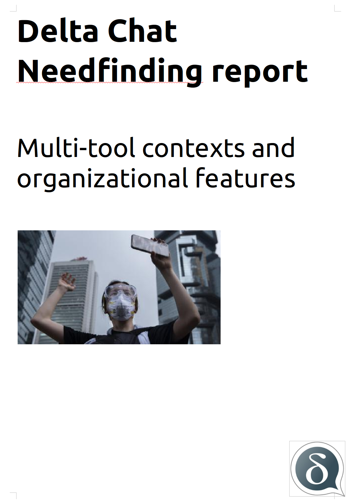

A new Delta Chat UX study [is out](../assets/blog/2020-03-multitool-needfinding.pdf), 
based on Xenia's interviews with people engaged in human rights missions in Belarus, 
Russia, Ukraine, Iran, Taiwan and Hong Kong.  It focuses on how Delta
Chat could or can already work well in conjunction with other tools and
apps, and for organizational settings.  Supporting organizational use of
messenging is a good fit for Delta Chat because it uses the e-mail
system which in turn is the primary communication tool for organizations
virtually everywhere.  The study has a particular focus on *asymmetric*
usage scenarios where "basecamp" monitors users at risk of detention and
abduction. It also highlights our past and future development aims to
address the identified needs. 

