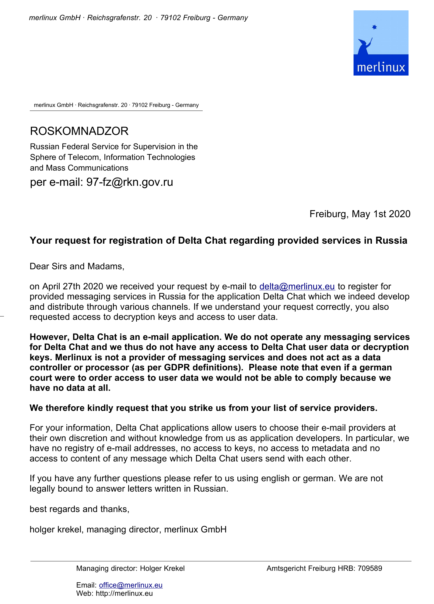

On April 27th we received a letter from <a href="http://eng.rkn.gov.ru/about/">Roskomnadzor</a>, the russian supervisor of communications and information technology. They requested us to provide access to Delta Chat user data and register with their state-run provider registry. <b>We declined for the simple reason that Delta Chat developers have no access to user data whatsoever</b>. Delta Chat is a decentralized messenger and doesn't have their own servers. You choose the e-mail provider which you trust yourself and we don't know about your choices. And even e-mail providers won't see Delta Chat message contents because messages are end-to-end encrypted via <a href="https://autocrypt.org">Autocrypt</a>. Big cheers to the e-mail ecosystem which has a standardized separation of apps (MUAs) from message transport (MTA), and a planetary-scale and diversely operated system at that ... even if a little messy and slow-moving ;) 

<a href="../assets/blog/2020-roskomnadzor.pdf">
     
    <b>Formal answer to Russian state request for Delta Chat user data</b>
</a>
