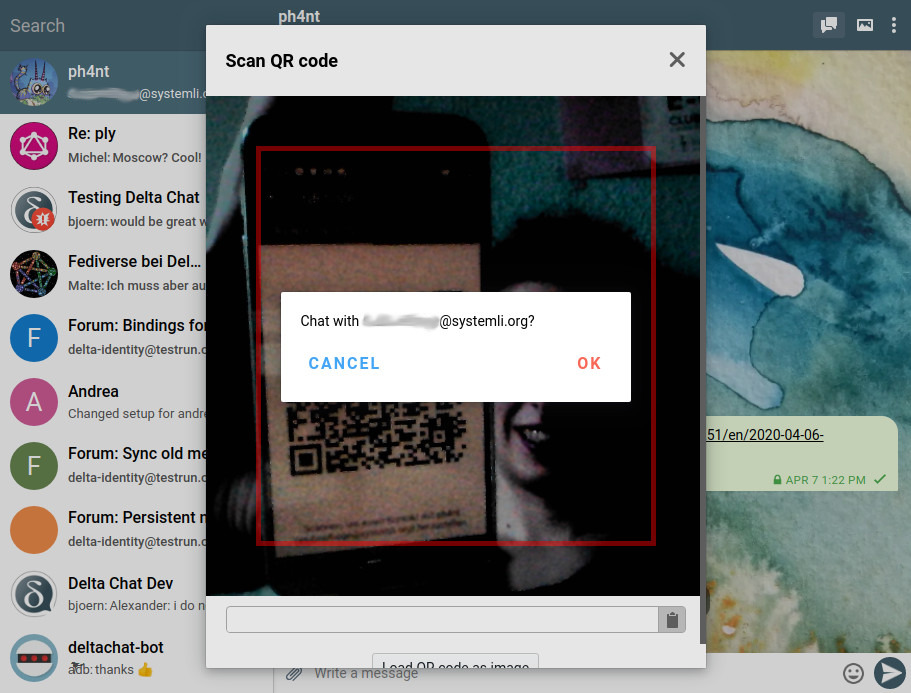
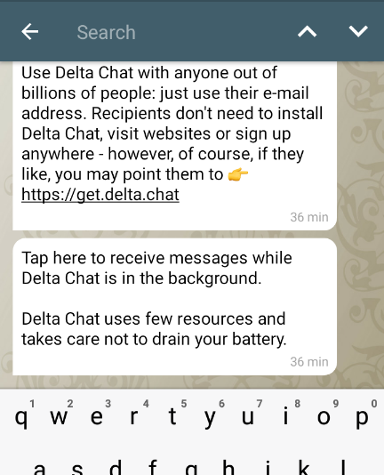
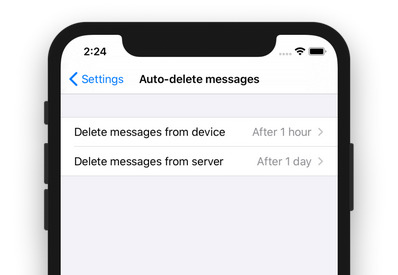

**New Delta chat releases! Thanks to all the early testers and all the work
that went into the new releases on Android, iOS and Desktop. Here is an
overview on what you can expect:**

## Desktop 1.3

- Scan QR codes on desktop to verify chats or join groups
- Pin chats to the top if you need them often
- Change the names of your contacts to tell them apart
- For new accounts, ed25519 keys are generated. The new keys are smaller and faster. [This saves traffic](https://delta.chat/en/2020-03-11-reduced-message-size) and time.

*You can now scan QR codes with the Desktop Client.*

## Android 1.6

- Auto-delete messages from server, and/or from your device
- Have more than one account and switch between them (experimental)
- Search messages in a chat
- Search through the in-app help
- For new accounts, Ed25519 keys are generated. The new keys are smaller and faster. [This saves traffic](https://delta.chat/en/2020-03-11-reduced-message-size) and time.

*Search through all messages in a chat, and jump between the found messages.*

## iOS 1.6

- Auto-delete messages from server, and/or from your device
- Get started easier with the new welcome screen
- Create account by scanning a QR code
- For new accounts, Ed25519 keys are generated. The new keys are smaller and faster. [This saves traffic](https://delta.chat/en/2020-03-11-reduced-message-size) and time.

*You can automatically have your messages deleted to save space on your device or protect it against theft.*

## Try it out With the New Releases!

You can find the new releases on [get.delta.chat](https://get.delta.chat), as usual.
Hope you like this!
