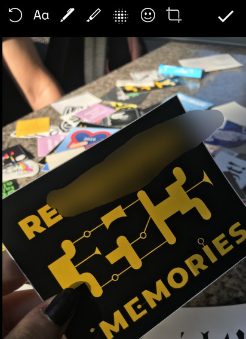
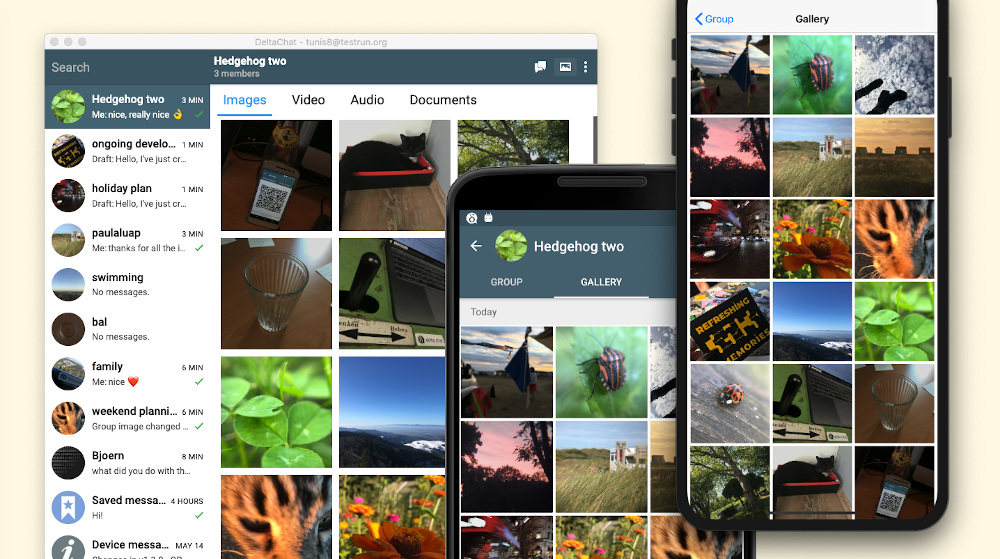

New Delta chat releases are out now or coming soon -
here is an overview about what you can expect from **Delta Chat 1.10:**

### It's faster!

_"Stand back while Delta Chat's core Rust lib is fully moving to Async"_
was [Holger's advice on Twitter](https://twitter.com/delta_chat/status/1261386305247690752)
when the Async move was started.

But **what is _Async_ good for**, from the user's perspective? 

With one word: **Speed.**
Downloading messages is much faster now,
tens of messages arrive in the same time, normally one message is downloaded.
Sending is faster as well.
Everything that is network related got a boost.

To be honest, as an old C developer,
i was pretty sceptical if the improvement will be noticeable at all.
One year ago, before the [Rustocalypse](https://delta.chat/en/2019-05-08-xyiv#the-coming-delta-chat-rustocalypse),
Delta Chat was written in C — i mean, what can be faster than _that?_

Well, i've happily learned, _Async Rust_ can.

Thanks a lot to our chief magician _dignifiedquire_ to make this possible ✨

### Blur Images

 
Shot a photo you want to post - but there are some **details on the photo you do not want to be spread?**
A license plate, a clock with the date, an marker on a jacket that will identify the person, a face?

With the new _blur_ tool (5th icon in the screenshot aside), you can easily remove these details from an image before posting.
Currently, this feature is available on Android only.

### Pssst! 🤫

Take a break and **focus on things that really matter.**
You can now mute chats on all platforms and not only on Android.

### A gallery in every chat

Android and Desktop have **per-chat image-galleries** since some time -
with 1.10, it also arrived on iOS.

This way, you can easily share moments and access them later.
Tip on the edge: Also your **Saved Messages** have a gallery - use this to easily access images
you forwarded there or directly took with the camera function.

### Much more

Some other features at a glance - 
many of them would justify a separate blog page, but well, for now, a line must suffice:

- New Emojis on Android
- Multi-account is now available on Desktop and on Android
- Reworked notifications on Android
- Much better error reporting
- Media quality setting on iOS and Android
- Direct display of animated GIF on iOS
- Share images from other apps to Delta Chat - now also available on iOS
- Other apps can open Delta Chat with a standard Android-E-Mail-Intent
- **Enlarge Avatars** on Desktop and Android

## Try it out the new releases!

If you have not got Delta Chat 1.10 yet,
see [get.delta.chat](https://get.delta.chat) for an overview.
You'll also find detailed **changelogs** there.

As usual, the different stores take different lengths of times for updates — thanks for your patience. 
And last, not least, thanks to all the testers, translators, developers to make this release happen :)
