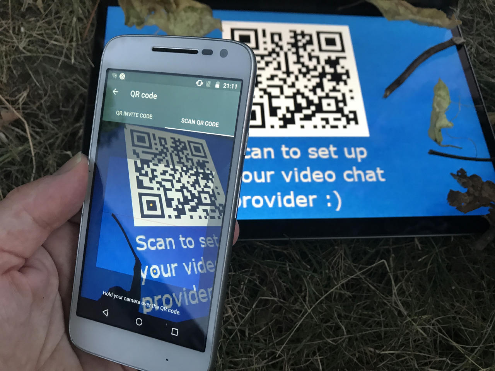
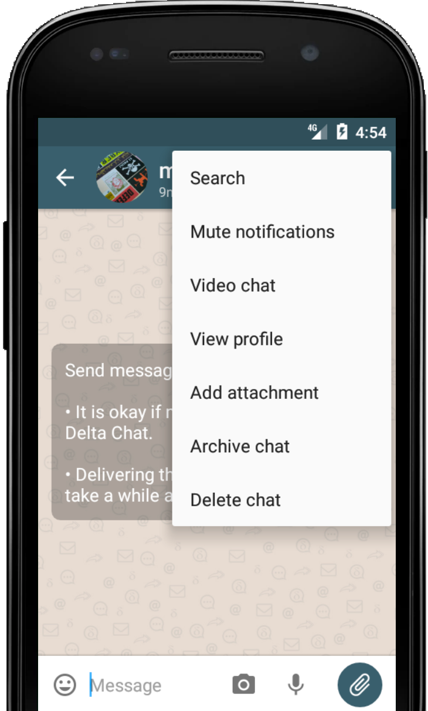
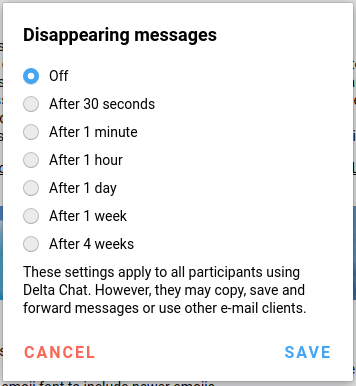

Summer is there - and also a **new round of Delta Chat releases**.

We're happy that we could fix tons of bugs the last weeks,
so that the overall experience of Delta Chat will be a much more stable one.
Also we added lots of smaller, but nevertheless important things.

- Sending an receiving messages is more reliable
- Desktop's message got several long awaited fixes
- Windows and Linux now support more emoji 🥳
- camera handling updated on iOS
- enlarge profile image on iOS ↕️
- iOS profile view got an update
- show a warning when the password was changed on the server
- improve error handling when there is no network

Moreover, we're happy to
introduce two more major, frequently requested features in Delta Chat:
_Disappearing messages_ and _Video chats_.

### Video chats

_"How can e-mail and video chats go together?"_

_"And what happens if the called person doesn't even use Delta Chat?"_  
(remember, we do not force people to use our app)

_"Also, how this can fit with our decentralized approach?"_

We were thinking a lot about these questions in the past,
together with different user groups and testers,
and driven by various ux-researches.

So - it is **up to the user to decide which video chat provider to use.**

- They can enter it in the **settings**
- The video provider may come from the **provider-info** with other server-data 
(which makes a lot of sense, however this is currently not supported by many email-providers).
- Finally, the user can also scan a video chat provider **from a qr-code** - 
this way, video chat providers can be shared easily and quickly.

Delta Chat is not very picky about the chosen provider:
The user can use every instance that contains the roomname in the url, which includes famous
services as jitsi, talky.io, appear.in and many more.

We believe in widely decentralizing the video chat services
is a good idea for overall privacy.
Enabling the user to use any existing instance or hosting their own helps a lot for this approach.

However, once set, **starting a video chat is simple** -
just tap "Video chat" in any one-to-one chat and wait for the recipient to join.
(there is no need for the recipient to set a video chat provider on its own -
and also, the recipient is still free to join the chat from a
non-delta-client, if they really want to :)

Finally, there is also the project [basicwebrtc](https://github.com/cracker0dks/basicwebrtc)
that introduces a slim, fast webrtc-experience.
If a _basicwebrtc_ is detected as a videochat instance,
on desktop, the call is handled directly in-app.

All in all, video chats are already pretty usable,
however, we expect things being fine-tuned in the next releases.

_Video chats can be started from Android 1.12 and Desktop 1.10.4 and
can be joined from all existing clients_

## Disappearing messages

Another new feature in all recent Delta Chat versions on all platforms are the so called
_Disappearing messages_.

Once the feature is enabled in the settings,
any user can decide to see all subsequent messages disappearing.

After a chosen timeout,
the **messages will disappear** on all the users devices,
on the users server -
and moreover, also on devices and servers of 
the other members if they are using Delta Chat and did not make a copy or screenshot.

**It is all about trust** -
you cannot guarantee deletion in any way, 
not for Delta Chat nor for any other messengers -
eg. users may use a camera
or just write it down on piece of paper using this retro technology called pen.

However, together with the burner accounts and the 
deletion of old messages, Delta Chat has a pretty good
set of features to get rid of things :)

Also here, as needed, we will streamline things in the next versions
and will offer the disappearing messages options by default then.

## Try out the new releases!

If you have not got the newest Delta Chat yet,
see [get.delta.chat](https://get.delta.chat) for an overview.
You'll also find **detailed changelogs** there.

As usual, the different stores take different lengths of times for updates — thanks for your patience. 
Also, thanks to all the ux-research attendees, testers, translators and developers to make this release happen :)
