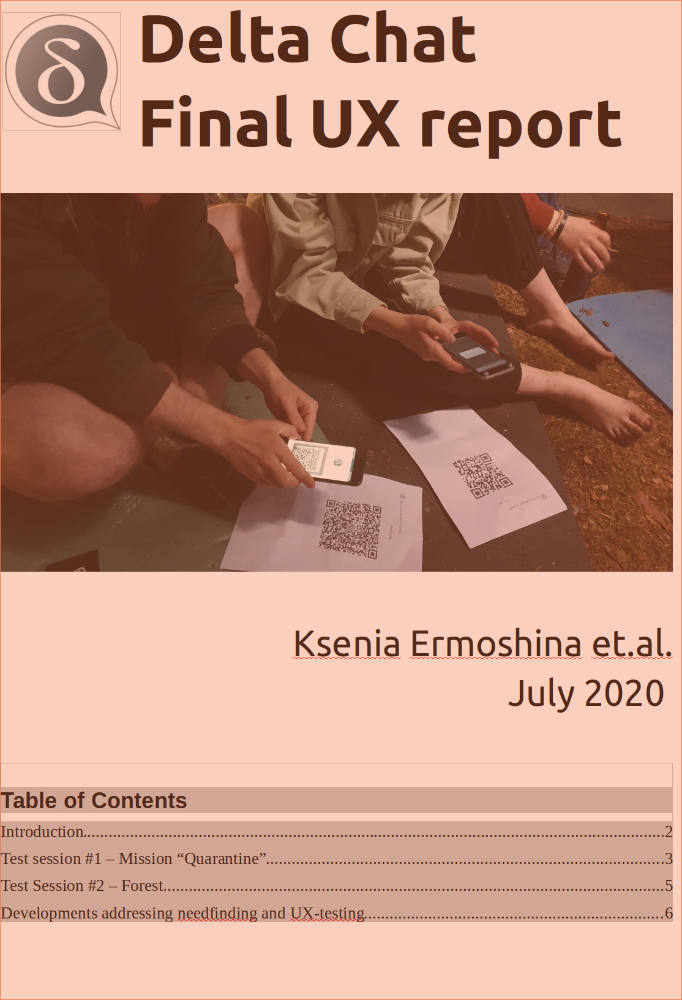

Our final Delta Chat UX summary report is out, 
summarizing our developments which address real world needs from
people engaged in human rights missions in Belarus, 
Russia, Ukraine, Iran, Taiwan and Hong Kong. This work was thankfully supported 
by the [OpenTechFund](https://opentech.fund) and would otherwise not have been
possible.   

<a href="../assets/blog/DC_final_ux_july_2020.pdf">
     
    <b>Download</b> 2020-07-final-ux.pdf
</a>
