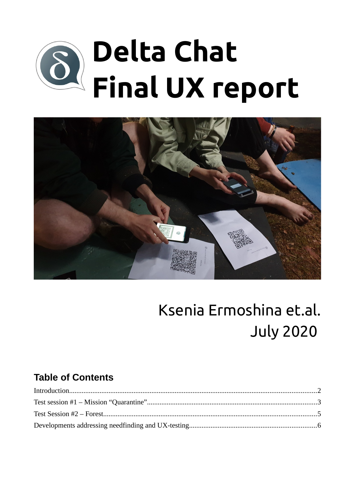

Our final Delta Chat UX summary report [is out](../assets/blog/2020-07-final-ux.pdf),
summarizing developments addressing needfinding interviews and real-world UX tests 
with people engaged in human rights missions in Belarus, 
Russia, Ukraine, Iran, Taiwan and Hong Kong. Most of this work was supported 
by the [OpenTechFund](https://opentech.fund) and would otherwise not have been
possible. 

<a href="../assets/blog/DC_final_ux_july_2020.pdf">
     
    <b>Download</b> 2020-07-final-ux.pdf
</a>
