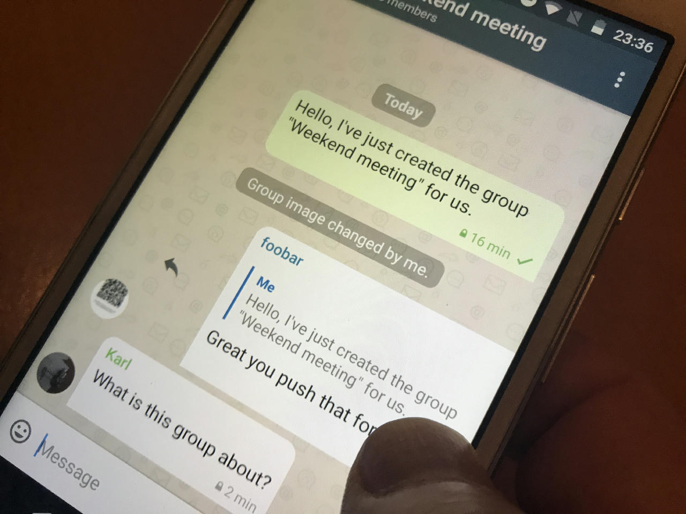
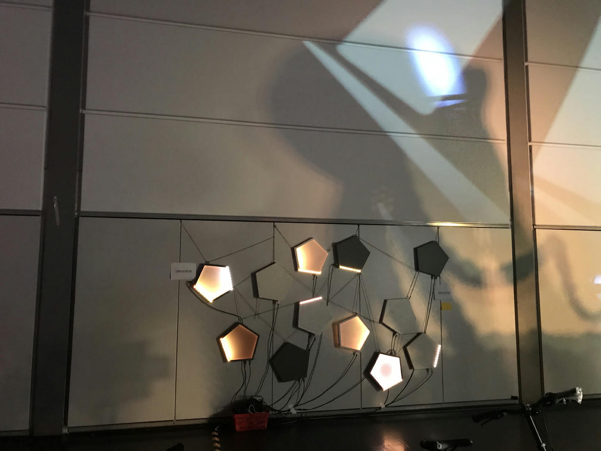
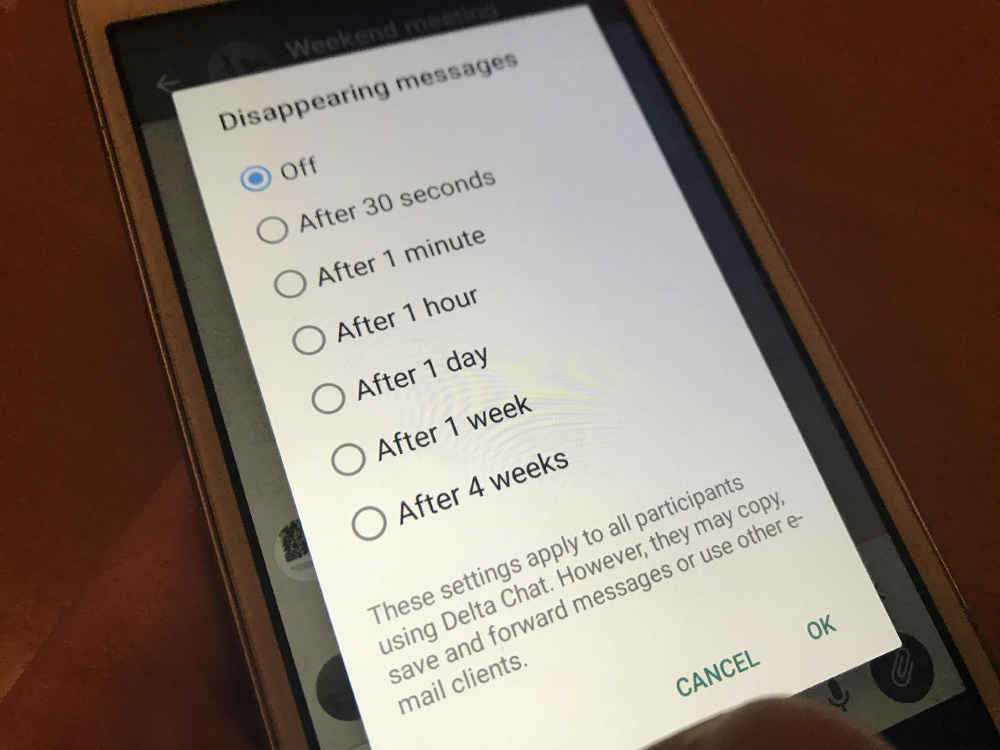

Cold November? No! After many weeks of development and testing,
Android releases have shipped, starting the **new release series.**

What can you expect from **Delta Chat Android 1.14?**

## Swipe to Reply

A long awaited feature is now here.
Not much to explain — this is well known from other apps:

Just **swipe any message to the right**
and you'll see a quote above the compose line
and you can continue writing your message as usual.

You can quote normal text and answer with text,
but you can also quote e.g. images or voice messages
and answer with images or voice messages :)

## From the machine room

As [you might know](2019-05-08-xyiv#the-coming-delta-chat-rustocalypse),
all Delta Chat platforms share the same _core library_
that takes care of the **_really_ hard stuff:**
Crypto, network, protocols, database — you get the idea.

Changes in the core are not directly visible to the user.
The rationale is:
If you do not notice the core, it does **the best job it can do.**

One example:  
When you set up a **new account**
(enter e-mail and your password)
this _now_ only takes **a few seconds** until Delta Chat
is ready to receive and send messages.

In _older_ versions, this could easily take more than a minute!

Another example, also during setup:  
Your **address book now gets prefilled** with e-mail-addresses
you've already contacted in the past using the account you just log in to.

Last, not least, core handles and fixes
all the differences of the **different providers**,
that make the e-mail space as diverse and huge as it is.

This is the kind of stuff the core developers take care of.
A big "thank you" for this incredible work!

## Some more things

Some other features at a glance:

* **Disappearing messages**,
  [in the past an experimental feature](2020-07-30-summer-update#disappearing-messages),
  are available by default now.
  Any chat can now be configured
  to delete sent and received messages after some time.

* Chats open at the **first unseen** message.

* Storing things in your **Saved messages** chat has been possible for some time now -
  with 1.14, this is can be done faster and easier —
  just long-tap a message and forward it to "Saved messages". ✔️ **Saved.**

* See the [Changelogs](download#changelogs) for all the glory details :)

## What about Desktop and iOS?

Apart from the "Machine room" chapter,
this blog post is mainly about Android this time.
However, iOS and Desktop updates are also **in the queue**,
stay tuned about news there.

## Try out the new releases!

Check out,
[get.delta.chat](https://get.delta.chat) for the new versions.

As usual, updates reach the different stores at different times — thanks for your patience.
And again, thanks a lot to all the testers, translators, developers for making this release happen 🙏
