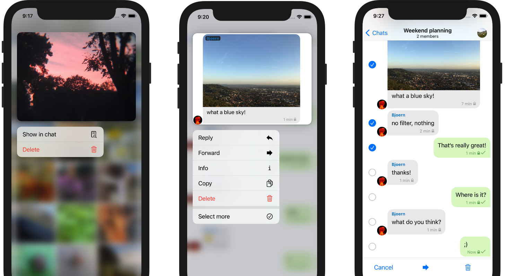
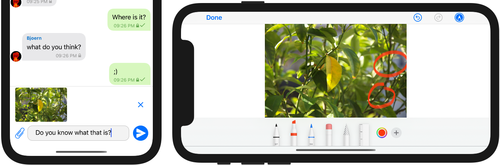

_Delta Chat iOS_ is available
[since about a year now](2020-01-09-iOS-appstore-release) 🎉 —  
while being nicely usable and working,
compared to the more mature Android and Desktop versions,
some UI-features were just missing from our iOS app.
Note that all platforms share the same,
stable [Rust-core](https://github.com/deltachat/deltachat-core-rust) so you can expect the same core functionality and stability that our longer evolving Android and Desktop apps enjoy.

With the releases of the lasts months
and with the **brand new iOS 1.16 release**
we were closing several gaps
and added **lots of features to the iOS user-interface:**

### Context menus and multi select

- We've added **multi select for messages** - 
  long-tap a message, "select more"
  and forward or delete several messages together.

- You see a nice image in the gallery of a larger chat -
  but you cannot really remember the context?
  Long-tapping the image and selecting **show in chat**
  brings you directly to the correct message in the chat now
  (this feature is even released first on iOS - other platforms will follow)

- When using multi-select or show-in-chat,
  you will notice the **improved context menus** that show
  the available options directly together with the selection.
   
These menus are available since iOS 13
and they are a good example
why native UI development rules for every-day-apps as messengers -
they just _look, feel and work better_ than platform-independent compromises.

### Send images with text and edit images

- **Before sending an image**, you can now **add some text:**
  Use the camera or the gallery as usual - 
  the image will be shown above the input field where you can add some text
  and finally tap the send-button.

- In the same way, you can **add some description to documents or files**

- Also, before sending an image,
  you can even **draw on it and do some basic editing:**
  Tap the image selected to send
  and then the **edit icon** in the upper right corner.
  

### What else?

- We did some effort to **improve accessibility** -
  thanks to our community helping us to target some issues.
  Please let us know, if you encounter more issues.
  
- Before 1.16, but never mentioned in an dedicated iOS blog post,
  we added **global search**, **disappearing messages**, **swipe-to-reply**,
  improved **video recording** and **message view**
  and [much more](https://github.com/deltachat/deltachat-ios/blob/master/CHANGELOG.md#delta-chat-ios-changelog).

**Currently, we are working on improving background notifications** -
depending how often you use Delta Chat
and depending on how many other apps you have installed,
iOS does not allow us to check for new messages as we would like to do.
This is a known issue and there are ongoing efforts to address the issue -- stay tuned :)

Finally, it is worth mentioning, that, despite all these new features
the **minimal requirements have not changed:**
iOS 11, iPhone 5s or iPad 5/Air/Mini are still sufficient.  
Although supporting old systems is quite some additional work,
we have resisted the temptation to increase requirements several times.
So, existing devices can be continued for everyone's benefit
(maybe beside Apple's :)

## Try out the new iOS releases!

**As always, you'll find the new iOS version in Apple's
[App Store](https://apps.apple.com/us/app/delta-chat/id1459523234).**

Are you maybe interested in testing new features?
Maybe even happy to [report bugs](contribute#translations-and-bug-reports)?
Check out for new beta releases, in Apple's 
[Testflight](https://testflight.apple.com/join/uEMc1NxS).

Finally, of course, if you do not use an Apple device:
Delta Chat is available for lots of [other platforms](download).
