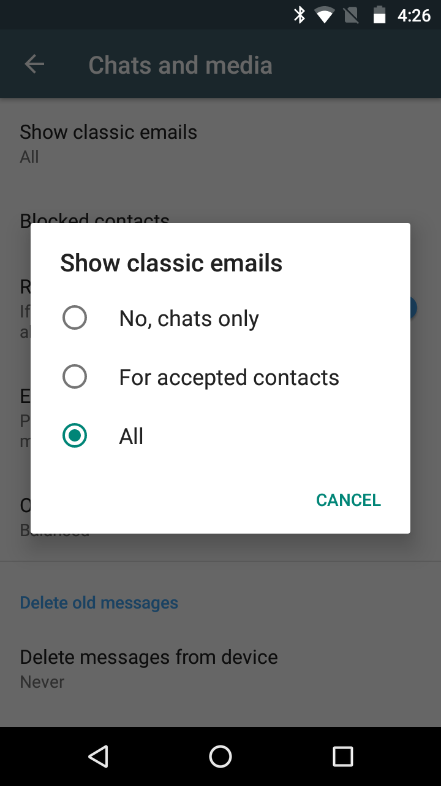

Since the first day,
Delta Chat uses the most **diverse and distributed** network ever existing
for transporting chat messages: **E-mail.**

Delta Chat resists the temptation to build another cage on top of that
and works well together with **other providers and apps;**
doing some good jobs in
**separating chat messages from classical e-mails**.

But what if you want Delta Chat to **interoperate with classic e-mail?**

## How it works

Well, in general, also classic e-mail works since the first day:

- You can **chat with any e-mail address,**
  there is no need that the recipient also uses Delta Chat.
  The recipient just receives a classic e-mail then
  (not only a link as some other apps do).

- To **receive classic e-mails** in addition to chat messages,
  you need to enable **Settings / Show classic mail.**

However, for both cases, 
due to the diversity of the mail system,
in the past,  there were several annoyances when it comes to detail.

The current update targets several of these
and this blog post shows some highlights.

## Mailing lists

Yes, this is a request that also exist since the first day :)

However, Delta Chat 1.20 finally supports **reading mailing lists** -
before, mailing lists were just ignored.

Mailing lists are especialy important as
also "normal" mails may come as mailing lists -
eg. delivery notifications from parcel services.
Not showing mailing lists may miss these information.

As sender on mailing lists may be anonymized by the mailing list software,
they are are marked by a leading tilde as **~Alice**.

This and several other little things that need to be considered,
led to delay after delay.
So, we're finally pretty happy to have that in -
please [report back if you encounter any issues](https://delta.chat/en/contribute#translations-and-bug-reports),
so that we can also open mailing lists for **writing** soon™.

## HTML-mails

While Delta Chat tries hard to get the gist of classic emails
and cuts unimportant quotes and parts,
this cleverness has its limits -
images may be embedded,
font color may be important, 
there may be tables and so on.

Whenever the conversion to plain text may lose such information,
you will now see a **Show full message** button
directly below the text inside the bubble.

## Nicer handling of support addresses

Support addresses as **info@example.org** often expand to multiple co-worker
where (at best :) one of them will come reply to you.

Depending on the software the company you are writing to uses,
however, the reply may come from a different address -
in the past, that led to another one-to-one chat, so that you miss the context
and conversations become hard.

The current version fixes this issue and you'll stay in the chat context.

## Other improvements

[Nearly 100 issues were targeted](https://github.com/orgs/deltachat/projects/31) 
to improve email-comaptibility,
some other highlights are:

- Messages **look better** if the recipient does not use Delta Chat -
  the subject is nicer, no unexpected avatar attached

- Better **attachment handling**

- Support of **Outlook.com** (and other providers messing up headers ;) 

- Due to more senders, we added **more and new colors** for contact avatars

- **Check all server-folders** for new messages from time to time

- [Bots](https://delta.chat/en/2020-03-26-shining-some-light-on-bots) also benfit from several features -
  eg. they also can anonymize users and can send HTML-mails.

- **Speedup global search**

- you can see the **status** (the footer) of each contact
  in the contact's profile (the feature is available on Android, other systems will follow)

## Is this for everyone?

Handling e-mail in Delta Chat is only an option,
users are still free to use Delta Chat as before,
in combination with other e-mail clients.

We are pretty aware that the current improvements
are only some steps towards mail, more to come.

However, Delta Chat is probably the best messenger
for handling e-mails already today ;)

## Get the updates

**Check out [get.delta.chat](https://get.delta.chat) for the new versions.**

iOS and Android are available already today -
and include even more things to discover,
improved notifications on iOS, voice-recording-locking on Android
and [much, much more](https://delta.chat/en/download#changelogs).
Desktop versions will follow.
