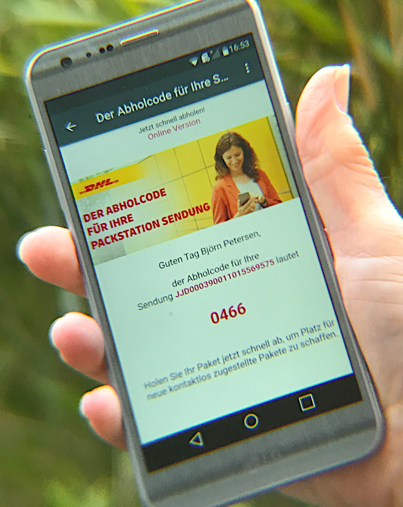

The current releases make
interoperability with classic e-mail land even smoother,
targeting several long-awaited things.

## Rich-formatted HTML-mails

_Got a train ticket?_
_A notification from a parcel service?_
_An invitation?_

All these messages may come as **rich-formatted HTML-mails**,
that are now displayed nicely directly inside Delta Chat 1.20.

To access them,
just use the **Show full message** button
that will be added just to the bubble whenever needed.

## Mailing lists

Delta Chat 1.20 supports **reading mailing lists.**

Mailing lists are especially important as
also "normal" mails may come as mailing lists -
e.g. the mentioned notification from the parcel service
is now displayed even if wrapped into a mailing list.

As sender on mailing lists may be anonymized by the mailing list software,
they are marked by a leading tilde as **~Alice**.

This and several other tiny things needed to be considered to make things work,
so, we're finally pretty happy to have mailing lists in -
please [report back if you encounter any issues](https://delta.chat/en/contribute#translations-and-bug-reports),
so that we can also open mailing lists for **writing** soon™.

## Nicer handling of support addresses

Support addresses as **info@example.org** often expand to multiple co-worker
where (at best :) one of them will come reply to you.

These replies may come from different addresses,
however, are shown in the correct chat now.

## Other improvements

[Nearly 100 issues were targeted](https://github.com/orgs/deltachat/projects/31#column-11613951)
to improve email-comaptibility,
some other highlights are:

- Messages **look better** if the recipient does not use Delta Chat -
  the subject is nicer, no unexpected avatar attached

- Better **attachment handling**

- Support of **Outlook.com** (and other providers messing up headers ;)

- **Check all server-folders** for new messages from time to time

- [Bots](https://delta.chat/en/2020-03-26-shining-some-light-on-bots) also benefit from several features -
  e.g. they also can anonymize users and can send HTML-mails.

- Due to more senders, we added **more and new colors** for contact avatars

- Due to more messages overall, we **speedup global search**

- you can see the **status** (the footer) of each contact
  in the contact's profile (the feature is available on Android, other systems will follow)

## How it works

Since the first day,
Delta Chat uses the most **diverse and distributed** network ever existing
for transporting chat messages: E-mail.

Delta Chat resists the temptation to build another cage on top of that
and works well together with **other providers and apps;**
doing some good jobs in
separating chat messages from classical e-mails.

So, in general, classic e-mail works since the first day:

- You can **chat with any e-mail address,**
  there is no need that the recipient also uses Delta Chat.
  The recipient just receives a classic e-mail then
  (not only a link as some other apps do).

- To **receive classic e-mails** in addition to chat messages,
  you need to enable **Settings / Chats and media / Show classic emails.**

However, for both cases,
due to the diversity of the mail system,
in the past, there were several annoyances when it comes to detail.

As shown above, the current update targets several of these :)

## Is this for everyone?

Handling e-mail in Delta Chat is only an option,
you are still free to use Delta Chat as before,
in combination with other e-mail clients.

We are pretty aware that the current improvements
are only some steps towards mail, more to come.

However, Delta Chat is probably the best messenger
for handling e-mails already today ;)

## Get the updates

**Check out [get.delta.chat](https://get.delta.chat) for the new versions.**

iOS and Android are available already today;
shipping to all stores may take some more days.

The versions include even more things to discover,
improved notifications on iOS, voice-recording-locking on Android
and [much, much more](https://delta.chat/en/download#changelogs).

Desktop versions will follow.
