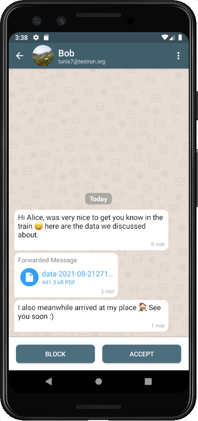
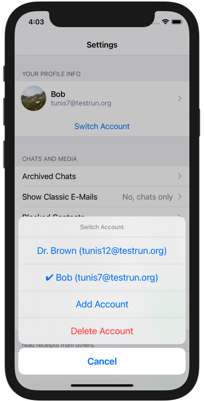
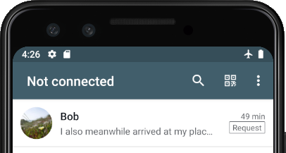

Many updates to tell, about M1 and, of course, about new releases.

## M1

_"M1?"_ A computer chip? Metric screw thread? Not even close.

M1 was a place in Hamburg where some Delta Chat developers
and friends met for two weeks in August.
We chilled, discussed and settled things -
or at least tried that :)

The meeting satisfies a whole blog post on its own.
However, for now,
I just want to take the chance to shout a big **"Thank you!"**
to everyone making that possible.
And also send some explicit greetings to everyone who could not make it to M1,
for pandemic or whatever reasons.

One visible outcome of M1 are new releases, **Delta Chat 1.22**, that will be discussed in the rest of this blogpost

## Much better Chat Requests

When a person you have not been in contact with yet, writes to you or adds you to a group,
you now get a **Chat Request** that appears directly the chat list:

- The Chat Request is marked as such with the tag "Request"
- All messages appear in the correct chat context,
  you can inspect and read all messages as usual
- You can open attachments, view images, even save or forward them
- Read Receipts are not sent to Chat Requests

At any point, you can decide whether to **Accept** the Chat Request - 
in this case, the Chat Request is converted to a normal chat.

Also the normal actions work for Chat Requests now:
You can decide to **Pin** it to not forget to handle it later -
or **Archive** it if you do not want to think about it ;)

And, of course, you can **Block** or **Delete** the request.

Note: If you are updating from an older version of Delta Chat,
you will find your old request in the Archive now -
that is now **easier accessible** directly from the menu (Android/Desktop)
or from the settings (iOS).

## Multi-Account Added or Improved

**Delta Chat iOS** gets Multi-Account functionality **for the first time** -
in the settings, you can add additional accounts 
and switch between them easily.

Adding an account is **just as easy** as the initial setup.

Compared to existing, Multi-Account implementations on Android and Desktop,
account **switching is super-fast.**
**No more forced waiting** when selecting a different account 
that has some messages to download just after switching.

We could make that possible by using the **new rust code base**,
that allows running accounts concurrently.
That also allows eg. group-joins being processed in the background -
imagine you give someone a qr-code for a group and switch to another account just in the moment one wants to join.
With the new code base, this is no longer an issue.

Good news for **Delta Chat Android and Desktop** -
we switched also there to the **same rust code base**. 

Having the same code base on all platforms
also opens several options for the future - stay curious :)

## Connectivity and Quota

The third big part: We made the **connectivity visible:**

The **title bar** now shows if you are not connected for whatever reason,
may it be lost WIFI or may it be that your provider is down again.

A tap on the title
opens the **new Connectivity View** 
that gives you **detailed information** about the reason –
plus some other useful information, eg. possible by your provider **Quota information**.

The connectivity view will get some more improvements the next time,
also there - stay tuned :)

## Get the updates

As always, **check out [get.delta.chat](https://get.delta.chat) for the new versions** -
as always, shipping to all stores will take some time.

And, also as always, the  new versions include even,
[much, much more to discover](https://delta.chat/en/download#changelogs).
