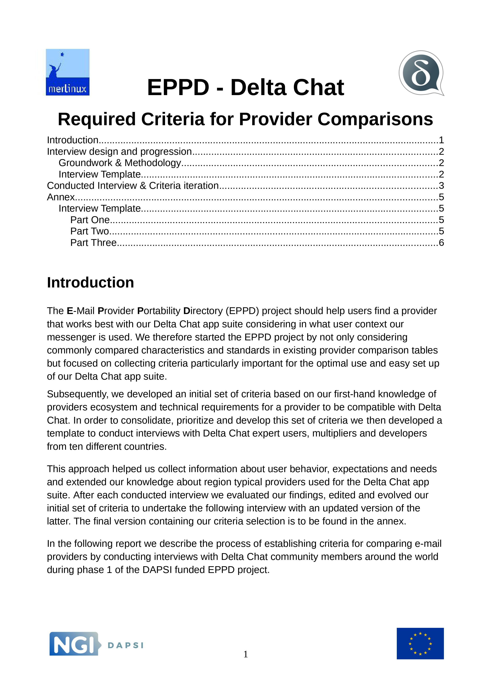

What provider should I use for Delta Chat?  We hear this question often but it's not so easy to answer. Everyone has different needs and situations. So how to go about this? 

Early this year we applied for EU [NGI](https://www.ngi.eu/) funding to come up with a thorough e-mail provider comparison approach and to improve our apps while doing that. In April we received funding from the [DAPSI EU consortium](https://dapsi.ngi.eu/hall-of-fame/eppd/) to support a more comprehensive approach of comparing e-mail providers. To find out about useful comparison criteria, we systematically asked Delta Chat power users from ten countries, about what they need from a provider - including what their communities like or dislike about different providers. We just finished a report and have a working set of criteria which we are happy with.

<a href="../assets/blog/eppd_criteria_final.pdf">
     
    <b>Download</b> eppd_criteria_final.pdf
</a>

Based on these criteria we are now to evaluate roughly 20 providers in the upcoming months. Many thanks to [Gerry](https://github.com/gerryfrancis) who majorly helped with identifying an initial provider list and collect information about them. Apart from making it easier for Delta Chat users to choose a provider, we are to use these findings to make Delta Chat easier to use. In fact, the recent [Connectivity and Quota improvements](https://delta.chat/en/2021-08-24-updates#connectivity-and-quota) already originate in our EPPD effort. 

If you have any additional input or questions on this please mention "EPPD" in a post on our [support forum](https://support.delta.chat) -- you can login with your Delta Chat app there through a QR scan btw :) 
