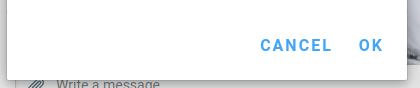

The 1.22.2 release of Delta Chat Desktop just only got released a couple of weeks
ago, still new changes are currently in the making, hardly visible to the outside world
that doesn't hang around on our [GitHub](https://github.com/deltachat/deltachat-desktop).

This blog series, "This week in Delta Chat" (which is totally inspired by the awesome
humans responsible for the [This week in Plasma blog](https://pointieststick.com/2021/09/25/this-week-in-kde-plasma-on-the-move/) series) wants shine some light on all those
changes, experiments and efforts that are happening.

This week was all about Dialogs, as the title already states. The journey started by implementing a highly requested feature, accessing the Profiles of Group Members through the Group Dialog. But the journey didn't end there, another mayor annoyance was that all Dialogs always had those 'Ok'/'Cancel'/'Close' footer buttons, even if there was no action currently happening that needed a confirming 'Ok'. This evovled into a mayor overhaul of almost all Dialogs. Besides this, @treefit worked on better types in deltachat-node, allowing us to find some types of bugs easier.
**Please note** that this are previews, our current state of development. Nothing is set in stone and things tend to change.

## Accessing Profiles through the group dialog**
Clicking on any member in the group dialog will now switch to the profile of that member.

<video muted controls>
    <source src="../assets/blog/2021-10-05-this-week-in-desktop/access profile through group dialog.mp4" type="video/mp4">
</video>

## Add member
Adding a member will now open a seperate dialog, with "Ok" & "Cancel" buttons. This should be more
intuitive then having it backed into the same Group dialog as it was before.

## Editing group avatar & name

## Editing profile name

## Overhauled settings

