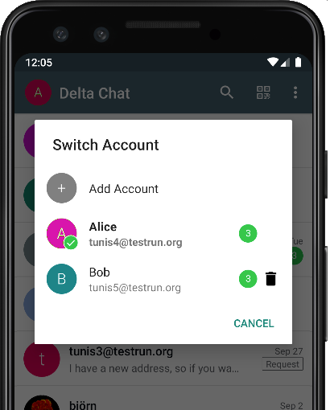
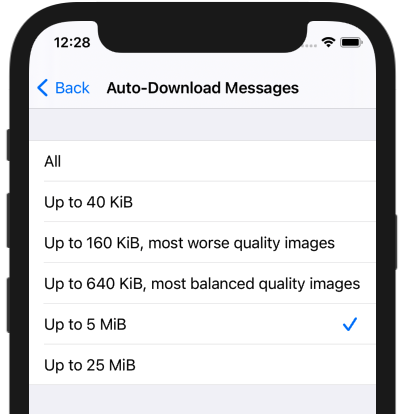
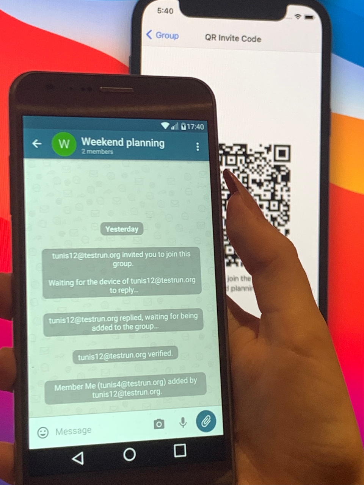

Yip, Delta Chat **1.24 is out for Android and iOS:**

## Android's new Account Switcher

Some more steps in our ongoing effort in multi-account improvements:

- The **profile image of the currently selected account**
  is shown directly above the chat list
  
- A tap in the image opens the account list and allows
  **faster switching** to another account
  
- See if account has **unread messages** before you switch to it

For iOS, account switching is done in the settings,
however, some of the ideas will probably also find its way to iOS.

In case you missed the last blogpost:
[Multi-account runs concurrently meanwhile](2021-08-24-updates#multi-account-added-or-improved) -
which made things as the _unread message counter_ possible in the first place :)

## Download on Demand

Have you ever been annoyed
by a large download
blocking you doing more important things in a bad network?
Or eating your mobile contingent?

If so, this feature is for you!

Instead of downloading all messages unconditionally you
can advice Delta Chat to just show a placeholder and a
**"Download" button for messages larger than some threshold.**

Then, you can manually **start download when it really fits.**

This works for all messages,
no matter if they were sent with Delta Chat or with a classical e-mail program.

## Group-Joins

When scanning a QR code that brings you to a group,
you now **immediately** see that group in your chat list,
no matter if the involved devices are **online or not.**

The real handshake runs completely in the background then,
not blocking you from doing much more important things,
as checking out which emoji to chose for your birthday invitation 🎉

## Improved Search

_Search_ was not really mentioned in the last posts,
but there were lots of improvements over the last versions as well.
Some recent changes:

- An In-Chat-Search is now available on Android as well as on iOS
  and allows you to do an **incremental search within any chat.**
  You start it by the Menu (Android) or the chat's profile (iOS).

- With the **Previous and Next** buttons you can cycle through the result.

- The global search has become a boost,
  it is **much faster now.**
  

##  _"All that you say could be true. What else?"_

_Words from a super-sceptical cat ..._ but well, something's left, indeed:

- **Stickers** - several enthusiasts made it possible
  to display stickers, **even animated ones, are displayed on all platforms.**
  There is no built-in sticker selector -
  however, many platforms already have one built into the standard keyboard
  or you can install other apps that handle that for you,
  (this probably statisfies a separate blog post :)
  
- **Get warned when your mailbox runs full** - since the last update,
  the current "quota usage" is displayed in the connectivity view.
  now you get even a warning in the device chat
  when your quota is about to exceed - one at 80% and another at 95% usage.

- By huge user demand,
  we added [**Broadcasts Lists,** as known from other messengers](https://github.com/deltachat/deltachat-android/pull/2060),
  as an experimental feature.
  You can test them already today at "Settings / Advanced / Experimental Features".

- **Even more** to discover 
  [in the changelogs](download#changelogs).
  You'll also find details about the bug fixes there.

## Get the Updates

**Check out [get.delta.chat](https://get.delta.chat)** for the new versions.
As always, shipping to all stores will take some time.
