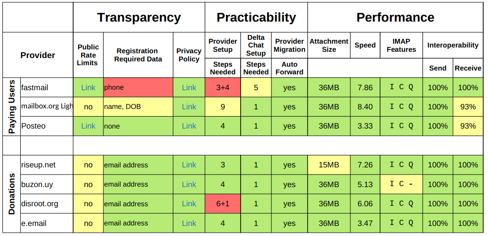

In the last couple of months we engaged with comparing around 20 international e-mail providers, based on our [earlier research into comparison criteria](https://delta.chat/en/2021-09-11-eppd-provider-criteria). These efforts were part of our [EPPD](https://dapsi.ngi.eu/hall-of-fame/eppd/) project funded by the EU. 

<a href="../assets/blog/eppd-comparison-final.pdf">
     
    <b>Download</b> provider comparison table.
</a>

In the table you will see both qualitative and quantitative evaluations. The third page of this PDF contains explanations for what we measured and what you can see. Overall, most providers are fine to use with Delta Chat although we recommend caution with those that lack basic IMAP Features or require much personal data. The speed for sending small messages was largely below 10 seconds and some providers manage to stay under around 1-3 seconds. If you experience slowness you will be able to long-click and look at "Message Info" in the upcoming 1.28 releases. You can then inspect through which hops the message travelled and where it was delayed. 

Note that automatically testing speed and rate limits proved to be a cumbersome exercise as most e-mail providers are very sensitive to automated scripted interactions. For some providers we failed to run interoperability tests because we used fresh accounts which are probably monitored even more strictly. For most providers, however, we could measure all data. We published our measurement tool [eppdperf on github](https://github.com/deltachat/eppdperf) and intend to improve it further.  In that repository you also find the raw data underlying our overview table. 

If you have feedback or questions you are welcome to post on our [support forum](https://support.delta.chat) -- you can login with your Delta Chat app there through a QR scan btw :) 
