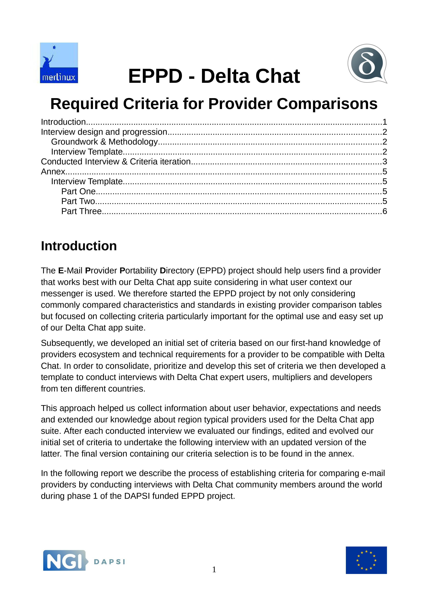

---
title: Which E-Mail Providers work well with Delta Chat? Quite some :) 
author: missytake, jette, holga
image: ../assets/blog/eppd-criteria-final.jpg
---

Coming to an end with our EU [NGI](https://www.ngi.eu/) funded E-mail Provider Comparison Directory (EPPD) project, we gathered some interesting results about providers' performances and how they can influence the use of our Delta Chat app suite.  

The [DAPSI](https://dapsi.ngi.eu/hall-of-fame/eppd/) funding did not only result in an email provider comparison directory but also helped to improve Delta Chat's onboarding and usability! We released [quota and connectivity] (https://delta.chat/en/2021-08-24-updates) and the [account switcher] (https://delta.chat/en/2021-11-17-releases) which we are quite happy with.

<a href="../assets/blog/eppd_criteria_final.pdf">
     
    <b>Download</b> eppd_criteria_final.pdf
</a>

In the [comparison table] (.....) you'll find 20 providers which we compared considering criteria such as the speed of sending and receiving messages, attachment size or how many steps you need until you start chatting with Delta Chat. Over all categories are performance, practicability and transparency. The infos for each collumn is condensed to prevent you from an overload of numbers. If you want to see everything in detail, please check out the raw material on [github] (https://github.com/deltachat/eppdperf) During this provider comparison process we also updated our [provider DB] (https://providers.delta.chat).   

If you have any additional input or questions on this please mention "EPPD" in a post on our [support forum](https://support.delta.chat) -- you can login with your Delta Chat app there through a QR scan btw :) 
