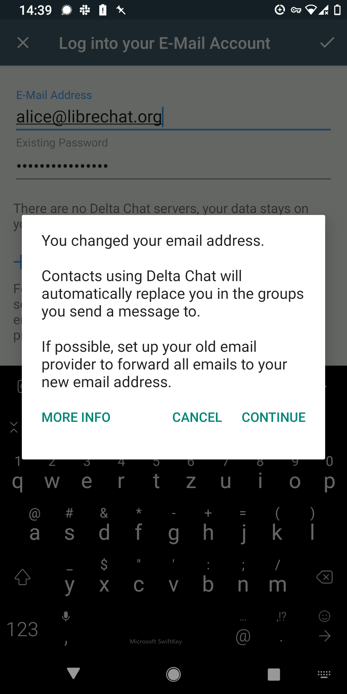
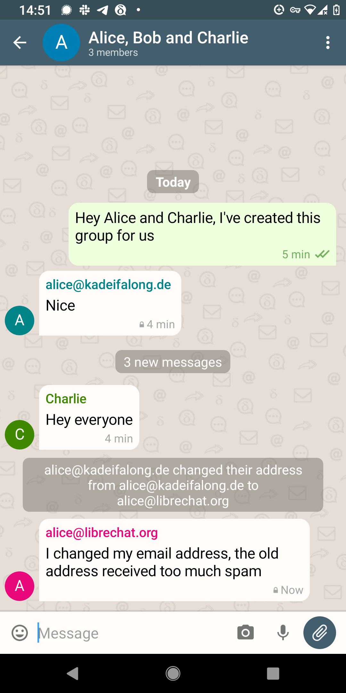

The Delta Chat 1.32 introduces support for new providers (most notably 163.com), a slew of bug fixes and the first release of AEAP mechanisms. AEAP enables or e-mail what number porting does for mobiles.

TLDR; How to migrate to a new provider with Delta Chat:

- Probe and change your address at "Password and Account" seetings screen in Delta Chat
- Make your old email provider forward all emails to your new email address
- Continue chatting as usual :)

By design, no user confirmation dialogues aka "is this ok?" / "are you sure?" dialogues are presented because user studies show that most people just click "ok" or "cancel" as needed to move forward and rarely understand the implications.

### How it works under the hood

Nothing immediately happens after you successfully changed to your new e-mail address in the settings screen.  No messages are generated in the background, no network activity to inform anyone takes place. Your internal identification and encryption key stay the same and are not altered[^1]. Your contacts don't know that you changed your address yet and will continue to send messages to your old address. For this reason, you better **configure your old email provider so that it forwards all emails** to your new email address. Otherwise messages sent to your old address won't arrive because Delta Chat does not try to retrieve messages from their after the change. If you don't know how to setup e-mail forwarding for your old provider please ask on the https://support.delta.chat forum.

If you send a message to any chat, the other chat members will not complain if they see a group message coming from your new e-mail address but they will see a "~" in front of your address.  In this case they will still reply to your old e-mail address which is why it's important to configure e-mail forwarding on your old provider. Things are smoother if you send a message to a "verified group chat" because recipients there will automatically update to your new e-mail address and not send chat messages to your old e-mail address anymore! Verified groups are a still experiemtal but pretty stable feature of Delta Chat. Verified groups have blue tickmarks and members can only join after verifying with a pre-existing member. See [COUNTERMITM protocols](https://countermitm.readthedocs.io/en/latest/new.html) for more details.

[^1]: For those who know a bit more about PGP: Not altering the identification and encryption keys means that the UID field of your PGP key will not be changed and still contain the old address.  This is a design choice to keep things simple, and it's possible because Autocrypt says that "the content of the user id packet is only decorative" (<https://autocrypt.org/level1.html#openpgp-based-key-data>).

### What we still aim to improve about AEAP

In subsequent releases we hope to make the process quicker that all chat members automatically follow you to your new address. For this we need to [harden generic e-mail authenticity verification](https://github.com/deltachat/deltachat-core-rust/issues/3507) to the point of enabling AEAP for all encrypted chat groups (verified or not).

## Moving to Tokio

The core part of any Delta Chat app or Bot is the core library. [In Kyiv around May 2019 we started migrating this library to use "Rust"](https://delta.chat/en/2019-05-08-xyiv#the-coming-delta-chat-rustocalypse).  Later on we migrated to so called "async" Rust, the state of the art way of dealing with networking and messaging tasks in an internally asynchronous manner.  There are two major eco-systems, one is term "async-std" and the other is named "Tokio" and has found a lot more adoption in the last years.  Delta Chat now also adopted this more popular approach and it wasn't actually that hard to do the migration.  Kudos to living and adaptable eco-systems :)

